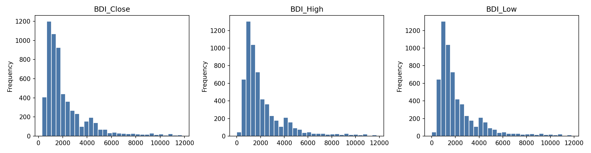
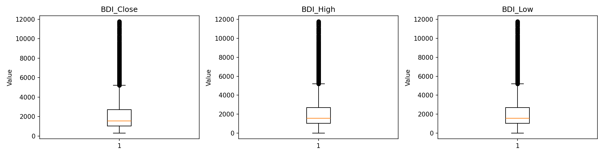
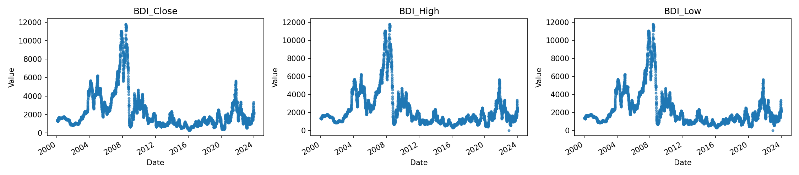
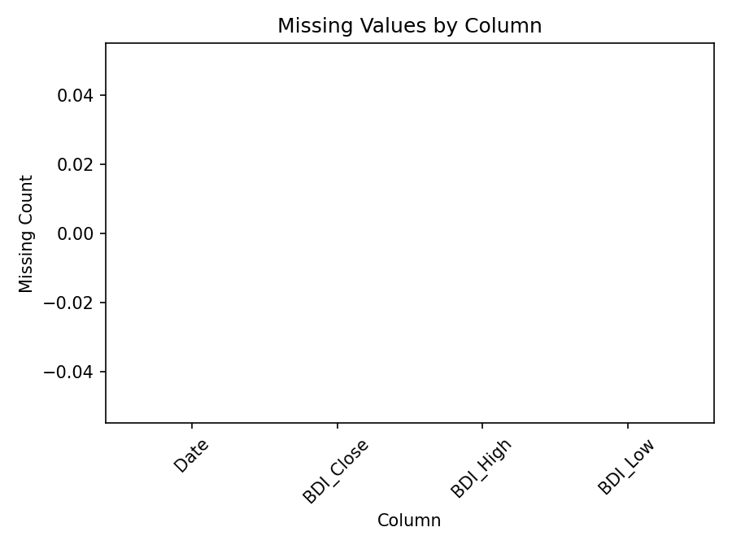
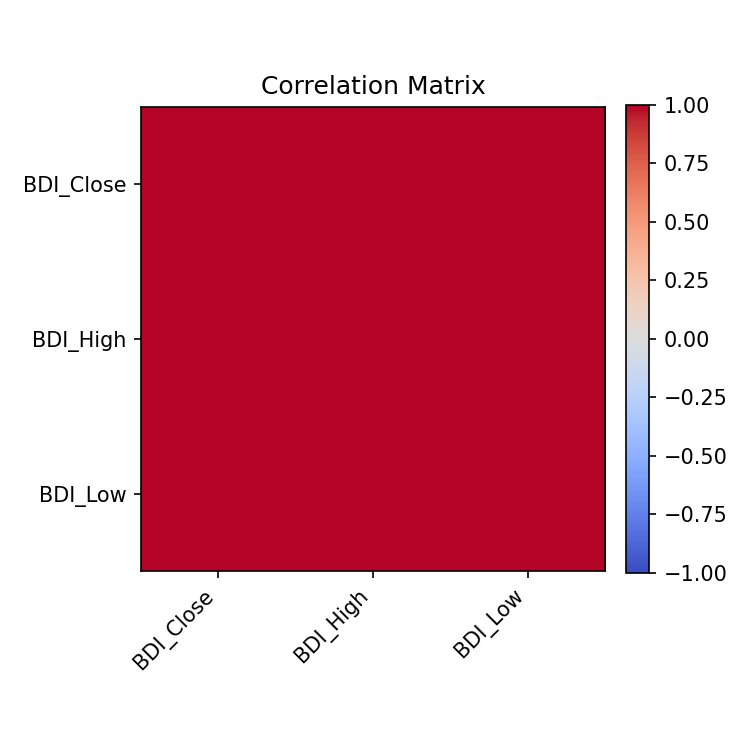

# Executive Summary

| Measure | Value |
| --- | --- |
| Dataset Name | 01_baltic_dry_index_daily.csv |
| Rows | 5992 |
| Columns | 4 |
| Date Range | 2000-01-04 to 2023-12-22 |
| Detected Frequency | Business-day-like |
| Missing Values | 0 |
| Duplicate Rows | 3 |
| Duplicate Dates | 3 |
| Outliers Detected | 1326 |
| Numeric Columns | 3 |
| Categorical Columns | 0 |
| Memory Usage | 485.81 KB |

## Dataset Overview

| Measure | Value |
| --- | --- |
| Rows | 5992 |
| Columns | 4 |
| Memory Usage | 485.81 KB |
| Shape | 5992 rows x 4 columns |
| Column Count | 4 |
| Numeric Columns | BDI_Close, BDI_High, BDI_Low |
| Numeric Column Count | 3 |
| Categorical Columns | None |
| Categorical Column Count | 0 |
| Datetime Columns | Date |
| Datetime Column Count | 1 |

## Column Profile

| Column | Data Type | Memory Usage | Missing Count | Missing % | Unique Values | Example Value |
| --- | --- | --- | --- | --- | --- | --- |
| Date | object | 345.24 KB | 0 | 0 | 5989 | 2000-01-04 |
| BDI_Close | float64 | 46.81 KB | 0 | 0 | 3108 | 1320 |
| BDI_High | float64 | 46.81 KB | 0 | 0 | 3108 | 1320 |
| BDI_Low | float64 | 46.81 KB | 0 | 0 | 3109 | 1320 |

## Preview

### First 5 Rows

| Date | BDI_Close | BDI_High | BDI_Low |
| --- | --- | --- | --- |
| 2000-01-04 | 1320 | 1320 | 1320 |
| 2000-01-05 | 1329 | 1329 | 1329 |
| 2000-01-06 | 1351 | 1351 | 1351 |
| 2000-01-07 | 1368 | 1368 | 1368 |
| 2000-01-10 | 1376 | 1376 | 1376 |

### Last 5 Rows

| Date | BDI_Close | BDI_High | BDI_Low |
| --- | --- | --- | --- |
| 2023-12-18 | 2288 | 2288 | 2288 |
| 2023-12-19 | 2219 | 2219 | 2219 |
| 2023-12-20 | 2150 | 2150 | 2150 |
| 2023-12-21 | 2087 | 2087 | 2087 |
| 2023-12-22 | 2094 | 2094 | 2094 |

## Data Quality

| Measure | Value |
| --- | --- |
| Missing values | 0 |
| Missing % | 0 |
| Duplicate rows | 3 |
| Duplicate dates | 3 |
| Infinite values | 0 |
| Zero values | 2 |
| Negative values | 0 |
| Constant columns | None |
| Near-constant columns | None |
| Potential identifier columns | None |
| Mixed data type columns | None |
| Object columns containing dates | Date |

### Numeric Sign Counts

| Column | Zero Values | Negative Values | Positive Values |
| --- | --- | --- | --- |
| BDI_Close | 0 | 0 | 5992 |
| BDI_High | 1 | 0 | 5991 |
| BDI_Low | 1 | 0 | 5991 |

## Missing Value Analysis

### Missing Count Per Column

| Column | Missing Count | Missing % |
| --- | --- | --- |
| Date | 0 | 0 |
| BDI_Close | 0 | 0 |
| BDI_High | 0 | 0 |
| BDI_Low | 0 | 0 |

Rows containing missing values: 0 (0.0%)

### Rows Containing Missing Values (First 10)

No records.

Grouped missing-value tables generated: 0

## Duplicate Analysis

Duplicate count: 3

### Preview Duplicate Records

| Date | BDI_Close | BDI_High | BDI_Low |
| --- | --- | --- | --- |
| 2020-01-02 | 976 | 976 | 976 |
| 2020-01-02 | 976 | 976 | 976 |
| 2020-01-03 | 907 | 907 | 907 |
| 2020-01-03 | 907 | 907 | 907 |
| 2020-01-06 | 844 | 844 | 844 |
| 2020-01-06 | 844 | 844 | 844 |

### Repeated Date Values

| Datetime Column | Duplicate Date Rows | Duplicate Date Values | Status | First Duplicated Dates |
| --- | --- | --- | --- | --- |
| Date | 3 | 3 | Detected | 2020-01-02, 2020-01-03, 2020-01-06 |

## Numeric Statistics

| Column | Count | Mean | Median | Mode | Minimum | Maximum | Range | Variance | Standard Deviation | Coefficient of Variation | IQR | Skewness | Kurtosis | Zero Count | Negative Count | Positive Count | Outlier Count Using IQR |
| --- | --- | --- | --- | --- | --- | --- | --- | --- | --- | --- | --- | --- | --- | --- | --- | --- | --- |
| BDI_Close | 5992 | 2244.14 | 1559 | 978 | 290 | 11793 | 11503 | 3.72986e+06 | 1931.28 | 0.860591 | 1671 | 2.23367 | 5.62304 | 0 | 0 | 5992 | 442 |
| BDI_High | 5992 | 2243.95 | 1559 | 978 | 0 | 11793 | 11793 | 3.7306e+06 | 1931.48 | 0.86075 | 1671.25 | 2.23307 | 5.62079 | 1 | 0 | 5991 | 442 |
| BDI_Low | 5992 | 2243.88 | 1559 | 978 | 0 | 11793 | 11793 | 3.73059e+06 | 1931.47 | 0.860774 | 1671.25 | 2.23315 | 5.62114 | 1 | 0 | 5991 | 442 |

## Categorical Statistics

Categorical columns detected: 0

## Datetime Analysis

| Column | Earliest Date | Latest Date | Date Span Days | Unique Dates | Duplicate Dates | Chronological Ordering | Monotonic Increasing | Estimated Frequency | Median Spacing | Most Common Spacing |
| --- | --- | --- | --- | --- | --- | --- | --- | --- | --- | --- |
| Date | 2000-01-04 | 2023-12-22 | 8753 | 5989 | 3 | True | False | Business-day-like | 1 days 00:00:00 | 1 days 00:00:00 |

## Join Key Analysis

No candidate join keys detected.

## Correlation Analysis

| Column | BDI_Close | BDI_High | BDI_Low |
| --- | --- | --- | --- |
| BDI_Close | 1 | 0.999957 | 0.999957 |
| BDI_High | 0.999957 | 1 | 0.999999 |
| BDI_Low | 0.999957 | 0.999999 | 1 |

| Measure | Columns | Correlation |
| --- | --- | --- |
| Highest correlation pair | BDI_High \| BDI_Low | 0.999999 |
| Lowest correlation pair | BDI_Close \| BDI_High | 0.999957 |

## Distribution Analysis

## Time-Series Diagnostics

| Column | Regular Frequency | Estimated Frequency | Missing Periods | Duplicate Periods | Business-Day Applicable | Business-Day Continuity % | Missing Business Days | Unexpected Weekday Gaps | Monthly Applicable | Monthly Continuity % | Missing Months |
| --- | --- | --- | --- | --- | --- | --- | --- | --- | --- | --- | --- |
| Date | False | Business-day-like | 265 | 3 | True | 95.76 | 265 | 265 | False | Not applicable | Not applicable |

## Dataset-Specific Checks

Dataset-specific rule: Baltic Dry Index

| Measure | Value |
| --- | --- |
| Duplicate trading days | 3 |
| Unexpected weekday gaps | 265 |
| Business-day continuity percent | 95.76 |
| Observed business days | 5989 |
| Expected business days | 6254 |
| Weekend records | 0 |
| Date continuity on business-day calendar | False |
| First missing business days | 2000-04-14, 2000-04-21, 2000-04-24, 2000-05-01, 2000-05-15, 2000-05-29, 2000-08-04, 2000-08-28, 2000-12-25, 2000-12-26 |
| Zero values across numeric columns | 2 |

### Zero values by numeric column

| column | zero_count |
| --- | --- |
| BDI_Close | 0 |
| BDI_High | 1 |
| BDI_Low | 1 |

## Pipeline Impact

| Measured Observation | Measured Value |
| --- | --- |
| Object columns containing date-like values | Date |
| Duplicate rows present | 3 |
| Duplicate datetime values present | 3 |
| Datetime frequency detected for Date | Business-day-like |
| Numeric measure-like column names present | BDI_Close, BDI_High, BDI_Low |
| Dataset-specific rule applied | Baltic Dry Index |

## Figures

| Figure | Saved File |
| --- | --- |
| Missing-value plot | 01_baltic_dry_index_daily_missing.png |
| Correlation heatmap | 01_baltic_dry_index_daily_correlation.png |
| Histograms | 01_baltic_dry_index_daily_histogram.png |
| Boxplots | 01_baltic_dry_index_daily_boxplot.png |
| Time-series plot | 01_baltic_dry_index_daily_timeseries.png |

