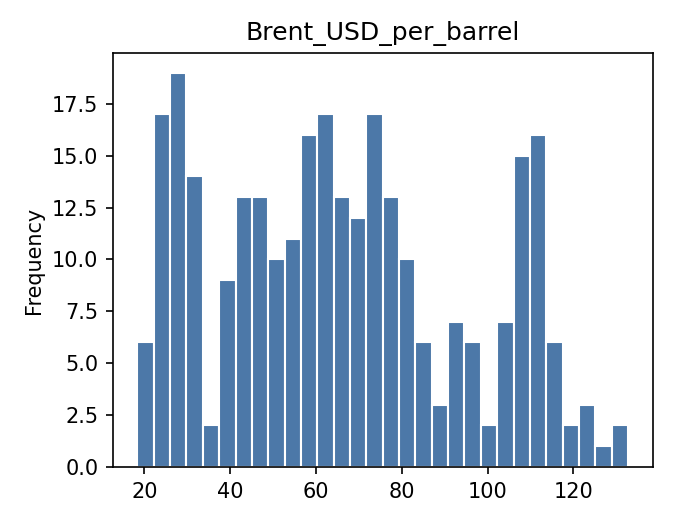
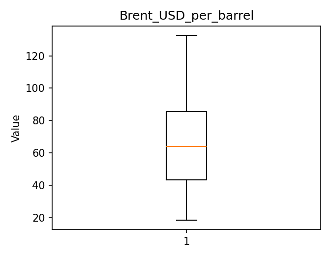
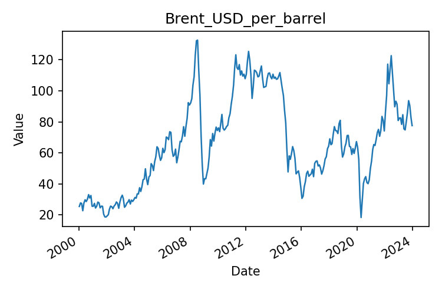
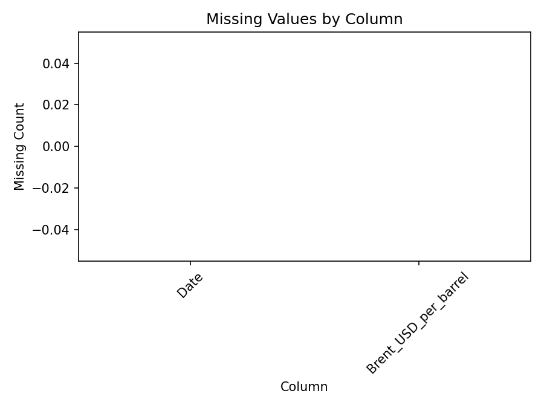

# Executive Summary

| Measure | Value |
| --- | --- |
| Dataset Name | 02_brent_crude_monthly.csv |
| Rows | 288 |
| Columns | 2 |
| Date Range | 2000-01-15 to 2023-12-15 |
| Detected Frequency | Monthly-like |
| Missing Values | 0 |
| Duplicate Rows | 0 |
| Duplicate Dates | 0 |
| Outliers Detected | 0 |
| Numeric Columns | 1 |
| Categorical Columns | 0 |
| Memory Usage | 18.97 KB |

## Dataset Overview

| Measure | Value |
| --- | --- |
| Rows | 288 |
| Columns | 2 |
| Memory Usage | 18.97 KB |
| Shape | 288 rows x 2 columns |
| Column Count | 2 |
| Numeric Columns | Brent_USD_per_barrel |
| Numeric Column Count | 1 |
| Categorical Columns | None |
| Categorical Column Count | 0 |
| Datetime Columns | Date |
| Datetime Column Count | 1 |

## Column Profile

| Column | Data Type | Memory Usage | Missing Count | Missing % | Unique Values | Example Value |
| --- | --- | --- | --- | --- | --- | --- |
| Date | object | 16.59 KB | 0 | 0 | 288 | 2000-01-15 |
| Brent_USD_per_barrel | float64 | 2.25 KB | 0 | 0 | 286 | 25.51 |

## Preview

### First 5 Rows

| Date | Brent_USD_per_barrel |
| --- | --- |
| 2000-01-15 | 25.51 |
| 2000-02-15 | 27.78 |
| 2000-03-15 | 27.49 |
| 2000-04-15 | 22.76 |
| 2000-05-15 | 27.74 |

### Last 5 Rows

| Date | Brent_USD_per_barrel |
| --- | --- |
| 2023-08-15 | 86.15 |
| 2023-09-15 | 93.72 |
| 2023-10-15 | 90.6 |
| 2023-11-15 | 82.94 |
| 2023-12-15 | 77.63 |

## Data Quality

| Measure | Value |
| --- | --- |
| Missing values | 0 |
| Missing % | 0 |
| Duplicate rows | 0 |
| Duplicate dates | 0 |
| Infinite values | 0 |
| Zero values | 0 |
| Negative values | 0 |
| Constant columns | None |
| Near-constant columns | None |
| Potential identifier columns | None |
| Mixed data type columns | None |
| Object columns containing dates | Date |

### Numeric Sign Counts

| Column | Zero Values | Negative Values | Positive Values |
| --- | --- | --- | --- |
| Brent_USD_per_barrel | 0 | 0 | 288 |

## Missing Value Analysis

### Missing Count Per Column

| Column | Missing Count | Missing % |
| --- | --- | --- |
| Date | 0 | 0 |
| Brent_USD_per_barrel | 0 | 0 |

Rows containing missing values: 0 (0.0%)

### Rows Containing Missing Values (First 10)

No records.

Grouped missing-value tables generated: 0

## Duplicate Analysis

Duplicate count: 0

### Preview Duplicate Records

No records.

### Repeated Date Values

| Datetime Column | Duplicate Date Rows | Duplicate Date Values | Status | First Duplicated Dates |
| --- | --- | --- | --- | --- |
| Date | 0 | 0 | No duplicates | None |

## Numeric Statistics

| Column | Count | Mean | Median | Mode | Minimum | Maximum | Range | Variance | Standard Deviation | Coefficient of Variation | IQR | Skewness | Kurtosis | Zero Count | Negative Count | Positive Count | Outlier Count Using IQR |
| --- | --- | --- | --- | --- | --- | --- | --- | --- | --- | --- | --- | --- | --- | --- | --- | --- | --- |
| Brent_USD_per_barrel | 288 | 66.1148 | 63.94 | 25.62 | 18.38 | 132.72 | 114.34 | 853.153 | 29.2088 | 0.441789 | 42.2675 | 0.2793 | -0.929786 | 0 | 0 | 288 | 0 |

## Categorical Statistics

Categorical columns detected: 0

## Datetime Analysis

| Column | Earliest Date | Latest Date | Date Span Days | Unique Dates | Duplicate Dates | Chronological Ordering | Monotonic Increasing | Estimated Frequency | Median Spacing | Most Common Spacing |
| --- | --- | --- | --- | --- | --- | --- | --- | --- | --- | --- |
| Date | 2000-01-15 | 2023-12-15 | 8735 | 288 | 0 | True | True | Monthly-like | 31 days 00:00:00 | 31 days 00:00:00 |

## Join Key Analysis

| Candidate Key | Classification |
| --- | --- |
| Date | Candidate Key |

## Correlation Analysis

Numeric columns available for correlation: fewer than 2

## Distribution Analysis

## Time-Series Diagnostics

| Column | Regular Frequency | Estimated Frequency | Missing Periods | Duplicate Periods | Business-Day Applicable | Business-Day Continuity % | Missing Business Days | Unexpected Weekday Gaps | Monthly Applicable | Monthly Continuity % | Missing Months |
| --- | --- | --- | --- | --- | --- | --- | --- | --- | --- | --- | --- |
| Date | True | Monthly-like | 0 | 0 | False | Not applicable | Not applicable | Not applicable | True | 100 | 0 |

## Dataset-Specific Checks

Dataset-specific rule: Brent Crude

| Measure | Value |
| --- | --- |
| Monthly continuity percent | 100 |
| Duplicate months | 0 |
| Missing months | 0 |
| Unique months | 288 |
| Expected months | 288 |
| First missing months | None |
| Chronological ordering | True |

## Pipeline Impact

| Measured Observation | Measured Value |
| --- | --- |
| Object columns containing date-like values | Date |
| Datetime frequency detected for Date | Monthly-like |
| Numeric measure-like column names present | Brent_USD_per_barrel |
| Dataset-specific rule applied | Brent Crude |

## Figures

| Figure | Saved File |
| --- | --- |
| Missing-value plot | 02_brent_crude_monthly_missing.png |
| Correlation heatmap | Not generated |
| Histograms | 02_brent_crude_monthly_histogram.png |
| Boxplots | 02_brent_crude_monthly_boxplot.png |
| Time-series plot | 02_brent_crude_monthly_timeseries.png |

- Correlation Heatmap: Not generated
