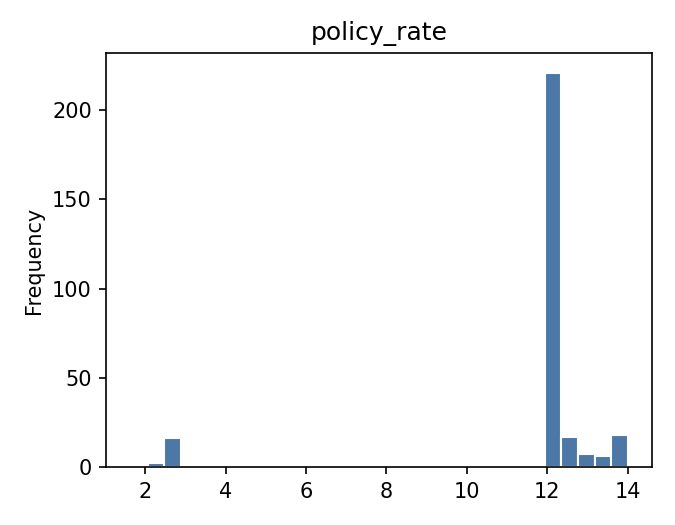
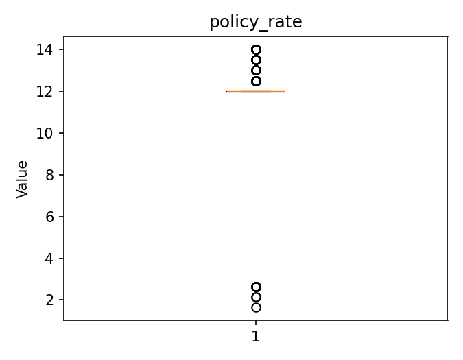
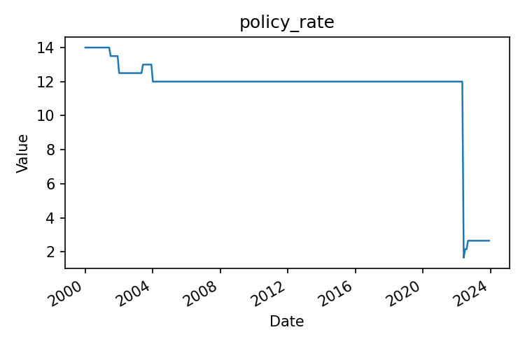
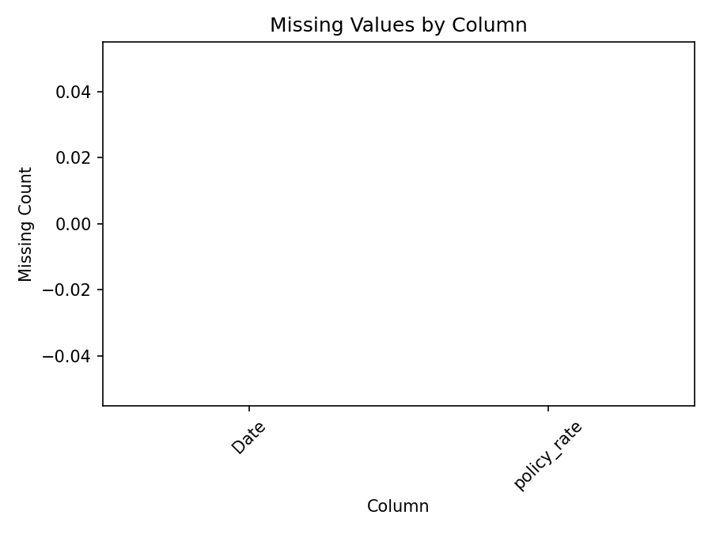

# Executive Summary

| Measure | Value |
| --- | --- |
| Dataset Name | 03_botswana_policy_rate.csv |
| Rows | 288 |
| Columns | 2 |
| Date Range | 2000-01-01 to 2023-12-01 |
| Detected Frequency | MS |
| Missing Values | 0 |
| Duplicate Rows | 0 |
| Duplicate Dates | 0 |
| Outliers Detected | 67 |
| Numeric Columns | 1 |
| Categorical Columns | 0 |
| Memory Usage | 18.97 KB |

## Dataset Overview

| Measure | Value |
| --- | --- |
| Rows | 288 |
| Columns | 2 |
| Memory Usage | 18.97 KB |
| Shape | 288 rows x 2 columns |
| Column Count | 2 |
| Numeric Columns | policy_rate |
| Numeric Column Count | 1 |
| Categorical Columns | None |
| Categorical Column Count | 0 |
| Datetime Columns | Date |
| Datetime Column Count | 1 |

## Column Profile

| Column | Data Type | Memory Usage | Missing Count | Missing % | Unique Values | Example Value |
| --- | --- | --- | --- | --- | --- | --- |
| Date | object | 16.59 KB | 0 | 0 | 288 | 2000-01-01 |
| policy_rate | float64 | 2.25 KB | 0 | 0 | 8 | 14 |

## Preview

### First 5 Rows

| Date | policy_rate |
| --- | --- |
| 2000-01-01 | 14 |
| 2000-02-01 | 14 |
| 2000-03-01 | 14 |
| 2000-04-01 | 14 |
| 2000-05-01 | 14 |

### Last 5 Rows

| Date | policy_rate |
| --- | --- |
| 2023-08-01 | 2.65 |
| 2023-09-01 | 2.65 |
| 2023-10-01 | 2.65 |
| 2023-11-01 | 2.65 |
| 2023-12-01 | 2.65 |

## Data Quality

| Measure | Value |
| --- | --- |
| Missing values | 0 |
| Missing % | 0 |
| Duplicate rows | 0 |
| Duplicate dates | 0 |
| Infinite values | 0 |
| Zero values | 0 |
| Negative values | 0 |
| Constant columns | None |
| Near-constant columns | None |
| Potential identifier columns | None |
| Mixed data type columns | None |
| Object columns containing dates | Date |

### Numeric Sign Counts

| Column | Zero Values | Negative Values | Positive Values |
| --- | --- | --- | --- |
| policy_rate | 0 | 0 | 288 |

## Missing Value Analysis

### Missing Count Per Column

| Column | Missing Count | Missing % |
| --- | --- | --- |
| Date | 0 | 0 |
| policy_rate | 0 | 0 |

Rows containing missing values: 0 (0.0%)

### Rows Containing Missing Values (First 10)

No records.

Grouped missing-value tables generated: 0

## Duplicate Analysis

Duplicate count: 0

### Preview Duplicate Records

No records.

### Repeated Date Values

| Datetime Column | Duplicate Date Rows | Duplicate Date Values | Status | First Duplicated Dates |
| --- | --- | --- | --- | --- |
| Date | 0 | 0 | No duplicates | None |

## Numeric Statistics

| Column | Count | Mean | Median | Mode | Minimum | Maximum | Range | Variance | Standard Deviation | Coefficient of Variation | IQR | Skewness | Kurtosis | Zero Count | Negative Count | Positive Count | Outlier Count Using IQR |
| --- | --- | --- | --- | --- | --- | --- | --- | --- | --- | --- | --- | --- | --- | --- | --- | --- | --- |
| policy_rate | 288 | 11.5863 | 12 | 12 | 1.65 | 14 | 12.35 | 6.08844 | 2.46748 | 0.212965 | 0 | -3.20807 | 9.29018 | 0 | 0 | 288 | 67 |

## Categorical Statistics

Categorical columns detected: 0

## Datetime Analysis

| Column | Earliest Date | Latest Date | Date Span Days | Unique Dates | Duplicate Dates | Chronological Ordering | Monotonic Increasing | Estimated Frequency | Median Spacing | Most Common Spacing |
| --- | --- | --- | --- | --- | --- | --- | --- | --- | --- | --- |
| Date | 2000-01-01 | 2023-12-01 | 8735 | 288 | 0 | True | True | MS | 31 days 00:00:00 | 31 days 00:00:00 |

## Join Key Analysis

| Candidate Key | Classification |
| --- | --- |
| Date | Candidate Key |

## Correlation Analysis

Numeric columns available for correlation: fewer than 2

## Distribution Analysis

## Time-Series Diagnostics

| Column | Regular Frequency | Estimated Frequency | Missing Periods | Duplicate Periods | Business-Day Applicable | Business-Day Continuity % | Missing Business Days | Unexpected Weekday Gaps | Monthly Applicable | Monthly Continuity % | Missing Months |
| --- | --- | --- | --- | --- | --- | --- | --- | --- | --- | --- | --- |
| Date | True | MS | 0 | 0 | False | Not applicable | Not applicable | Not applicable | True | 100 | 0 |

## Dataset-Specific Checks

Dataset-specific rule: Botswana Policy Rate

| Measure | Value |
| --- | --- |
| Number of policy changes | 7 |
| Dates of changes | 2001-07-01, 2002-01-01, 2003-06-01, 2004-01-01, 2022-06-01, 2022-07-01, 2022-09-01 |
| Longest unchanged period start | 2004-01-01 |
| Longest unchanged period end | 2022-05-01 |
| Longest unchanged period records | 221 |
| Longest unchanged period days | 6695 |
| Negative policy_rate values | 0 |
| Zero policy_rate values | 0 |

### Policy change records

| date | policy_rate |
| --- | --- |
| 2001-07-01 | 13.5 |
| 2002-01-01 | 12.5 |
| 2003-06-01 | 13 |
| 2004-01-01 | 12 |
| 2022-06-01 | 1.65 |
| 2022-07-01 | 2.15 |
| 2022-09-01 | 2.65 |

## Pipeline Impact

| Measured Observation | Measured Value |
| --- | --- |
| Object columns containing date-like values | Date |
| Datetime frequency detected for Date | MS |
| Numeric measure-like column names present | policy_rate |
| Dataset-specific rule applied | Botswana Policy Rate |

## Figures

| Figure | Saved File |
| --- | --- |
| Missing-value plot | 03_botswana_policy_rate_missing.png |
| Correlation heatmap | Not generated |
| Histograms | 03_botswana_policy_rate_histogram.png |
| Boxplots | 03_botswana_policy_rate_boxplot.png |
| Time-series plot | 03_botswana_policy_rate_timeseries.png |

- Correlation Heatmap: Not generated
