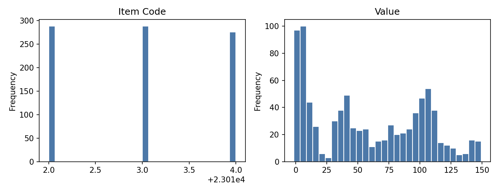
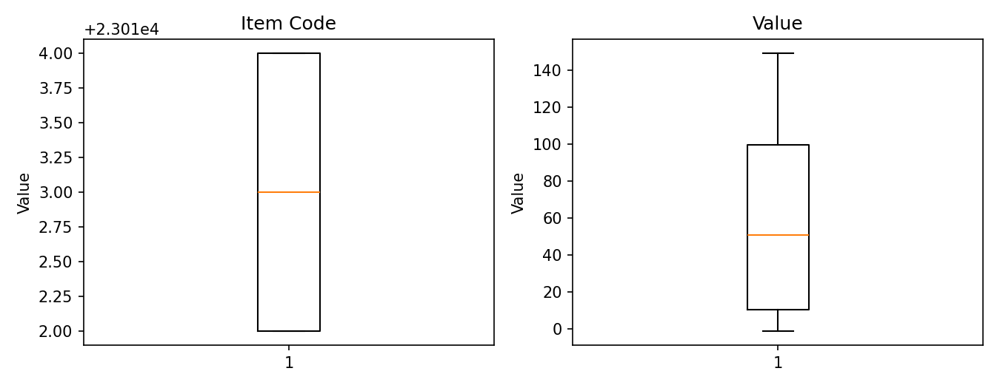
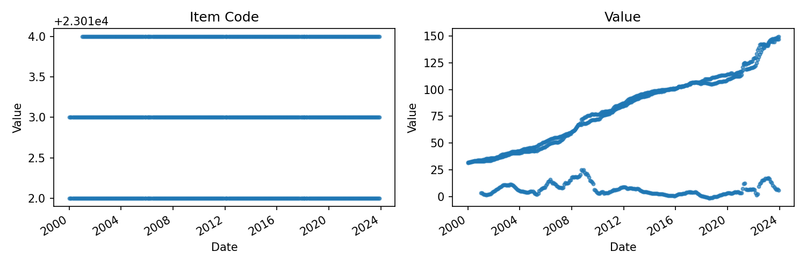
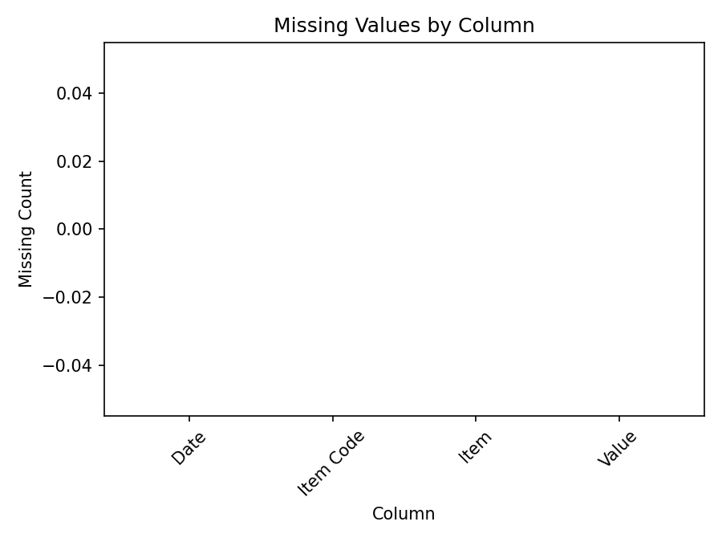

# Executive Summary

| Measure | Value |
| --- | --- |
| Dataset Name | 04_fao_botswana_prices.csv |
| Rows | 852 |
| Columns | 4 |
| Date Range | 2000-01-01 to 2023-12-01 |
| Detected Frequency | MS |
| Missing Values | 0 |
| Duplicate Rows | 0 |
| Duplicate Dates | 0 |
| Outliers Detected | 0 |
| Numeric Columns | 2 |
| Categorical Columns | 1 |
| Memory Usage | 133.16 KB |

## Dataset Overview

| Measure | Value |
| --- | --- |
| Rows | 852 |
| Columns | 4 |
| Memory Usage | 133.16 KB |
| Shape | 852 rows x 4 columns |
| Column Count | 4 |
| Numeric Columns | Item Code, Value |
| Numeric Column Count | 2 |
| Categorical Columns | Item |
| Categorical Column Count | 1 |
| Datetime Columns | Date |
| Datetime Column Count | 1 |

## Column Profile

| Column | Data Type | Memory Usage | Missing Count | Missing % | Unique Values | Example Value |
| --- | --- | --- | --- | --- | --- | --- |
| Date | object | 49.09 KB | 0 | 0 | 288 | 2000-01-01 |
| Item Code | int64 | 6.66 KB | 0 | 0 | 3 | 23012 |
| Item | object | 70.63 KB | 0 | 0 | 3 | Consumer Prices, General Indices (2015 = 100) |
| Value | float64 | 6.66 KB | 0 | 0 | 801 | 31.7483 |

## Preview

### First 5 Rows

| Date | Item Code | Item | Value |
| --- | --- | --- | --- |
| 2000-01-01 | 23012 | Consumer Prices, General Indices (2015 = 100) | 31.7483 |
| 2000-01-01 | 23013 | Consumer Prices, Food Indices (2015 = 100) | 31.9124 |
| 2000-02-01 | 23012 | Consumer Prices, General Indices (2015 = 100) | 31.9749 |
| 2000-02-01 | 23013 | Consumer Prices, Food Indices (2015 = 100) | 32.163 |
| 2000-03-01 | 23012 | Consumer Prices, General Indices (2015 = 100) | 32.277 |

### Last 5 Rows

| Date | Item Code | Item | Value |
| --- | --- | --- | --- |
| 2023-11-01 | 23013 | Consumer Prices, Food Indices (2015 = 100) | 148.983 |
| 2023-11-01 | 23014 | Food price inflation | 7.26112 |
| 2023-12-01 | 23012 | Consumer Prices, General Indices (2015 = 100) | 146.862 |
| 2023-12-01 | 23013 | Consumer Prices, Food Indices (2015 = 100) | 149.354 |
| 2023-12-01 | 23014 | Food price inflation | 6.07706 |

## Data Quality

| Measure | Value |
| --- | --- |
| Missing values | 0 |
| Missing % | 0 |
| Duplicate rows | 0 |
| Duplicate dates | 0 |
| Infinite values | 0 |
| Zero values | 1 |
| Negative values | 10 |
| Constant columns | None |
| Near-constant columns | None |
| Potential identifier columns | None |
| Mixed data type columns | None |
| Object columns containing dates | Date |

### Numeric Sign Counts

| Column | Zero Values | Negative Values | Positive Values |
| --- | --- | --- | --- |
| Item Code | 0 | 0 | 852 |
| Value | 1 | 10 | 841 |

## Missing Value Analysis

### Missing Count Per Column

| Column | Missing Count | Missing % |
| --- | --- | --- |
| Date | 0 | 0 |
| Item Code | 0 | 0 |
| Item | 0 | 0 |
| Value | 0 | 0 |

Rows containing missing values: 0 (0.0%)

### Rows Containing Missing Values (First 10)

No records.

Grouped missing-value tables generated: 0

## Duplicate Analysis

Duplicate count: 0

### Preview Duplicate Records

No records.

### Repeated Date Values

Expected (Long/Panel Structure)

## Numeric Statistics

| Column | Count | Mean | Median | Mode | Minimum | Maximum | Range | Variance | Standard Deviation | Coefficient of Variation | IQR | Skewness | Kurtosis | Zero Count | Negative Count | Positive Count | Outlier Count Using IQR |
| --- | --- | --- | --- | --- | --- | --- | --- | --- | --- | --- | --- | --- | --- | --- | --- | --- | --- |
| Item Code | 852 | 23013 | 23013 | 23012 | 23012 | 23014 | 2 | 0.662551 | 0.813972 | 3.53701e-05 | 2 | 0.025829 | -1.49017 | 0 | 0 | 852 | 0 |
| Value | 852 | 57.552 | 50.6808 | 33.0101 | -1.35266 | 149.354 | 150.707 | 1966.88 | 44.3495 | 0.770599 | 89.1818 | 0.230902 | -1.26854 | 1 | 10 | 841 | 0 |

## Categorical Statistics

### Item

Unique values: 3

| Top 10 Values | Frequency | Frequency % |
| --- | --- | --- |
| Consumer Prices, General Indices (2015 = 100) | 288 | 33.8 |
| Consumer Prices, Food Indices (2015 = 100) | 288 | 33.8 |
| Food price inflation | 276 | 32.39 |

## Datetime Analysis

| Column | Earliest Date | Latest Date | Date Span Days | Unique Dates | Duplicate Dates | Chronological Ordering | Monotonic Increasing | Estimated Frequency | Median Spacing | Most Common Spacing |
| --- | --- | --- | --- | --- | --- | --- | --- | --- | --- | --- |
| Date | 2000-01-01 | 2023-12-01 | 8735 | 288 | 564 | True | False | MS | 31 days 00:00:00 | 31 days 00:00:00 |

## Join Key Analysis

| Candidate Key | Classification |
| --- | --- |
| Date + Item Code | Composite Candidate Key |

## Correlation Analysis

Numeric columns available for correlation: fewer than 2

## Distribution Analysis

## Time-Series Diagnostics

| Column | Regular Frequency | Estimated Frequency | Missing Periods | Duplicate Periods | Business-Day Applicable | Business-Day Continuity % | Missing Business Days | Unexpected Weekday Gaps | Monthly Applicable | Monthly Continuity % | Missing Months |
| --- | --- | --- | --- | --- | --- | --- | --- | --- | --- | --- | --- |
| Date | False | MS | 0 | 564 | False | Not applicable | Not applicable | Not applicable | True | 100 | 0 |

## Dataset-Specific Checks

Dataset-specific rule: FAO Botswana

| Measure | Value |
| --- | --- |
| Unique items | 3 |
| Unique item codes | 3 |
| Value column present | True |
| Identifier columns present | Date, Item Code, Item |
| Long-structure columns present | True |
| Long vs wide structure | long |
| Wide numeric measure columns | None |
| Unique months | 288 |
| Missing months | 0 |
| Duplicate item-month combinations | 0 |

### Duplicate item-month preview

Records: 0

## Pipeline Impact

| Measured Observation | Measured Value |
| --- | --- |
| Object columns containing date-like values | Date |
| Datetime frequency detected for Date | MS |
| Long-structure columns present | Date, Item Code, Item |
| Numeric measure-like column names present | Value |
| Dataset-specific rule applied | FAO Botswana |

## Figures

| Figure | Saved File |
| --- | --- |
| Missing-value plot | 04_fao_botswana_prices_missing.png |
| Correlation heatmap | Not generated |
| Histograms | 04_fao_botswana_prices_histogram.png |
| Boxplots | 04_fao_botswana_prices_boxplot.png |
| Time-series plot | 04_fao_botswana_prices_timeseries.png |

- Correlation Heatmap: Not generated
