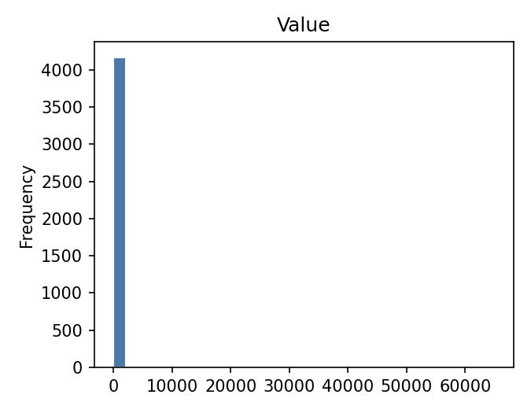
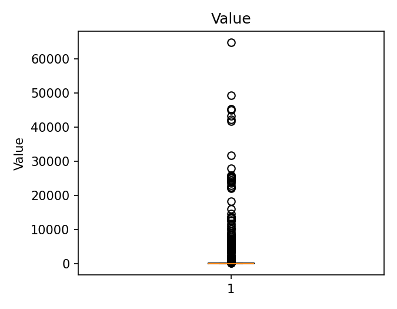
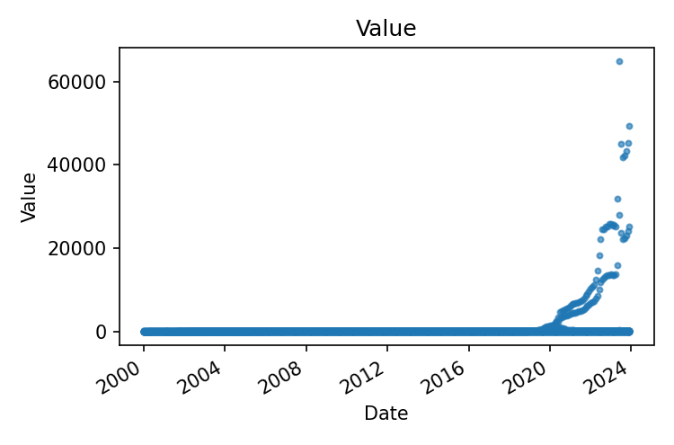
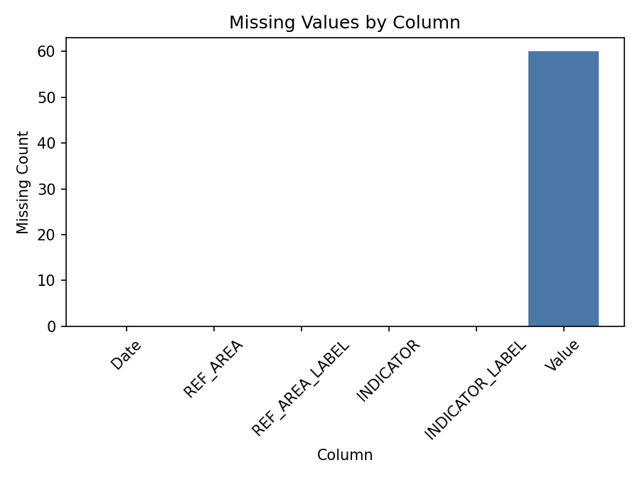

# Executive Summary

| Measure | Value |
| --- | --- |
| Dataset Name | 05_human_capital_project.csv |
| Rows | 4320 |
| Columns | 6 |
| Date Range | 2000-01-01 to 2023-12-01 |
| Detected Frequency | MS |
| Missing Values | 60 |
| Duplicate Rows | 0 |
| Duplicate Dates | 0 |
| Outliers Detected | 133 |
| Numeric Columns | 1 |
| Categorical Columns | 4 |
| Memory Usage | 1.33 MB |

## Dataset Overview

| Measure | Value |
| --- | --- |
| Rows | 4320 |
| Columns | 6 |
| Memory Usage | 1.33 MB |
| Shape | 4320 rows x 6 columns |
| Column Count | 6 |
| Numeric Columns | Value |
| Numeric Column Count | 1 |
| Categorical Columns | REF_AREA, REF_AREA_LABEL, INDICATOR, INDICATOR_LABEL |
| Categorical Column Count | 4 |
| Datetime Columns | Date |
| Datetime Column Count | 1 |

## Column Profile

| Column | Data Type | Memory Usage | Missing Count | Missing % | Unique Values | Example Value |
| --- | --- | --- | --- | --- | --- | --- |
| Date | object | 248.91 KB | 0 | 0 | 288 | 2000-01-01 |
| REF_AREA | object | 219.38 KB | 0 | 0 | 5 | BWA |
| REF_AREA_LABEL | object | 240.47 KB | 0 | 0 | 5 | Botswana |
| INDICATOR | object | 257.34 KB | 0 | 0 | 3 | FAO_CP_23012 |
| INDICATOR_LABEL | object | 357.19 KB | 0 | 0 | 3 | Consumer Prices, General Indices (2015 = 100) |
| Value | float64 | 33.75 KB | 60 | 1.39 | 4013 | 31.7483 |

## Preview

### First 5 Rows

| Date | REF_AREA | REF_AREA_LABEL | INDICATOR | INDICATOR_LABEL | Value |
| --- | --- | --- | --- | --- | --- |
| 2000-01-01 | BWA | Botswana | FAO_CP_23012 | Consumer Prices, General Indices (2015 = 100) | 31.7483 |
| 2000-01-01 | BWA | Botswana | FAO_CP_23013 | Consumer Prices, Food Indices (2015 = 100) | 31.9124 |
| 2000-01-01 | BWA | Botswana | FAO_CP_23014 | Food price inflation | NaN |
| 2000-01-01 | KEN | Kenya | FAO_CP_23012 | Consumer Prices, General Indices (2015 = 100) | 23.8127 |
| 2000-01-01 | KEN | Kenya | FAO_CP_23013 | Consumer Prices, Food Indices (2015 = 100) | 19.7349 |

### Last 5 Rows

| Date | REF_AREA | REF_AREA_LABEL | INDICATOR | INDICATOR_LABEL | Value |
| --- | --- | --- | --- | --- | --- |
| 2023-12-01 | ZAF | South Africa | FAO_CP_23013 | Consumer Prices, Food Indices (2015 = 100) | 175.954 |
| 2023-12-01 | ZAF | South Africa | FAO_CP_23014 | Food price inflation | 8.62222 |
| 2023-12-01 | ZWE | Zimbabwe | FAO_CP_23012 | Consumer Prices, General Indices (2015 = 100) | 25157 |
| 2023-12-01 | ZWE | Zimbabwe | FAO_CP_23013 | Consumer Prices, Food Indices (2015 = 100) | 49313.1 |
| 2023-12-01 | ZWE | Zimbabwe | FAO_CP_23014 | Food price inflation | 91.0827 |

## Data Quality

| Measure | Value |
| --- | --- |
| Missing values | 60 |
| Missing % | 0.23 |
| Duplicate rows | 0 |
| Duplicate dates | 0 |
| Infinite values | 0 |
| Zero values | 1 |
| Negative values | 68 |
| Constant columns | None |
| Near-constant columns | None |
| Potential identifier columns | None |
| Mixed data type columns | None |
| Object columns containing dates | Date |

### Numeric Sign Counts

| Column | Zero Values | Negative Values | Positive Values |
| --- | --- | --- | --- |
| Value | 1 | 68 | 4191 |

## Missing Value Analysis

### Missing Count Per Column

| Column | Missing Count | Missing % |
| --- | --- | --- |
| Date | 0 | 0 |
| REF_AREA | 0 | 0 |
| REF_AREA_LABEL | 0 | 0 |
| INDICATOR | 0 | 0 |
| INDICATOR_LABEL | 0 | 0 |
| Value | 60 | 1.39 |

Rows containing missing values: 60 (1.39%)

### Rows Containing Missing Values (First 10)

| Date | REF_AREA | REF_AREA_LABEL | INDICATOR | INDICATOR_LABEL | Value |
| --- | --- | --- | --- | --- | --- |
| 2000-01-01 | BWA | Botswana | FAO_CP_23014 | Food price inflation | NaN |
| 2000-01-01 | KEN | Kenya | FAO_CP_23014 | Food price inflation | NaN |
| 2000-01-01 | NAM | Namibia | FAO_CP_23014 | Food price inflation | NaN |
| 2000-01-01 | ZAF | South Africa | FAO_CP_23014 | Food price inflation | NaN |
| 2000-01-01 | ZWE | Zimbabwe | FAO_CP_23014 | Food price inflation | NaN |
| 2000-02-01 | BWA | Botswana | FAO_CP_23014 | Food price inflation | NaN |
| 2000-02-01 | KEN | Kenya | FAO_CP_23014 | Food price inflation | NaN |
| 2000-02-01 | NAM | Namibia | FAO_CP_23014 | Food price inflation | NaN |
| 2000-02-01 | ZAF | South Africa | FAO_CP_23014 | Food price inflation | NaN |
| 2000-02-01 | ZWE | Zimbabwe | FAO_CP_23014 | Food price inflation | NaN |

### Missing Values Grouped by REF_AREA

| REF_AREA | Rows With Missing Values | Missing Cells |
| --- | --- | --- |
| BWA | 12 | 12 |
| KEN | 12 | 12 |
| NAM | 12 | 12 |
| ZAF | 12 | 12 |
| ZWE | 12 | 12 |

### Missing Values Grouped by REF_AREA_LABEL

| REF_AREA_LABEL | Rows With Missing Values | Missing Cells |
| --- | --- | --- |
| Botswana | 12 | 12 |
| Kenya | 12 | 12 |
| Namibia | 12 | 12 |
| South Africa | 12 | 12 |
| Zimbabwe | 12 | 12 |

### Missing Values Grouped by INDICATOR

| INDICATOR | Rows With Missing Values | Missing Cells |
| --- | --- | --- |
| FAO_CP_23014 | 60 | 60 |

### Missing Values Grouped by INDICATOR_LABEL

| INDICATOR_LABEL | Rows With Missing Values | Missing Cells |
| --- | --- | --- |
| Food price inflation | 60 | 60 |

### Missing Values Grouped by Year

| Year | Rows With Missing Values | Missing Cells |
| --- | --- | --- |
| 2000 | 60 | 60 |

## Duplicate Analysis

Duplicate count: 0

### Preview Duplicate Records

No records.

### Repeated Date Values

Expected (Long/Panel Structure)

## Numeric Statistics

| Column | Count | Mean | Median | Mode | Minimum | Maximum | Range | Variance | Standard Deviation | Coefficient of Variation | IQR | Skewness | Kurtosis | Zero Count | Negative Count | Positive Count | Outlier Count Using IQR |
| --- | --- | --- | --- | --- | --- | --- | --- | --- | --- | --- | --- | --- | --- | --- | --- | --- | --- |
| Value | 4260 | 365.804 | 61.4183 | 99.1231 | -14.1366 | 64932.5 | 64946.7 | 7.43711e+06 | 2727.11 | 7.45511 | 89.666 | 12.9084 | 201.882 | 1 | 68 | 4191 | 133 |

## Categorical Statistics

### REF_AREA

Unique values: 5

| Top 10 Values | Frequency | Frequency % |
| --- | --- | --- |
| BWA | 864 | 20 |
| KEN | 864 | 20 |
| NAM | 864 | 20 |
| ZAF | 864 | 20 |
| ZWE | 864 | 20 |

### REF_AREA_LABEL

Unique values: 5

| Top 10 Values | Frequency | Frequency % |
| --- | --- | --- |
| Botswana | 864 | 20 |
| Kenya | 864 | 20 |
| Namibia | 864 | 20 |
| South Africa | 864 | 20 |
| Zimbabwe | 864 | 20 |

### INDICATOR

Unique values: 3

| Top 10 Values | Frequency | Frequency % |
| --- | --- | --- |
| FAO_CP_23012 | 1440 | 33.33 |
| FAO_CP_23013 | 1440 | 33.33 |
| FAO_CP_23014 | 1440 | 33.33 |

### INDICATOR_LABEL

Unique values: 3

| Top 10 Values | Frequency | Frequency % |
| --- | --- | --- |
| Consumer Prices, General Indices (2015 = 100) | 1440 | 33.33 |
| Consumer Prices, Food Indices (2015 = 100) | 1440 | 33.33 |
| Food price inflation | 1440 | 33.33 |

## Datetime Analysis

| Column | Earliest Date | Latest Date | Date Span Days | Unique Dates | Duplicate Dates | Chronological Ordering | Monotonic Increasing | Estimated Frequency | Median Spacing | Most Common Spacing |
| --- | --- | --- | --- | --- | --- | --- | --- | --- | --- | --- |
| Date | 2000-01-01 | 2023-12-01 | 8735 | 288 | 4032 | True | False | MS | 31 days 00:00:00 | 31 days 00:00:00 |

## Join Key Analysis

| Candidate Key | Classification |
| --- | --- |
| Date + REF_AREA + INDICATOR | Composite Candidate Key |

## Correlation Analysis

Numeric columns available for correlation: fewer than 2

## Distribution Analysis

## Time-Series Diagnostics

| Column | Regular Frequency | Estimated Frequency | Missing Periods | Duplicate Periods | Business-Day Applicable | Business-Day Continuity % | Missing Business Days | Unexpected Weekday Gaps | Monthly Applicable | Monthly Continuity % | Missing Months |
| --- | --- | --- | --- | --- | --- | --- | --- | --- | --- | --- | --- |
| Date | False | MS | 0 | 4032 | False | Not applicable | Not applicable | Not applicable | True | 100 | 0 |

## Dataset-Specific Checks

Dataset-specific rule: Human Capital

| Measure | Value |
| --- | --- |
| Countries | 5 |
| Country labels | 5 |
| Indicators | 3 |
| Indicator labels | 3 |
| Years | 24 |
| Duplicate country-date records | 2880 |
| Duplicate country-indicator-date records | 0 |

### Missing values by country

| REF_AREA | missing_rows |
| --- | --- |
| BWA | 12 |
| KEN | 12 |
| NAM | 12 |
| ZAF | 12 |
| ZWE | 12 |

### Missing values by indicator

| INDICATOR | missing_rows |
| --- | --- |
| FAO_CP_23014 | 60 |

### Missing values by year

| Year | missing_rows |
| --- | --- |
| 2000 | 60 |

## Pipeline Impact

| Measured Observation | Measured Value |
| --- | --- |
| Object columns containing date-like values | Date |
| Missing values present | 60 |
| Datetime frequency detected for Date | MS |
| Long-structure columns present | Date, REF_AREA, INDICATOR, INDICATOR_LABEL |
| Numeric measure-like column names present | Value |
| Dataset-specific rule applied | Human Capital |

## Figures

| Figure | Saved File |
| --- | --- |
| Missing-value plot | 05_human_capital_project_missing.png |
| Correlation heatmap | Not generated |
| Histograms | 05_human_capital_project_histogram.png |
| Boxplots | 05_human_capital_project_boxplot.png |
| Time-series plot | 05_human_capital_project_timeseries.png |

- Correlation Heatmap: Not generated
