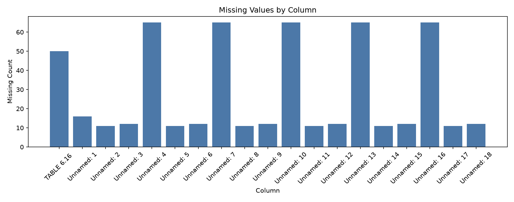
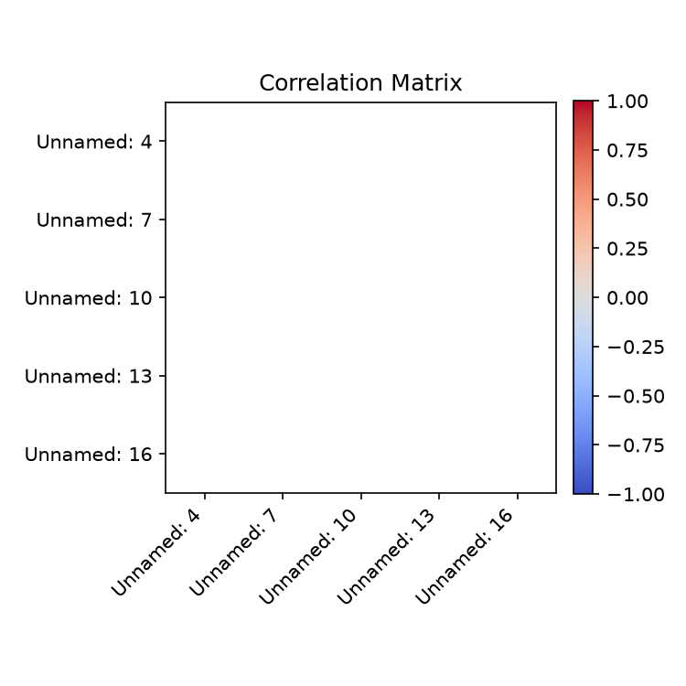

# Executive Summary

| Measure | Value |
| --- | --- |
| Dataset Name | 6-16.xlsx |
| Rows | 65 |
| Columns | 19 |
| Date Range | 0001-01-01 to 0001-12-01 |
| Detected Frequency | MS |
| Missing Values | 529 |
| Duplicate Rows | 6 |
| Duplicate Dates | 140 |
| Outliers Detected | 0 |
| Numeric Columns | 5 |
| Categorical Columns | 1 |
| Memory Usage | 32.90 KB |

## Dataset Overview

| Measure | Value |
| --- | --- |
| Rows | 65 |
| Columns | 19 |
| Memory Usage | 32.90 KB |
| Shape | 65 rows x 19 columns |
| Column Count | 19 |
| Numeric Columns | Unnamed: 4, Unnamed: 7, Unnamed: 10, Unnamed: 13, Unnamed: 16 |
| Numeric Column Count | 5 |
| Categorical Columns | TABLE 6.16  |
| Categorical Column Count | 1 |
| Datetime Columns | Unnamed: 1, Unnamed: 2, Unnamed: 3, Unnamed: 5, Unnamed: 6, Unnamed: 8, Unnamed: 9, Unnamed: 11, Unnamed: 12, Unnamed: 14, Unnamed: 15, Unnamed: 17, Unnamed: 18 |
| Datetime Column Count | 13 |

## Column Profile

| Column | Data Type | Memory Usage | Missing Count | Missing % | Unique Values | Example Value |
| --- | --- | --- | --- | --- | --- | --- |
| TABLE 6.16  | object | 2.22 KB | 50 | 76.92 | 16 | IMPORTS: OTHER PRINCIPAL IMPORTS1 |
| Unnamed: 1 | str | 3.16 KB | 16 | 24.62 | 19 |   |
| Unnamed: 2 | object | 2.07 KB | 11 | 16.92 | 55 | Fuel |
| Unnamed: 3 | object | 2.05 KB | 12 | 18.46 | 54 | Pula |
| Unnamed: 4 | float64 | 520 B | 65 | 100 | 1 |  |
| Unnamed: 5 | object | 2.09 KB | 11 | 16.92 | 55 | Food, Beverages & Tobacco |
| Unnamed: 6 | object | 2.06 KB | 12 | 18.46 | 54 | Pula |
| Unnamed: 7 | float64 | 520 B | 65 | 100 | 1 |  |
| Unnamed: 8 | object | 2.10 KB | 11 | 16.92 | 55 | Machinery & Electrical Equipment |
| Unnamed: 9 | object | 2.05 KB | 12 | 18.46 | 54 | Pula |
| Unnamed: 10 | float64 | 520 B | 65 | 100 | 1 |  |
| Unnamed: 11 | object | 2.09 KB | 11 | 16.92 | 55 | Chemical & Rubber Products |
| Unnamed: 12 | object | 2.05 KB | 12 | 18.46 | 54 | Pula |
| Unnamed: 13 | float64 | 520 B | 65 | 100 | 1 |  |
| Unnamed: 14 | object | 2.10 KB | 11 | 16.92 | 55 | Vehicles & Transport Equipment |
| Unnamed: 15 | object | 2.06 KB | 12 | 18.46 | 54 | Pula |
| Unnamed: 16 | float64 | 520 B | 65 | 100 | 1 |  |
| Unnamed: 17 | object | 2.09 KB | 11 | 16.92 | 55 | Metal & Metal Products |
| Unnamed: 18 | object | 2.06 KB | 12 | 18.46 | 54 | Pula |

## Preview

### First 5 Rows

| TABLE 6.16  | Unnamed: 1 | Unnamed: 2 | Unnamed: 3 | Unnamed: 4 | Unnamed: 5 | Unnamed: 6 | Unnamed: 7 | Unnamed: 8 | Unnamed: 9 | Unnamed: 10 | Unnamed: 11 | Unnamed: 12 | Unnamed: 13 | Unnamed: 14 | Unnamed: 15 | Unnamed: 16 | Unnamed: 17 | Unnamed: 18 |
| --- | --- | --- | --- | --- | --- | --- | --- | --- | --- | --- | --- | --- | --- | --- | --- | --- | --- | --- |
| NaN | NaN | NaN | NaN | NaN | NaN | NaN | NaN | NaN | NaN | NaN | NaN | NaN | NaN | NaN | NaN | NaN | NaN | NaN |
| IMPORTS: OTHER PRINCIPAL IMPORTS1 | NaN | NaN | NaN | NaN | NaN | NaN | NaN | NaN | NaN | NaN | NaN | NaN | NaN | NaN | NaN | NaN | NaN | NaN |
| (Million) | NaN | NaN | NaN | NaN | NaN | NaN | NaN | NaN | NaN | NaN | NaN | NaN | NaN | NaN | NaN | NaN | NaN | NaN |
| NaN | NaN | Fuel | NaN | NaN | Food, Beverages & Tobacco | NaN | NaN | Machinery & Electrical Equipment | NaN | NaN | Chemical & Rubber Products | NaN | NaN | Vehicles & Transport Equipment | NaN | NaN | Metal & Metal Products | NaN |
| NaN |   | US$ | Pula | NaN | US$ | Pula | NaN | US$ | Pula | NaN | US$ | Pula | NaN | US$ | Pula | NaN | US$ | Pula |

### Last 5 Rows

| TABLE 6.16  | Unnamed: 1 | Unnamed: 2 | Unnamed: 3 | Unnamed: 4 | Unnamed: 5 | Unnamed: 6 | Unnamed: 7 | Unnamed: 8 | Unnamed: 9 | Unnamed: 10 | Unnamed: 11 | Unnamed: 12 | Unnamed: 13 | Unnamed: 14 | Unnamed: 15 | Unnamed: 16 | Unnamed: 17 | Unnamed: 18 |
| --- | --- | --- | --- | --- | --- | --- | --- | --- | --- | --- | --- | --- | --- | --- | --- | --- | --- | --- |
| 2024 | Jan | 99.6981 | 1355.33 | NaN | 81.4306 | 1107 | NaN | 61.0982 | 830.59 | NaN | 67.2727 | 914.529 | NaN | 55.9652 | 760.81 | NaN | 23.8189 | 323.802 |
| NaN | Feb | 118.372 | 1622.8 | NaN | 81.3229 | 1114.88 | NaN | 89.9948 | 1233.77 | NaN | 64.0723 | 878.389 | NaN | 43.0259 | 589.857 | NaN | 31.2305 | 428.149 |
| NaN | Mar | 97.8324 | 1337.09 | NaN | 81.1401 | 1108.96 | NaN | 71.2577 | 973.892 | NaN | 53.9207 | 736.944 | NaN | 35.0697 | 479.304 | NaN | 26.2576 | 358.867 |
| 1. | Data is revised on a monthly basis to match Statistics Botswana latest updates and it might not tally with aggregates on tables 6.1, 6.2 and 6.3, which are revised on an annual basis.  | NaN | NaN | NaN | NaN | NaN | NaN | NaN | NaN | NaN | NaN | NaN | NaN | NaN | NaN | NaN | NaN | NaN |
| Source:        Statistics Botswana  | NaN | NaN | NaN | NaN | NaN | NaN | NaN | NaN | NaN | NaN | NaN | NaN | NaN | NaN | NaN | NaN | NaN | NaN |

## Data Quality

| Measure | Value |
| --- | --- |
| Missing values | 529 |
| Missing % | 42.83 |
| Duplicate rows | 6 |
| Duplicate dates | 140 |
| Infinite values | 0 |
| Zero values | 0 |
| Negative values | 0 |
| Constant columns | Unnamed: 4, Unnamed: 7, Unnamed: 10, Unnamed: 13, Unnamed: 16 |
| Near-constant columns | None |
| Potential identifier columns | None |
| Mixed data type columns | TABLE 6.16 , Unnamed: 2, Unnamed: 3, Unnamed: 5, Unnamed: 6, Unnamed: 8, Unnamed: 9, Unnamed: 11, Unnamed: 12, Unnamed: 14, Unnamed: 15, Unnamed: 17, Unnamed: 18 |
| Object columns containing dates | Unnamed: 1, Unnamed: 2, Unnamed: 3, Unnamed: 5, Unnamed: 6, Unnamed: 8, Unnamed: 9, Unnamed: 11, Unnamed: 12, Unnamed: 14, Unnamed: 15, Unnamed: 17, Unnamed: 18 |

### Numeric Sign Counts

| Column | Zero Values | Negative Values | Positive Values |
| --- | --- | --- | --- |
| Unnamed: 4 | 0 | 0 | 0 |
| Unnamed: 7 | 0 | 0 | 0 |
| Unnamed: 10 | 0 | 0 | 0 |
| Unnamed: 13 | 0 | 0 | 0 |
| Unnamed: 16 | 0 | 0 | 0 |

### Mixed Data Type Columns

| Column | Inferred Dtype | Python Types |
| --- | --- | --- |
| TABLE 6.16  | mixed-integer | int, str |
| Unnamed: 2 | mixed | float, str |
| Unnamed: 3 | mixed | float, str |
| Unnamed: 5 | mixed | float, str |
| Unnamed: 6 | mixed-integer | float, int, str |
| Unnamed: 8 | mixed | float, str |
| Unnamed: 9 | mixed | float, str |
| Unnamed: 11 | mixed | float, str |
| Unnamed: 12 | mixed | float, str |
| Unnamed: 14 | mixed | float, str |
| Unnamed: 15 | mixed-integer | float, int, str |
| Unnamed: 17 | mixed | float, str |
| Unnamed: 18 | mixed-integer | float, int, str |

## Missing Value Analysis

### Missing Count Per Column

| Column | Missing Count | Missing % |
| --- | --- | --- |
| TABLE 6.16  | 50 | 76.92 |
| Unnamed: 1 | 16 | 24.62 |
| Unnamed: 2 | 11 | 16.92 |
| Unnamed: 3 | 12 | 18.46 |
| Unnamed: 4 | 65 | 100 |
| Unnamed: 5 | 11 | 16.92 |
| Unnamed: 6 | 12 | 18.46 |
| Unnamed: 7 | 65 | 100 |
| Unnamed: 8 | 11 | 16.92 |
| Unnamed: 9 | 12 | 18.46 |
| Unnamed: 10 | 65 | 100 |
| Unnamed: 11 | 11 | 16.92 |
| Unnamed: 12 | 12 | 18.46 |
| Unnamed: 13 | 65 | 100 |
| Unnamed: 14 | 11 | 16.92 |
| Unnamed: 15 | 12 | 18.46 |
| Unnamed: 16 | 65 | 100 |
| Unnamed: 17 | 11 | 16.92 |
| Unnamed: 18 | 12 | 18.46 |

Rows containing missing values: 65 (100.0%)

### Rows Containing Missing Values (First 10)

| TABLE 6.16  | Unnamed: 1 | Unnamed: 2 | Unnamed: 3 | Unnamed: 4 | Unnamed: 5 | Unnamed: 6 | Unnamed: 7 | Unnamed: 8 | Unnamed: 9 | Unnamed: 10 | Unnamed: 11 | Unnamed: 12 | Unnamed: 13 | Unnamed: 14 | Unnamed: 15 | Unnamed: 16 | Unnamed: 17 | Unnamed: 18 |
| --- | --- | --- | --- | --- | --- | --- | --- | --- | --- | --- | --- | --- | --- | --- | --- | --- | --- | --- |
| NaN | NaN | NaN | NaN | NaN | NaN | NaN | NaN | NaN | NaN | NaN | NaN | NaN | NaN | NaN | NaN | NaN | NaN | NaN |
| IMPORTS: OTHER PRINCIPAL IMPORTS1 | NaN | NaN | NaN | NaN | NaN | NaN | NaN | NaN | NaN | NaN | NaN | NaN | NaN | NaN | NaN | NaN | NaN | NaN |
| (Million) | NaN | NaN | NaN | NaN | NaN | NaN | NaN | NaN | NaN | NaN | NaN | NaN | NaN | NaN | NaN | NaN | NaN | NaN |
| NaN | NaN | Fuel | NaN | NaN | Food, Beverages & Tobacco | NaN | NaN | Machinery & Electrical Equipment | NaN | NaN | Chemical & Rubber Products | NaN | NaN | Vehicles & Transport Equipment | NaN | NaN | Metal & Metal Products | NaN |
| NaN |   | US$ | Pula | NaN | US$ | Pula | NaN | US$ | Pula | NaN | US$ | Pula | NaN | US$ | Pula | NaN | US$ | Pula |
| 2014 | NaN | 1214.46 | 10894.9 | NaN | 700.781 | 6286.7 | NaN | 920.244 | 8255.5 | NaN | 654.398 | 5870.6 | NaN | 628.47 | 5638 | NaN | 312.262 | 2801.3 |
| 2015 | NaN | 901.651 | 9116.7 | NaN | 694.532 | 7022.5 | NaN | 910.394 | 9205.1 | NaN | 631.572 | 6385.9 | NaN | 526.262 | 5321.1 | NaN | 287.466 | 2906.6 |
| 2016 | NaN | 794.399 | 8652.2 | NaN | 686.774 | 7480 | NaN | 843.74 | 9189.6 | NaN | 602.451 | 6561.6 | NaN | 462.315 | 5035.3 | NaN | 279.668 | 3046 |
| 2017 | NaN | 783.108 | 8100.89 | NaN | 672.616 | 6957.9 | NaN | 701.066 | 7252.21 | NaN | 549.161 | 5680.82 | NaN | 402.647 | 4165.2 | NaN | 239.648 | 2479.05 |
| 2018 | NaN | 833.35 | 8515.4 | NaN | 776.018 | 7915.33 | NaN | 825.885 | 8431.74 | NaN | 560.156 | 5726.72 | NaN | 519.823 | 5308.62 | NaN | 284.713 | 2910.81 |

### Missing Values Grouped by Year

| Year | Rows With Missing Values | Missing Cells |
| --- | --- | --- |
| NaN | 26 | 299 |
| 1 | 39 | 230 |

## Duplicate Analysis

Duplicate count: 6

### Preview Duplicate Records

| TABLE 6.16  | Unnamed: 1 | Unnamed: 2 | Unnamed: 3 | Unnamed: 4 | Unnamed: 5 | Unnamed: 6 | Unnamed: 7 | Unnamed: 8 | Unnamed: 9 | Unnamed: 10 | Unnamed: 11 | Unnamed: 12 | Unnamed: 13 | Unnamed: 14 | Unnamed: 15 | Unnamed: 16 | Unnamed: 17 | Unnamed: 18 |
| --- | --- | --- | --- | --- | --- | --- | --- | --- | --- | --- | --- | --- | --- | --- | --- | --- | --- | --- |
| NaN | NaN | NaN | NaN | NaN | NaN | NaN | NaN | NaN | NaN | NaN | NaN | NaN | NaN | NaN | NaN | NaN | NaN | NaN |
| NaN | NaN | NaN | NaN | NaN | NaN | NaN | NaN | NaN | NaN | NaN | NaN | NaN | NaN | NaN | NaN | NaN | NaN | NaN |
| NaN | NaN | NaN | NaN | NaN | NaN | NaN | NaN | NaN | NaN | NaN | NaN | NaN | NaN | NaN | NaN | NaN | NaN | NaN |
| NaN | NaN | NaN | NaN | NaN | NaN | NaN | NaN | NaN | NaN | NaN | NaN | NaN | NaN | NaN | NaN | NaN | NaN | NaN |
| NaN | NaN | NaN | NaN | NaN | NaN | NaN | NaN | NaN | NaN | NaN | NaN | NaN | NaN | NaN | NaN | NaN | NaN | NaN |
| NaN | NaN | NaN | NaN | NaN | NaN | NaN | NaN | NaN | NaN | NaN | NaN | NaN | NaN | NaN | NaN | NaN | NaN | NaN |
| NaN | NaN | NaN | NaN | NaN | NaN | NaN | NaN | NaN | NaN | NaN | NaN | NaN | NaN | NaN | NaN | NaN | NaN | NaN |

### Repeated Date Values

| Datetime Column | Duplicate Date Rows | Duplicate Date Values | Status | First Duplicated Dates |
| --- | --- | --- | --- | --- |
| Unnamed: 1 | 27 | 12 | Detected | 0001-01-01, 0001-02-01, 0001-03-01, 0001-04-01, 0001-05-01, 0001-06-01, 0001-07-01, 0001-08-01, 0001-09-01, 0001-10-01 |
| Unnamed: 2 | 11 | 9 | Detected | 1970-01-01, 1970-01-01, 1970-01-01, 1970-01-01, 1970-01-01, 1970-01-01, 1970-01-01, 1970-01-01, 1970-01-01 |
| Unnamed: 3 | 1 | 1 | Detected | 1970-01-01 |
| Unnamed: 5 | 17 | 10 | Detected | 1970-01-01, 1970-01-01, 1970-01-01, 1970-01-01, 1970-01-01, 1970-01-01, 1970-01-01, 1970-01-01, 1970-01-01, 1970-01-01 |
| Unnamed: 6 | 2 | 2 | Detected | 1970-01-01, 1970-01-01 |
| Unnamed: 8 | 15 | 8 | Detected | 1970-01-01, 1970-01-01, 1970-01-01, 1970-01-01, 1970-01-01, 1970-01-01, 1970-01-01, 1970-01-01 |
| Unnamed: 9 | 2 | 2 | Detected | 1970-01-01, 1970-01-01 |
| Unnamed: 11 | 17 | 14 | Detected | 1970-01-01, 1970-01-01, 1970-01-01, 1970-01-01, 1970-01-01, 1970-01-01, 1970-01-01, 1970-01-01, 1970-01-01, 1970-01-01 |
| Unnamed: 12 | 2 | 2 | Detected | 1970-01-01, 1970-01-01 |
| Unnamed: 14 | 15 | 8 | Detected | 1970-01-01, 1970-01-01, 1970-01-01, 1970-01-01, 1970-01-01, 1970-01-01, 1970-01-01, 1970-01-01 |
| Unnamed: 15 | 2 | 2 | Detected | 1970-01-01, 1970-01-01 |
| Unnamed: 17 | 24 | 11 | Detected | 1970-01-01, 1970-01-01, 1970-01-01, 1970-01-01, 1970-01-01, 1970-01-01, 1970-01-01, 1970-01-01, 1970-01-01, 1970-01-01 |
| Unnamed: 18 | 5 | 5 | Detected | 1970-01-01, 1970-01-01, 1970-01-01, 1970-01-01, 1970-01-01 |

## Numeric Statistics

| Column | Count | Mean | Median | Mode | Minimum | Maximum | Range | Variance | Standard Deviation | Coefficient of Variation | IQR | Skewness | Kurtosis | Zero Count | Negative Count | Positive Count | Outlier Count Using IQR |
| --- | --- | --- | --- | --- | --- | --- | --- | --- | --- | --- | --- | --- | --- | --- | --- | --- | --- |
| Unnamed: 4 | 0 | NaN | NaN | NaN | NaN | NaN | NaN | NaN | NaN | NaN | NaN | NaN | NaN | 0 | 0 | 0 | 0 |
| Unnamed: 7 | 0 | NaN | NaN | NaN | NaN | NaN | NaN | NaN | NaN | NaN | NaN | NaN | NaN | 0 | 0 | 0 | 0 |
| Unnamed: 10 | 0 | NaN | NaN | NaN | NaN | NaN | NaN | NaN | NaN | NaN | NaN | NaN | NaN | 0 | 0 | 0 | 0 |
| Unnamed: 13 | 0 | NaN | NaN | NaN | NaN | NaN | NaN | NaN | NaN | NaN | NaN | NaN | NaN | 0 | 0 | 0 | 0 |
| Unnamed: 16 | 0 | NaN | NaN | NaN | NaN | NaN | NaN | NaN | NaN | NaN | NaN | NaN | NaN | 0 | 0 | 0 | 0 |

## Categorical Statistics

### TABLE 6.16 

Unique values: 16

| Top 10 Values | Frequency | Frequency % |
| --- | --- | --- |
| NaN | 50 | 76.92 |
| IMPORTS: OTHER PRINCIPAL IMPORTS1 | 1 | 1.54 |
| (Million) | 1 | 1.54 |
| 2014 | 1 | 1.54 |
| 2015 | 1 | 1.54 |
| 2016 | 1 | 1.54 |
| 2017 | 1 | 1.54 |
| 2018 | 1 | 1.54 |
| 2019 | 1 | 1.54 |
| 2020 | 1 | 1.54 |

## Datetime Analysis

| Column | Earliest Date | Latest Date | Date Span Days | Unique Dates | Duplicate Dates | Chronological Ordering | Monotonic Increasing | Estimated Frequency | Median Spacing | Most Common Spacing |
| --- | --- | --- | --- | --- | --- | --- | --- | --- | --- | --- |
| Unnamed: 1 | 0001-01-01 | 0001-12-01 | 334 | 12 | 27 | False | False | MS | 31 days 00:00:00 | 31 days 00:00:00 |
| Unnamed: 2 | 1970-01-01T00:00:00.000000059 | 1970-01-01T00:00:00.000001214 | 0 | 41 | 11 | False | False | Daily-like | 0 days 00:00:00.000000004 | 0 days 00:00:00.000000002 |
| Unnamed: 3 | 1970-01-01T00:00:00.000000653 | 1970-01-01T00:00:00.000010894 | 0 | 51 | 1 | False | False | Daily-like | 0 days 00:00:00.000000030 | 0 days 00:00:00.000000002 |
| Unnamed: 5 | 1970-01-01T00:00:00.000000071 | 1970-01-01T00:00:00.000000776 | 0 | 35 | 17 | False | False | Daily-like | 0 days 00:00:00.000000002 | 0 days 00:00:00.000000001 |
| Unnamed: 6 | 1970-01-01T00:00:00.000000795 | 1970-01-01T00:00:00.000007915 | 0 | 50 | 2 | False | False | Daily-like | 0 days 00:00:00.000000019 | 0 days 00:00:00.000000004 |
| Unnamed: 8 | 1970-01-01T00:00:00.000000055 | 1970-01-01T00:00:00.000000920 | 0 | 37 | 15 | False | False | Daily-like | 0 days 00:00:00.000000002 | 0 days 00:00:00.000000001 |
| Unnamed: 9 | 1970-01-01T00:00:00.000000611 | 1970-01-01T00:00:00.000009205 | 0 | 50 | 2 | False | False | Daily-like | 0 days 00:00:00.000000013 | 0 days 00:00:00.000000003 |
| Unnamed: 11 | 1970-01-01T00:00:00.000000050 | 1970-01-01T00:00:00.000000654 | 0 | 35 | 17 | False | False | Daily-like | 0 days 00:00:00.000000002 | 0 days 00:00:00.000000001 |
| Unnamed: 12 | 1970-01-01T00:00:00.000000550 | 1970-01-01T00:00:00.000006561 | 0 | 50 | 2 | False | False | Daily-like | 0 days 00:00:00.000000013 | 0 days 00:00:00.000000002 |
| Unnamed: 14 | 1970-01-01T00:00:00.000000028 | 1970-01-01T00:00:00.000000628 | 0 | 37 | 15 | False | False | Daily-like | 0 days 00:00:00.000000003 | 0 days 00:00:00.000000001 |
| Unnamed: 15 | 1970-01-01T00:00:00.000000359 | 1970-01-01T00:00:00.000005638 | 0 | 50 | 2 | False | False | Daily-like | 0 days 00:00:00.000000013 | 0 days 00:00:00.000000004 |
| Unnamed: 17 | 1970-01-01T00:00:00.000000021 | 1970-01-01T00:00:00.000000312 | 0 | 28 | 24 | False | False | Daily-like | 0 days 00:00:00.000000002 | 0 days 00:00:00.000000001 |
| Unnamed: 18 | 1970-01-01T00:00:00.000000274 | 1970-01-01T00:00:00.000003046 | 0 | 47 | 5 | False | False | Daily-like | 0 days 00:00:00.000000005 | 0 days 00:00:00.000000003 |

## Join Key Analysis

| Candidate Key | Classification |
| --- | --- |
| Unnamed: 2 | Candidate Key |
| Unnamed: 3 | Candidate Key |
| Unnamed: 5 | Candidate Key |
| Unnamed: 6 | Candidate Key |
| Unnamed: 8 | Candidate Key |
| Unnamed: 9 | Candidate Key |
| Unnamed: 11 | Candidate Key |
| Unnamed: 12 | Candidate Key |
| Unnamed: 14 | Candidate Key |
| Unnamed: 15 | Candidate Key |
| Unnamed: 17 | Candidate Key |
| Unnamed: 18 | Candidate Key |
| Unnamed: 1 + Unnamed: 2 | Composite Candidate Key |

## Correlation Analysis

| Column | Unnamed: 4 | Unnamed: 7 | Unnamed: 10 | Unnamed: 13 | Unnamed: 16 |
| --- | --- | --- | --- | --- | --- |
| Unnamed: 4 | NaN | NaN | NaN | NaN | NaN |
| Unnamed: 7 | NaN | NaN | NaN | NaN | NaN |
| Unnamed: 10 | NaN | NaN | NaN | NaN | NaN |
| Unnamed: 13 | NaN | NaN | NaN | NaN | NaN |
| Unnamed: 16 | NaN | NaN | NaN | NaN | NaN |

## Distribution Analysis

- Histograms: Not generated

- Boxplots: Not generated

## Time-Series Diagnostics

| Column | Regular Frequency | Estimated Frequency | Missing Periods | Duplicate Periods | Business-Day Applicable | Business-Day Continuity % | Missing Business Days | Unexpected Weekday Gaps | Monthly Applicable | Monthly Continuity % | Missing Months |
| --- | --- | --- | --- | --- | --- | --- | --- | --- | --- | --- | --- |
| Unnamed: 1 | False | MS | 0 | 27 | False | Not applicable | Not applicable | Not applicable | True | 100 | 0 |
| Unnamed: 2 | False | Daily-like | Not calculated | 11 | False | Not applicable | Not applicable | Not applicable | False | Not applicable | Not applicable |
| Unnamed: 3 | False | Daily-like | Not calculated | 1 | False | Not applicable | Not applicable | Not applicable | False | Not applicable | Not applicable |
| Unnamed: 5 | False | Daily-like | Not calculated | 17 | False | Not applicable | Not applicable | Not applicable | False | Not applicable | Not applicable |
| Unnamed: 6 | False | Daily-like | Not calculated | 2 | False | Not applicable | Not applicable | Not applicable | False | Not applicable | Not applicable |
| Unnamed: 8 | False | Daily-like | Not calculated | 15 | False | Not applicable | Not applicable | Not applicable | False | Not applicable | Not applicable |
| Unnamed: 9 | False | Daily-like | Not calculated | 2 | False | Not applicable | Not applicable | Not applicable | False | Not applicable | Not applicable |
| Unnamed: 11 | False | Daily-like | Not calculated | 17 | False | Not applicable | Not applicable | Not applicable | False | Not applicable | Not applicable |
| Unnamed: 12 | False | Daily-like | Not calculated | 2 | False | Not applicable | Not applicable | Not applicable | False | Not applicable | Not applicable |
| Unnamed: 14 | False | Daily-like | Not calculated | 15 | False | Not applicable | Not applicable | Not applicable | False | Not applicable | Not applicable |
| Unnamed: 15 | False | Daily-like | Not calculated | 2 | False | Not applicable | Not applicable | Not applicable | False | Not applicable | Not applicable |
| Unnamed: 17 | False | Daily-like | Not calculated | 24 | False | Not applicable | Not applicable | Not applicable | False | Not applicable | Not applicable |
| Unnamed: 18 | False | Daily-like | Not calculated | 5 | False | Not applicable | Not applicable | Not applicable | False | Not applicable | Not applicable |

- Time Series: Not generated

## Dataset-Specific Checks

Dataset-specific rule: No filename-specific rule matched

| Measure | Value |
| --- | --- |
| Dataset-specific checks generated | 0 |

## Pipeline Impact

| Measured Observation | Measured Value |
| --- | --- |
| Object columns containing date-like values | Unnamed: 1, Unnamed: 2, Unnamed: 3, Unnamed: 5, Unnamed: 6, Unnamed: 8, Unnamed: 9, Unnamed: 11, Unnamed: 12, Unnamed: 14, Unnamed: 15, Unnamed: 17, Unnamed: 18 |
| Duplicate rows present | 6 |
| Duplicate datetime values present | 140 |
| Missing values present | 529 |
| Constant columns present | Unnamed: 4, Unnamed: 7, Unnamed: 10, Unnamed: 13, Unnamed: 16 |
| Datetime frequency detected for Unnamed: 1 | MS |
| Datetime frequency detected for Unnamed: 2 | Daily-like |
| Datetime frequency detected for Unnamed: 3 | Daily-like |
| Datetime frequency detected for Unnamed: 5 | Daily-like |
| Datetime frequency detected for Unnamed: 6 | Daily-like |
| Datetime frequency detected for Unnamed: 8 | Daily-like |
| Datetime frequency detected for Unnamed: 9 | Daily-like |
| Datetime frequency detected for Unnamed: 11 | Daily-like |
| Datetime frequency detected for Unnamed: 12 | Daily-like |
| Datetime frequency detected for Unnamed: 14 | Daily-like |
| Datetime frequency detected for Unnamed: 15 | Daily-like |
| Datetime frequency detected for Unnamed: 17 | Daily-like |
| Datetime frequency detected for Unnamed: 18 | Daily-like |
| Dataset-specific rule applied | No filename-specific rule matched |

## Figures

| Figure | Saved File |
| --- | --- |
| Missing-value plot | 6-16_missing.png |
| Correlation heatmap | 6-16_correlation.png |
| Histograms | Not generated |
| Boxplots | Not generated |
| Time-series plot | Not generated |

