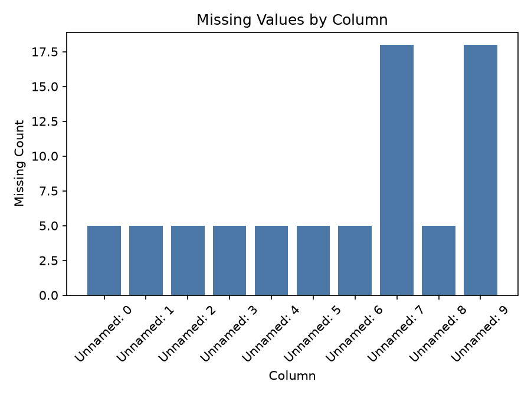

# Executive Summary

| Measure | Value |
| --- | --- |
| Dataset Name | Botswana Consumer Price Index.xlsx |
| Rows | 133 |
| Columns | 10 |
| Date Range | 2016-01-01 to 2026-06-01 |
| Detected Frequency | MS |
| Missing Values | 76 |
| Duplicate Rows | 4 |
| Duplicate Dates | 861 |
| Outliers Detected | 0 |
| Numeric Columns | 0 |
| Categorical Columns | 0 |
| Memory Usage | 45.85 KB |

## Dataset Overview

| Measure | Value |
| --- | --- |
| Rows | 133 |
| Columns | 10 |
| Memory Usage | 45.85 KB |
| Shape | 133 rows x 10 columns |
| Column Count | 10 |
| Numeric Columns | None |
| Numeric Column Count | 0 |
| Categorical Columns | None |
| Categorical Column Count | 0 |
| Datetime Columns | Unnamed: 0, Unnamed: 1, Unnamed: 2, Unnamed: 3, Unnamed: 4, Unnamed: 5, Unnamed: 6, Unnamed: 7, Unnamed: 8, Unnamed: 9 |
| Datetime Column Count | 10 |

## Column Profile

| Column | Data Type | Memory Usage | Missing Count | Missing % | Unique Values | Example Value |
| --- | --- | --- | --- | --- | --- | --- |
| Unnamed: 0 | str | 7.27 KB | 5 | 3.76 | 129 | Time |
| Unnamed: 1 | object | 4.28 KB | 5 | 3.76 | 89 | Annual Inflation, Rural Village |
| Unnamed: 2 | object | 4.27 KB | 5 | 3.76 | 78 | Annual Inflation, Urban Village |
| Unnamed: 3 | object | 4.27 KB | 5 | 3.76 | 110 | Food & Non- |
| Unnamed: 4 | object | 4.27 KB | 5 | 3.76 | 104 | Alcohol |
| Unnamed: 5 | object | 4.25 KB | 5 | 3.76 | 127 | Imported Tradeables Index |
| Unnamed: 6 | object | 4.21 KB | 5 | 3.76 | 125 | Inflation (%) |
| Unnamed: 7 | object | 4.29 KB | 18 | 13.53 | 84 | Core Monthly Inflation (Excluding Administered Prices) (percentage) |
| Unnamed: 8 | object | 4.32 KB | 5 | 3.76 | 109 | Consumer Price Index (Trimmed Mean) (September 2016 = 100) |
| Unnamed: 9 | object | 4.27 KB | 18 | 13.53 | 76 | Core Monthly Inflation Rate (Trimmed Mean) (percentage) |

## Preview

### First 5 Rows

| Unnamed: 0 | Unnamed: 1 | Unnamed: 2 | Unnamed: 3 | Unnamed: 4 | Unnamed: 5 | Unnamed: 6 | Unnamed: 7 | Unnamed: 8 | Unnamed: 9 |
| --- | --- | --- | --- | --- | --- | --- | --- | --- | --- |
| NaN | NaN | NaN | NaN | NaN | NaN | NaN | NaN | NaN | NaN |
| NaN | NaN | NaN | NaN | NaN | NaN | NaN | NaN | NaN | NaN |
| NaN | NaN | NaN | NaN | NaN | NaN | NaN | NaN | NaN | NaN |
| NaN | NaN | NaN | NaN | NaN | NaN | NaN | NaN | NaN | NaN |
| NaN | NaN | NaN | NaN | NaN | NaN | NaN | NaN | NaN | NaN |

### Last 5 Rows

| Unnamed: 0 | Unnamed: 1 | Unnamed: 2 | Unnamed: 3 | Unnamed: 4 | Unnamed: 5 | Unnamed: 6 | Unnamed: 7 | Unnamed: 8 | Unnamed: 9 |
| --- | --- | --- | --- | --- | --- | --- | --- | --- | --- |
| Feb 2026 | 4.3 | 4.1 | 159.2 | 156.2 | 150.3 | 6.4 | 5 | 140.3 | 4.6 |
| Mar 2026 | 4.58583 | 4.24959 | 160.6 | 157.6 | 151.062 | 6.56818 | 5.31301 | 140.933 | 4.77348 |
| Apr 2026 | 11.8 | 10.1 | 161.4 | 159.7 | 167.659 | 17.7942 | 5.57892 | 148.652 | 8.79646 |
| May 2026 | 12.1 | 10.5 | 161.6 | 160.3 | 168.235 | 18.0965 | 5.94075 | 149.112 | 9.10994 |
| Jun 2026 | 12.1166 | 10.4434 | 161.9 | 161 | 168.324 | 17.8711 | 5.85256 | 149.272 | 9.0095 |

## Data Quality

| Measure | Value |
| --- | --- |
| Missing values | 76 |
| Missing % | 5.71 |
| Duplicate rows | 4 |
| Duplicate dates | 861 |
| Infinite values | 0 |
| Zero values | 0 |
| Negative values | 0 |
| Constant columns | None |
| Near-constant columns | None |
| Potential identifier columns | None |
| Mixed data type columns | Unnamed: 1, Unnamed: 2, Unnamed: 3, Unnamed: 4, Unnamed: 5, Unnamed: 6, Unnamed: 7, Unnamed: 8, Unnamed: 9 |
| Object columns containing dates | Unnamed: 0, Unnamed: 1, Unnamed: 2, Unnamed: 3, Unnamed: 4, Unnamed: 5, Unnamed: 6, Unnamed: 7, Unnamed: 8, Unnamed: 9 |

### Mixed Data Type Columns

| Column | Inferred Dtype | Python Types |
| --- | --- | --- |
| Unnamed: 1 | mixed-integer | float, int, str |
| Unnamed: 2 | mixed-integer | float, int, str |
| Unnamed: 3 | mixed-integer | float, int, str |
| Unnamed: 4 | mixed-integer | float, int, str |
| Unnamed: 5 | mixed-integer | float, int, str |
| Unnamed: 6 | mixed-integer | float, int, str |
| Unnamed: 7 | mixed-integer | float, int, str |
| Unnamed: 8 | mixed-integer | float, int, str |
| Unnamed: 9 | mixed-integer | float, int, str |

## Missing Value Analysis

### Missing Count Per Column

| Column | Missing Count | Missing % |
| --- | --- | --- |
| Unnamed: 0 | 5 | 3.76 |
| Unnamed: 1 | 5 | 3.76 |
| Unnamed: 2 | 5 | 3.76 |
| Unnamed: 3 | 5 | 3.76 |
| Unnamed: 4 | 5 | 3.76 |
| Unnamed: 5 | 5 | 3.76 |
| Unnamed: 6 | 5 | 3.76 |
| Unnamed: 7 | 18 | 13.53 |
| Unnamed: 8 | 5 | 3.76 |
| Unnamed: 9 | 18 | 13.53 |

Rows containing missing values: 18 (13.53%)

### Rows Containing Missing Values (First 10)

| Unnamed: 0 | Unnamed: 1 | Unnamed: 2 | Unnamed: 3 | Unnamed: 4 | Unnamed: 5 | Unnamed: 6 | Unnamed: 7 | Unnamed: 8 | Unnamed: 9 |
| --- | --- | --- | --- | --- | --- | --- | --- | --- | --- |
| NaN | NaN | NaN | NaN | NaN | NaN | NaN | NaN | NaN | NaN |
| NaN | NaN | NaN | NaN | NaN | NaN | NaN | NaN | NaN | NaN |
| NaN | NaN | NaN | NaN | NaN | NaN | NaN | NaN | NaN | NaN |
| NaN | NaN | NaN | NaN | NaN | NaN | NaN | NaN | NaN | NaN |
| NaN | NaN | NaN | NaN | NaN | NaN | NaN | NaN | NaN | NaN |
| Dec 2018 | 2.5 | 3.5 | 100 | 100 | 100 | 4.37563 | NaN | 108 | NaN |
| Jan 2019 | 2.4 | 3.4 | 100.4 | 99.8 | 100.305 | 4.38925 | NaN | 100.4 | NaN |
| Feb 2019 | 2.27919 | 3.2 | 100.6 | 99.6 | 100.512 | 4.22001 | NaN | 100.5 | NaN |
| Mar 2019 | 2.18589 | 3.2 | 101 | 99.9 | 100.556 | 4.20481 | NaN | 100.6 | NaN |
| Apr 2019 | 1.66204 | 2.6 | 101.4 | 101.2 | 100.811 | 4.26495 | NaN | 101.3 | NaN |

### Missing Values Grouped by Year

| Year | Rows With Missing Values | Missing Cells |
| --- | --- | --- |
| NaN | 5 | 50 |
| 2019 | 12 | 24 |
| 2018 | 1 | 2 |

## Duplicate Analysis

Duplicate count: 4

### Preview Duplicate Records

| Unnamed: 0 | Unnamed: 1 | Unnamed: 2 | Unnamed: 3 | Unnamed: 4 | Unnamed: 5 | Unnamed: 6 | Unnamed: 7 | Unnamed: 8 | Unnamed: 9 |
| --- | --- | --- | --- | --- | --- | --- | --- | --- | --- |
| NaN | NaN | NaN | NaN | NaN | NaN | NaN | NaN | NaN | NaN |
| NaN | NaN | NaN | NaN | NaN | NaN | NaN | NaN | NaN | NaN |
| NaN | NaN | NaN | NaN | NaN | NaN | NaN | NaN | NaN | NaN |
| NaN | NaN | NaN | NaN | NaN | NaN | NaN | NaN | NaN | NaN |
| NaN | NaN | NaN | NaN | NaN | NaN | NaN | NaN | NaN | NaN |

### Repeated Date Values

| Datetime Column | Duplicate Date Rows | Duplicate Date Values | Status | First Duplicated Dates |
| --- | --- | --- | --- | --- |
| Unnamed: 0 | 0 | 0 | No duplicates | None |
| Unnamed: 1 | 111 | 11 | Detected | 1970-01-01, 1970-01-01, 1970-01-01, 1970-01-01, 1970-01-01, 1970-01-01, 1970-01-01, 1970-01-01, 1970-01-01, 1970-01-01 |
| Unnamed: 2 | 111 | 11 | Detected | 1970-01-01, 1970-01-01, 1970-01-01, 1970-01-01, 1970-01-01, 1970-01-01, 1970-01-01, 1970-01-01, 1970-01-01, 1970-01-01 |
| Unnamed: 3 | 74 | 24 | Detected | 1970-01-01, 1970-01-01, 1970-01-01, 1970-01-01, 1970-01-01, 1970-01-01, 1970-01-01, 1970-01-01, 1970-01-01, 1970-01-01 |
| Unnamed: 4 | 77 | 27 | Detected | 1970-01-01, 1970-01-01, 1970-01-01, 1970-01-01, 1970-01-01, 1970-01-01, 1970-01-01, 1970-01-01, 1970-01-01, 1970-01-01 |
| Unnamed: 5 | 88 | 27 | Detected | 1970-01-01, 1970-01-01, 1970-01-01, 1970-01-01, 1970-01-01, 1970-01-01, 1970-01-01, 1970-01-01, 1970-01-01, 1970-01-01 |
| Unnamed: 6 | 102 | 15 | Detected | 1970-01-01, 1970-01-01, 1970-01-01, 1970-01-01, 1970-01-01, 1969-12-31, 1969-12-31, 1970-01-01, 1970-01-01, 1970-01-01 |
| Unnamed: 7 | 104 | 8 | Detected | 1970-01-01, 1970-01-01, 1970-01-01, 1970-01-01, 1970-01-01, 1970-01-01, 1970-01-01, 1970-01-01 |
| Unnamed: 8 | 91 | 26 | Detected | 1970-01-01, 1970-01-01, 1970-01-01, 1970-01-01, 1970-01-01, 1970-01-01, 1970-01-01, 1970-01-01, 1970-01-01, 1970-01-01 |
| Unnamed: 9 | 103 | 10 | Detected | 1970-01-01, 1970-01-01, 1970-01-01, 1970-01-01, 1970-01-01, 1970-01-01, 1970-01-01, 1970-01-01, 1970-01-01, 1970-01-01 |

## Numeric Statistics

Numeric columns detected: 0

## Categorical Statistics

Categorical columns detected: 0

## Datetime Analysis

| Column | Earliest Date | Latest Date | Date Span Days | Unique Dates | Duplicate Dates | Chronological Ordering | Monotonic Increasing | Estimated Frequency | Median Spacing | Most Common Spacing |
| --- | --- | --- | --- | --- | --- | --- | --- | --- | --- | --- |
| Unnamed: 0 | 2016-01-01 | 2026-06-01 | 3804 | 126 | 0 | True | True | MS | 31 days 00:00:00 | 31 days 00:00:00 |
| Unnamed: 1 | 1970-01-01 | 1970-01-01T00:00:00.000000015 | 0 | 15 | 111 | False | False | Daily-like | 0 days 00:00:00.000000001 | 0 days 00:00:00.000000001 |
| Unnamed: 2 | 1970-01-01 | 1970-01-01T00:00:00.000000014 | 0 | 15 | 111 | False | False | ns | 0 days 00:00:00.000000001 | 0 days 00:00:00.000000001 |
| Unnamed: 3 | 1970-01-01T00:00:00.000000097 | 1970-01-01T00:00:00.000000161 | 0 | 52 | 74 | False | False | Daily-like | 0 days 00:00:00.000000001 | 0 days 00:00:00.000000001 |
| Unnamed: 4 | 1970-01-01T00:00:00.000000098 | 1970-01-01T00:00:00.000000161 | 0 | 49 | 77 | False | False | Daily-like | 0 days 00:00:00.000000001 | 0 days 00:00:00.000000001 |
| Unnamed: 5 | 1970-01-01T00:00:00.000000093 | 1970-01-01T00:00:00.000000168 | 0 | 38 | 88 | False | False | Daily-like | 0 days 00:00:00.000000001 | 0 days 00:00:00.000000001 |
| Unnamed: 6 | 1969-12-31T23:59:59.999999998 | 1970-01-01T00:00:00.000000023 | 0 | 24 | 102 | False | False | Business-day-like | 0 days 00:00:00.000000001 | 0 days 00:00:00.000000001 |
| Unnamed: 7 | 1970-01-01T00:00:00.000000001 | 1970-01-01T00:00:00.000000009 | 0 | 9 | 104 | False | False | ns | 0 days 00:00:00.000000001 | 0 days 00:00:00.000000001 |
| Unnamed: 8 | 1970-01-01T00:00:00.000000097 | 1970-01-01T00:00:00.000000149 | 0 | 35 | 91 | False | False | Daily-like | 0 days 00:00:00.000000001 | 0 days 00:00:00.000000001 |
| Unnamed: 9 | 1970-01-01T00:00:00.000000001 | 1970-01-01T00:00:00.000000011 | 0 | 10 | 103 | False | False | Daily-like | 0 days 00:00:00.000000001 | 0 days 00:00:00.000000001 |

## Join Key Analysis

| Candidate Key | Classification |
| --- | --- |
| Unnamed: 0 | Candidate Key |
| Unnamed: 0 + Unnamed: 1 | Composite Candidate Key |

## Correlation Analysis

Numeric columns available for correlation: fewer than 2

## Distribution Analysis

- Histograms: Not generated

- Boxplots: Not generated

## Time-Series Diagnostics

| Column | Regular Frequency | Estimated Frequency | Missing Periods | Duplicate Periods | Business-Day Applicable | Business-Day Continuity % | Missing Business Days | Unexpected Weekday Gaps | Monthly Applicable | Monthly Continuity % | Missing Months |
| --- | --- | --- | --- | --- | --- | --- | --- | --- | --- | --- | --- |
| Unnamed: 0 | True | MS | 0 | 0 | False | Not applicable | Not applicable | Not applicable | True | 100 | 0 |
| Unnamed: 1 | False | Daily-like | Not calculated | 111 | False | Not applicable | Not applicable | Not applicable | False | Not applicable | Not applicable |
| Unnamed: 2 | False | ns | Not calculated | 111 | False | Not applicable | Not applicable | Not applicable | False | Not applicable | Not applicable |
| Unnamed: 3 | False | Daily-like | Not calculated | 74 | False | Not applicable | Not applicable | Not applicable | False | Not applicable | Not applicable |
| Unnamed: 4 | False | Daily-like | Not calculated | 77 | False | Not applicable | Not applicable | Not applicable | False | Not applicable | Not applicable |
| Unnamed: 5 | False | Daily-like | Not calculated | 88 | False | Not applicable | Not applicable | Not applicable | False | Not applicable | Not applicable |
| Unnamed: 6 | False | Business-day-like | 0 | 102 | True | 100 | 0 | 0 | False | Not applicable | Not applicable |
| Unnamed: 7 | False | ns | Not calculated | 104 | False | Not applicable | Not applicable | Not applicable | False | Not applicable | Not applicable |
| Unnamed: 8 | False | Daily-like | Not calculated | 91 | False | Not applicable | Not applicable | Not applicable | False | Not applicable | Not applicable |
| Unnamed: 9 | False | Daily-like | Not calculated | 103 | False | Not applicable | Not applicable | Not applicable | False | Not applicable | Not applicable |

- Time Series: Not generated

## Dataset-Specific Checks

Dataset-specific rule: No filename-specific rule matched

| Measure | Value |
| --- | --- |
| Dataset-specific checks generated | 0 |

## Pipeline Impact

| Measured Observation | Measured Value |
| --- | --- |
| Object columns containing date-like values | Unnamed: 0, Unnamed: 1, Unnamed: 2, Unnamed: 3, Unnamed: 4, Unnamed: 5, Unnamed: 6, Unnamed: 7, Unnamed: 8, Unnamed: 9 |
| Duplicate rows present | 4 |
| Duplicate datetime values present | 861 |
| Missing values present | 76 |
| Datetime frequency detected for Unnamed: 0 | MS |
| Datetime frequency detected for Unnamed: 1 | Daily-like |
| Datetime frequency detected for Unnamed: 2 | ns |
| Datetime frequency detected for Unnamed: 3 | Daily-like |
| Datetime frequency detected for Unnamed: 4 | Daily-like |
| Datetime frequency detected for Unnamed: 5 | Daily-like |
| Datetime frequency detected for Unnamed: 6 | Business-day-like |
| Datetime frequency detected for Unnamed: 7 | ns |
| Datetime frequency detected for Unnamed: 8 | Daily-like |
| Datetime frequency detected for Unnamed: 9 | Daily-like |
| Dataset-specific rule applied | No filename-specific rule matched |

## Figures

| Figure | Saved File |
| --- | --- |
| Missing-value plot | Botswana Consumer Price Index_missing.png |
| Correlation heatmap | Not generated |
| Histograms | Not generated |
| Boxplots | Not generated |
| Time-series plot | Not generated |

- Correlation Heatmap: Not generated
