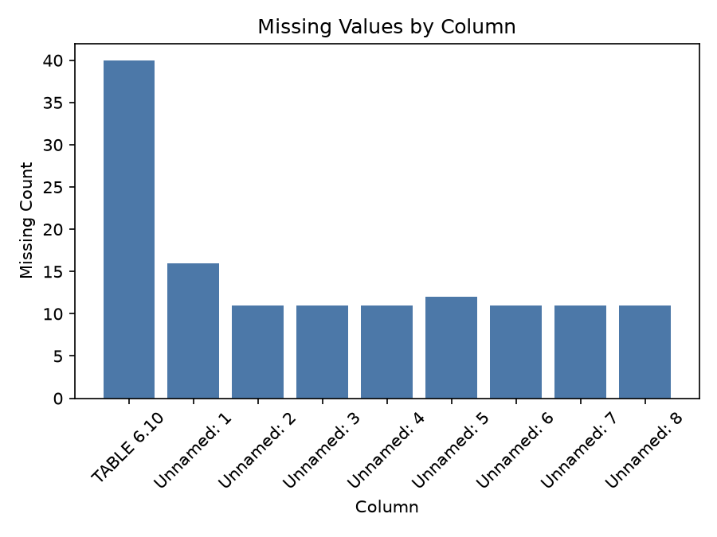

# Executive Summary

| Measure | Value |
| --- | --- |
| Dataset Name | F6-10.csv |
| Rows | 55 |
| Columns | 9 |
| Date Range | Not detected |
| Detected Frequency | Not detected |
| Missing Values | 134 |
| Duplicate Rows | 5 |
| Duplicate Dates | 0 |
| Outliers Detected | 0 |
| Numeric Columns | 0 |
| Categorical Columns | 9 |
| Memory Usage | 23.81 KB |

## Dataset Overview

| Measure | Value |
| --- | --- |
| Rows | 55 |
| Columns | 9 |
| Memory Usage | 23.81 KB |
| Shape | 55 rows x 9 columns |
| Column Count | 9 |
| Numeric Columns | None |
| Numeric Column Count | 0 |
| Categorical Columns | TABLE 6.10, Unnamed: 1, Unnamed: 2, Unnamed: 3, Unnamed: 4, Unnamed: 5, Unnamed: 6, Unnamed: 7, Unnamed: 8 |
| Categorical Column Count | 9 |
| Datetime Columns | None |
| Datetime Column Count | 0 |

## Column Profile

| Column | Data Type | Memory Usage | Missing Count | Missing % | Unique Values | Example Value |
| --- | --- | --- | --- | --- | --- | --- |
| TABLE 6.10 | str | 2.29 KB | 40 | 72.73 | 16 | EXCHANGE RATES: FOREIGN CURRENCY PER PULA - AVERAGES1 |
| Unnamed: 1 | str | 2.51 KB | 16 | 29.09 | 19 | Q1 |
| Unnamed: 2 | str | 2.70 KB | 11 | 20 | 35 | US |
| Unnamed: 3 | str | 2.71 KB | 11 | 20 | 41 | Pound |
| Unnamed: 4 | str | 2.66 KB | 11 | 20 | 40 | Japanese |
| Unnamed: 5 | str | 2.68 KB | 12 | 21.82 | 40 | Euro |
| Unnamed: 6 | str | 2.72 KB | 11 | 20 | 45 | Chinese |
| Unnamed: 7 | str | 2.70 KB | 11 | 20 | 44 | SA |
| Unnamed: 8 | str | 2.70 KB | 11 | 20 | 38 |   |

## Preview

### First 5 Rows

| TABLE 6.10 | Unnamed: 1 | Unnamed: 2 | Unnamed: 3 | Unnamed: 4 | Unnamed: 5 | Unnamed: 6 | Unnamed: 7 | Unnamed: 8 |
| --- | --- | --- | --- | --- | --- | --- | --- | --- |
| NaN | NaN | NaN | NaN | NaN | NaN | NaN | NaN | NaN |
| EXCHANGE RATES: FOREIGN CURRENCY PER PULA - AVERAGES1 | NaN | NaN | NaN | NaN | NaN | NaN | NaN | NaN |
| NaN | NaN | US | Pound | Japanese | NaN | Chinese | SA |   |
| Period | NaN | dollar | sterling | yen | Euro | yuan2 | rand | SDR |
| 2015 | NaN | 0.0989 | 0.0647 | 11.96 | 0.0891 | … | 1.2570 | 0.0707 |

### Last 5 Rows

| TABLE 6.10 | Unnamed: 1 | Unnamed: 2 | Unnamed: 3 | Unnamed: 4 | Unnamed: 5 | Unnamed: 6 | Unnamed: 7 | Unnamed: 8 |
| --- | --- | --- | --- | --- | --- | --- | --- | --- |
| NaN | May | 0.0736 | 0.0582 | 11.47 | 0.0681 | 0.5328 | 1.3542 | 0.0556 |
|           1.         The monthly averages are calculated from the daily exchange rates. The quarterly and annual averages are calculated from  | NaN | NaN | NaN | NaN | NaN | NaN | NaN | NaN |
| NaN | the relevant monthly averages. | NaN | NaN | NaN | NaN | NaN | NaN | NaN |
|           2.         The Chinese yuan (CNH) was introduced in October 2016. | NaN | NaN | NaN | NaN | NaN | NaN | NaN | NaN |
| Source:           | Bank of Botswana | NaN | NaN | NaN | NaN | NaN | NaN | NaN |

## Data Quality

| Measure | Value |
| --- | --- |
| Missing values | 134 |
| Missing % | 27.07 |
| Duplicate rows | 5 |
| Duplicate dates | 0 |
| Infinite values | 0 |
| Zero values | 0 |
| Negative values | 0 |
| Constant columns | None |
| Near-constant columns | None |
| Potential identifier columns | None |
| Mixed data type columns | None |
| Object columns containing dates | None |

## Missing Value Analysis

### Missing Count Per Column

| Column | Missing Count | Missing % |
| --- | --- | --- |
| TABLE 6.10 | 40 | 72.73 |
| Unnamed: 1 | 16 | 29.09 |
| Unnamed: 2 | 11 | 20 |
| Unnamed: 3 | 11 | 20 |
| Unnamed: 4 | 11 | 20 |
| Unnamed: 5 | 12 | 21.82 |
| Unnamed: 6 | 11 | 20 |
| Unnamed: 7 | 11 | 20 |
| Unnamed: 8 | 11 | 20 |

Rows containing missing values: 50 (90.91%)

### Rows Containing Missing Values (First 10)

| TABLE 6.10 | Unnamed: 1 | Unnamed: 2 | Unnamed: 3 | Unnamed: 4 | Unnamed: 5 | Unnamed: 6 | Unnamed: 7 | Unnamed: 8 |
| --- | --- | --- | --- | --- | --- | --- | --- | --- |
| NaN | NaN | NaN | NaN | NaN | NaN | NaN | NaN | NaN |
| EXCHANGE RATES: FOREIGN CURRENCY PER PULA - AVERAGES1 | NaN | NaN | NaN | NaN | NaN | NaN | NaN | NaN |
| NaN | NaN | US | Pound | Japanese | NaN | Chinese | SA |   |
| Period | NaN | dollar | sterling | yen | Euro | yuan2 | rand | SDR |
| 2015 | NaN | 0.0989 | 0.0647 | 11.96 | 0.0891 | … | 1.2570 | 0.0707 |
| 2016 | NaN | 0.0918 | 0.0681 | 9.97 | 0.0830 | 0.6406 | 1.3495 | 0.0661 |
| 2017 | NaN | 0.0967 | 0.0751 | 10.84 | 0.0857 | 0.6526 | 1.2873 | 0.0697 |
| 2018 | NaN | 0.0983 | 0.0735 | 10.84 | 0.0831 | 0.6489 | 1.2960 | 0.0693 |
| 2019 | NaN | 0.0930 | 0.0729 | 10.14 | 0.0830 | 0.6428 | 1.3432 | 0.0673 |
| NaN | NaN | NaN | NaN | NaN | NaN | NaN | NaN | NaN |

Grouped missing-value tables generated: 0

## Duplicate Analysis

Duplicate count: 5

### Preview Duplicate Records

| TABLE 6.10 | Unnamed: 1 | Unnamed: 2 | Unnamed: 3 | Unnamed: 4 | Unnamed: 5 | Unnamed: 6 | Unnamed: 7 | Unnamed: 8 |
| --- | --- | --- | --- | --- | --- | --- | --- | --- |
| NaN | NaN | NaN | NaN | NaN | NaN | NaN | NaN | NaN |
| NaN | NaN | NaN | NaN | NaN | NaN | NaN | NaN | NaN |
| NaN | NaN | NaN | NaN | NaN | NaN | NaN | NaN | NaN |
| NaN | NaN | NaN | NaN | NaN | NaN | NaN | NaN | NaN |
| NaN | NaN | NaN | NaN | NaN | NaN | NaN | NaN | NaN |
| NaN | NaN | NaN | NaN | NaN | NaN | NaN | NaN | NaN |

### Repeated Date Values

No datetime columns detected.

## Numeric Statistics

Numeric columns detected: 0

## Categorical Statistics

### TABLE 6.10

Unique values: 16

| Top 10 Values | Frequency | Frequency % |
| --- | --- | --- |
| NaN | 40 | 72.73 |
| EXCHANGE RATES: FOREIGN CURRENCY PER PULA - AVERAGES1 | 1 | 1.82 |
| Period | 1 | 1.82 |
| 2015 | 1 | 1.82 |
| 2016 | 1 | 1.82 |
| 2017 | 1 | 1.82 |
| 2018 | 1 | 1.82 |
| 2019 | 1 | 1.82 |
| 2020 | 1 | 1.82 |
| 2021 | 1 | 1.82 |

### Unnamed: 1

Unique values: 19

| Top 10 Values | Frequency | Frequency % |
| --- | --- | --- |
| NaN | 16 | 29.09 |
| Jan | 3 | 5.45 |
| Feb | 3 | 5.45 |
| Mar | 3 | 5.45 |
| Apr | 3 | 5.45 |
| May | 3 | 5.45 |
| Q1 | 2 | 3.64 |
| Q2 | 2 | 3.64 |
| Q3 | 2 | 3.64 |
| Q4 | 2 | 3.64 |

### Unnamed: 2

Unique values: 35

| Top 10 Values | Frequency | Frequency % |
| --- | --- | --- |
| NaN | 11 | 20 |
| 0.0864 | 2 | 3.64 |
| 0.0823 | 2 | 3.64 |
| 0.0791 | 2 | 3.64 |
| 0.0764 | 2 | 3.64 |
| 0.0756 | 2 | 3.64 |
| 0.0742 | 2 | 3.64 |
| 0.0732 | 2 | 3.64 |
| 0.0727 | 2 | 3.64 |
| 0.0740 | 2 | 3.64 |

### Unnamed: 3

Unique values: 41

| Top 10 Values | Frequency | Frequency % |
| --- | --- | --- |
| NaN | 11 | 20 |
| 0.0660 | 3 | 5.45 |
| 0.0663 | 2 | 3.64 |
| 0.0640 | 2 | 3.64 |
| Pound | 1 | 1.82 |
| sterling | 1 | 1.82 |
| 0.0647 | 1 | 1.82 |
| 0.0681 | 1 | 1.82 |
| 0.0751 | 1 | 1.82 |
| 0.0735 | 1 | 1.82 |

### Unnamed: 4

Unique values: 40

| Top 10 Values | Frequency | Frequency % |
| --- | --- | --- |
| NaN | 11 | 20 |
| 10.16 | 3 | 5.45 |
| 10.84 | 2 | 3.64 |
| 10.81 | 2 | 3.64 |
| 10.67 | 2 | 3.64 |
| Japanese | 1 | 1.82 |
| yen | 1 | 1.82 |
| 11.96 | 1 | 1.82 |
| 9.97 | 1 | 1.82 |
| 10.14 | 1 | 1.82 |

### Unnamed: 5

Unique values: 40

| Top 10 Values | Frequency | Frequency % |
| --- | --- | --- |
| NaN | 12 | 21.82 |
| 0.0830 | 2 | 3.64 |
| 0.0761 | 2 | 3.64 |
| 0.0679 | 2 | 3.64 |
| 0.0685 | 2 | 3.64 |
| Euro | 1 | 1.82 |
| 0.0891 | 1 | 1.82 |
| 0.0857 | 1 | 1.82 |
| 0.0831 | 1 | 1.82 |
| 0.0819 | 1 | 1.82 |

### Unnamed: 6

Unique values: 45

| Top 10 Values | Frequency | Frequency % |
| --- | --- | --- |
| NaN | 11 | 20 |
| Chinese | 1 | 1.82 |
| yuan2 | 1 | 1.82 |
| … | 1 | 1.82 |
| 0.6406 | 1 | 1.82 |
| 0.6526 | 1 | 1.82 |
| 0.6489 | 1 | 1.82 |
| 0.6428 | 1 | 1.82 |
| 0.6305 | 1 | 1.82 |
| 0.5926 | 1 | 1.82 |

### Unnamed: 7

Unique values: 44

| Top 10 Values | Frequency | Frequency % |
| --- | --- | --- |
| NaN | 11 | 20 |
| 1.3100 | 2 | 3.64 |
| SA | 1 | 1.82 |
| rand | 1 | 1.82 |
| 1.2570 | 1 | 1.82 |
| 1.3495 | 1 | 1.82 |
| 1.2873 | 1 | 1.82 |
| 1.2960 | 1 | 1.82 |
| 1.3432 | 1 | 1.82 |
| 1.3833 | 1 | 1.82 |

### Unnamed: 8

Unique values: 38

| Top 10 Values | Frequency | Frequency % |
| --- | --- | --- |
| NaN | 11 | 20 |
| 0.0615 | 3 | 5.45 |
| 0.0634 | 2 | 3.64 |
| 0.0584 | 2 | 3.64 |
| 0.0556 | 2 | 3.64 |
| 0.0555 | 2 | 3.64 |
| 0.0550 | 2 | 3.64 |
|   | 1 | 1.82 |
| SDR | 1 | 1.82 |
| 0.0707 | 1 | 1.82 |

## Datetime Analysis

Datetime columns detected: 0

## Join Key Analysis

No candidate join keys detected.

## Correlation Analysis

Numeric columns available for correlation: fewer than 2

## Distribution Analysis

- Histograms: Not generated

- Boxplots: Not generated

## Time-Series Diagnostics

Datetime columns detected: 0

- Time Series: Not generated

## Dataset-Specific Checks

Dataset-specific rule: No filename-specific rule matched

| Measure | Value |
| --- | --- |
| Dataset-specific checks generated | 0 |

## Pipeline Impact

| Measured Observation | Measured Value |
| --- | --- |
| Duplicate rows present | 5 |
| Missing values present | 134 |
| Dataset-specific rule applied | No filename-specific rule matched |

## Figures

| Figure | Saved File |
| --- | --- |
| Missing-value plot | F6-10_missing.png |
| Correlation heatmap | Not generated |
| Histograms | Not generated |
| Boxplots | Not generated |
| Time-series plot | Not generated |

- Correlation Heatmap: Not generated
