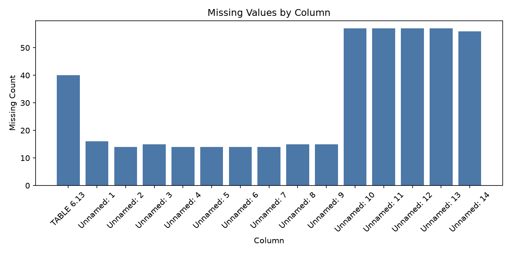
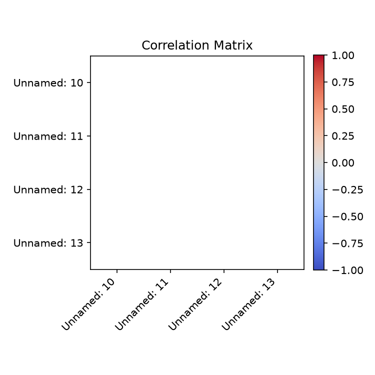

# Executive Summary

| Measure | Value |
| --- | --- |
| Dataset Name | F6-13.csv |
| Rows | 57 |
| Columns | 15 |
| Date Range | Not detected |
| Detected Frequency | Not detected |
| Missing Values | 455 |
| Duplicate Rows | 5 |
| Duplicate Dates | 0 |
| Outliers Detected | 0 |
| Numeric Columns | 4 |
| Categorical Columns | 11 |
| Memory Usage | 30.15 KB |

## Dataset Overview

| Measure | Value |
| --- | --- |
| Rows | 57 |
| Columns | 15 |
| Memory Usage | 30.15 KB |
| Shape | 57 rows x 15 columns |
| Column Count | 15 |
| Numeric Columns | Unnamed: 10, Unnamed: 11, Unnamed: 12, Unnamed: 13 |
| Numeric Column Count | 4 |
| Categorical Columns | TABLE 6.13, Unnamed: 1, Unnamed: 2, Unnamed: 3, Unnamed: 4, Unnamed: 5, Unnamed: 6, Unnamed: 7, Unnamed: 8, Unnamed: 9, Unnamed: 14 |
| Categorical Column Count | 11 |
| Datetime Columns | None |
| Datetime Column Count | 0 |

## Column Profile

| Column | Data Type | Memory Usage | Missing Count | Missing % | Unique Values | Example Value |
| --- | --- | --- | --- | --- | --- | --- |
| TABLE 6.13 | str | 2.22 KB | 40 | 70.18 | 18 | REAL EXCHANGE RATES INDICES: FOREIGN CURRENCY PER PULA1 |
| Unnamed: 1 | str | 2.82 KB | 16 | 28.07 | 22 | Q1 |
| Unnamed: 2 | str | 2.67 KB | 14 | 24.56 | 39 | US |
| Unnamed: 3 | str | 2.66 KB | 15 | 26.32 | 41 | Euro |
| Unnamed: 4 | str | 2.67 KB | 14 | 24.56 | 39 | Pound |
| Unnamed: 5 | str | 2.70 KB | 14 | 24.56 | 42 | Japanese |
| Unnamed: 6 | str | 2.71 KB | 14 | 24.56 | 37 | Chinese |
| Unnamed: 7 | str | 2.69 KB | 14 | 24.56 | 38 | SA |
| Unnamed: 8 | str | 2.65 KB | 15 | 26.32 | 38 | SDR |
| Unnamed: 9 | str | 2.65 KB | 15 | 26.32 | 31 | REER3 |
| Unnamed: 10 | float64 | 456 B | 57 | 100 | 1 |  |
| Unnamed: 11 | float64 | 456 B | 57 | 100 | 1 |  |
| Unnamed: 12 | float64 | 456 B | 57 | 100 | 1 |  |
| Unnamed: 13 | float64 | 456 B | 57 | 100 | 1 |  |
| Unnamed: 14 | str | 1.80 KB | 56 | 98.25 | 2 |    |

## Preview

### First 5 Rows

| TABLE 6.13 | Unnamed: 1 | Unnamed: 2 | Unnamed: 3 | Unnamed: 4 | Unnamed: 5 | Unnamed: 6 | Unnamed: 7 | Unnamed: 8 | Unnamed: 9 | Unnamed: 10 | Unnamed: 11 | Unnamed: 12 | Unnamed: 13 | Unnamed: 14 |
| --- | --- | --- | --- | --- | --- | --- | --- | --- | --- | --- | --- | --- | --- | --- |
| NaN | NaN | NaN | NaN | NaN | NaN | NaN | NaN | NaN | NaN | NaN | NaN | NaN | NaN | NaN |
| REAL EXCHANGE RATES INDICES: FOREIGN CURRENCY PER PULA1 | NaN | NaN | NaN | NaN | NaN | NaN | NaN | NaN | NaN | NaN | NaN | NaN | NaN | NaN |
| (December 2018 = 100) | NaN | NaN | NaN | NaN | NaN | NaN | NaN | NaN | NaN | NaN | NaN | NaN | NaN | NaN |
| NaN | NaN | NaN | NaN | NaN | NaN | NaN | NaN | NaN | NaN | NaN | NaN | NaN | NaN | NaN |
| NaN | NaN | US | NaN | Pound | Japanese | Chinese | SA | NaN | NaN | NaN | NaN | NaN | NaN | NaN |

### Last 5 Rows

| TABLE 6.13 | Unnamed: 1 | Unnamed: 2 | Unnamed: 3 | Unnamed: 4 | Unnamed: 5 | Unnamed: 6 | Unnamed: 7 | Unnamed: 8 | Unnamed: 9 | Unnamed: 10 | Unnamed: 11 | Unnamed: 12 | Unnamed: 13 | Unnamed: 14 |
| --- | --- | --- | --- | --- | --- | --- | --- | --- | --- | --- | --- | --- | --- | --- |
| 1. | Calculated using headline inflation.   | NaN | NaN | NaN | NaN | NaN | NaN | NaN | NaN | NaN | NaN | NaN | NaN | NaN |
| 2. | The Chinese yuan (CNH) was introduced in October 2016. | NaN | NaN | NaN | NaN | NaN | NaN | NaN | NaN | NaN | NaN | NaN | NaN | NaN |
|         3.           | REER (real effective exchange rate) is the trade-weighted exchange rate of the Pula against a fixed basket of currencies, | NaN | NaN | NaN | NaN | NaN | NaN | NaN | NaN | NaN | NaN | NaN | NaN | NaN |
| NaN | after allowing for relative inflation. | NaN | NaN | NaN | NaN | NaN | NaN | NaN | NaN | NaN | NaN | NaN | NaN | NaN |
| Source:          | Bank of Botswana | NaN | NaN | NaN | NaN | NaN | NaN | NaN | NaN | NaN | NaN | NaN | NaN | NaN |

## Data Quality

| Measure | Value |
| --- | --- |
| Missing values | 455 |
| Missing % | 53.22 |
| Duplicate rows | 5 |
| Duplicate dates | 0 |
| Infinite values | 0 |
| Zero values | 0 |
| Negative values | 0 |
| Constant columns | Unnamed: 10, Unnamed: 11, Unnamed: 12, Unnamed: 13 |
| Near-constant columns | Unnamed: 14 |
| Potential identifier columns | None |
| Mixed data type columns | None |
| Object columns containing dates | None |

### Numeric Sign Counts

| Column | Zero Values | Negative Values | Positive Values |
| --- | --- | --- | --- |
| Unnamed: 10 | 0 | 0 | 0 |
| Unnamed: 11 | 0 | 0 | 0 |
| Unnamed: 12 | 0 | 0 | 0 |
| Unnamed: 13 | 0 | 0 | 0 |

### Near-Constant Columns (Dominant Value >= 95%)

| Column | Dominant Value | Dominant Count | Dominant % | Unique Values |
| --- | --- | --- | --- | --- |
| Unnamed: 14 | NaN | 56 | 98.25 | 2 |

## Missing Value Analysis

### Missing Count Per Column

| Column | Missing Count | Missing % |
| --- | --- | --- |
| TABLE 6.13 | 40 | 70.18 |
| Unnamed: 1 | 16 | 28.07 |
| Unnamed: 2 | 14 | 24.56 |
| Unnamed: 3 | 15 | 26.32 |
| Unnamed: 4 | 14 | 24.56 |
| Unnamed: 5 | 14 | 24.56 |
| Unnamed: 6 | 14 | 24.56 |
| Unnamed: 7 | 14 | 24.56 |
| Unnamed: 8 | 15 | 26.32 |
| Unnamed: 9 | 15 | 26.32 |
| Unnamed: 10 | 57 | 100 |
| Unnamed: 11 | 57 | 100 |
| Unnamed: 12 | 57 | 100 |
| Unnamed: 13 | 57 | 100 |
| Unnamed: 14 | 56 | 98.25 |

Rows containing missing values: 57 (100.0%)

### Rows Containing Missing Values (First 10)

| TABLE 6.13 | Unnamed: 1 | Unnamed: 2 | Unnamed: 3 | Unnamed: 4 | Unnamed: 5 | Unnamed: 6 | Unnamed: 7 | Unnamed: 8 | Unnamed: 9 | Unnamed: 10 | Unnamed: 11 | Unnamed: 12 | Unnamed: 13 | Unnamed: 14 |
| --- | --- | --- | --- | --- | --- | --- | --- | --- | --- | --- | --- | --- | --- | --- |
| NaN | NaN | NaN | NaN | NaN | NaN | NaN | NaN | NaN | NaN | NaN | NaN | NaN | NaN | NaN |
| REAL EXCHANGE RATES INDICES: FOREIGN CURRENCY PER PULA1 | NaN | NaN | NaN | NaN | NaN | NaN | NaN | NaN | NaN | NaN | NaN | NaN | NaN | NaN |
| (December 2018 = 100) | NaN | NaN | NaN | NaN | NaN | NaN | NaN | NaN | NaN | NaN | NaN | NaN | NaN | NaN |
| NaN | NaN | NaN | NaN | NaN | NaN | NaN | NaN | NaN | NaN | NaN | NaN | NaN | NaN | NaN |
| NaN | NaN | US | NaN | Pound | Japanese | Chinese | SA | NaN | NaN | NaN | NaN | NaN | NaN | NaN |
| End of  | NaN | dollar | Euro | sterling | yen | yuan2 | rand | SDR | REER3 | NaN | NaN | NaN | NaN | NaN |
| 2015 | NaN | 92.2 | 94.4 | 79.4 | 96.2 | … | 109.2 | 91.5 | 100.1 | NaN | NaN | NaN | NaN | NaN |
| 2016 | NaN | 98.1 | 105.3 | 102.5 | 101.0 | 99.1 | 97.5 | 101.0 | 99.4 | NaN | NaN | NaN | NaN | NaN |
| 2017 | NaN | 107.1 | 102.0 | 101.1 | 107.6 | 101.4 | 94.3 | 104.3 | 99.7 | NaN | NaN | NaN | NaN | NaN |
| 2018 | NaN | 100.0 | 100.0 | 100.0 | 100.0 | 100.0 | 100.0 | 100.0 | 100.0 | NaN | NaN | NaN | NaN | NaN |

Grouped missing-value tables generated: 0

## Duplicate Analysis

Duplicate count: 5

### Preview Duplicate Records

| TABLE 6.13 | Unnamed: 1 | Unnamed: 2 | Unnamed: 3 | Unnamed: 4 | Unnamed: 5 | Unnamed: 6 | Unnamed: 7 | Unnamed: 8 | Unnamed: 9 | Unnamed: 10 | Unnamed: 11 | Unnamed: 12 | Unnamed: 13 | Unnamed: 14 |
| --- | --- | --- | --- | --- | --- | --- | --- | --- | --- | --- | --- | --- | --- | --- |
| NaN | NaN | NaN | NaN | NaN | NaN | NaN | NaN | NaN | NaN | NaN | NaN | NaN | NaN | NaN |
| NaN | NaN | NaN | NaN | NaN | NaN | NaN | NaN | NaN | NaN | NaN | NaN | NaN | NaN | NaN |
| NaN | NaN | NaN | NaN | NaN | NaN | NaN | NaN | NaN | NaN | NaN | NaN | NaN | NaN | NaN |
| NaN | NaN | NaN | NaN | NaN | NaN | NaN | NaN | NaN | NaN | NaN | NaN | NaN | NaN | NaN |
| NaN | NaN | NaN | NaN | NaN | NaN | NaN | NaN | NaN | NaN | NaN | NaN | NaN | NaN | NaN |
| NaN | NaN | NaN | NaN | NaN | NaN | NaN | NaN | NaN | NaN | NaN | NaN | NaN | NaN | NaN |

### Repeated Date Values

No datetime columns detected.

## Numeric Statistics

| Column | Count | Mean | Median | Mode | Minimum | Maximum | Range | Variance | Standard Deviation | Coefficient of Variation | IQR | Skewness | Kurtosis | Zero Count | Negative Count | Positive Count | Outlier Count Using IQR |
| --- | --- | --- | --- | --- | --- | --- | --- | --- | --- | --- | --- | --- | --- | --- | --- | --- | --- |
| Unnamed: 10 | 0 | NaN | NaN | NaN | NaN | NaN | NaN | NaN | NaN | NaN | NaN | NaN | NaN | 0 | 0 | 0 | 0 |
| Unnamed: 11 | 0 | NaN | NaN | NaN | NaN | NaN | NaN | NaN | NaN | NaN | NaN | NaN | NaN | 0 | 0 | 0 | 0 |
| Unnamed: 12 | 0 | NaN | NaN | NaN | NaN | NaN | NaN | NaN | NaN | NaN | NaN | NaN | NaN | 0 | 0 | 0 | 0 |
| Unnamed: 13 | 0 | NaN | NaN | NaN | NaN | NaN | NaN | NaN | NaN | NaN | NaN | NaN | NaN | 0 | 0 | 0 | 0 |

## Categorical Statistics

### TABLE 6.13

Unique values: 18

| Top 10 Values | Frequency | Frequency % |
| --- | --- | --- |
| NaN | 40 | 70.18 |
| REAL EXCHANGE RATES INDICES: FOREIGN CURRENCY PER PULA1 | 1 | 1.75 |
| (December 2018 = 100) | 1 | 1.75 |
| End of  | 1 | 1.75 |
| 2015 | 1 | 1.75 |
| 2016 | 1 | 1.75 |
| 2017 | 1 | 1.75 |
| 2018 | 1 | 1.75 |
| 2019 | 1 | 1.75 |
| 2020 | 1 | 1.75 |

### Unnamed: 1

Unique values: 22

| Top 10 Values | Frequency | Frequency % |
| --- | --- | --- |
| NaN | 16 | 28.07 |
| Jan | 3 | 5.26 |
| Feb | 3 | 5.26 |
| Mar | 3 | 5.26 |
| Apr | 3 | 5.26 |
| Q1 | 2 | 3.51 |
| Q2 | 2 | 3.51 |
| Q3 | 2 | 3.51 |
| Q4 | 2 | 3.51 |
| May | 2 | 3.51 |

### Unnamed: 2

Unique values: 39

| Top 10 Values | Frequency | Frequency % |
| --- | --- | --- |
| NaN | 14 | 24.56 |
| 84.5 | 3 | 5.26 |
| 100.9 | 2 | 3.51 |
| 92.0 | 2 | 3.51 |
| 83.2 | 2 | 3.51 |
| US | 1 | 1.75 |
| dollar | 1 | 1.75 |
| 92.2 | 1 | 1.75 |
| 98.1 | 1 | 1.75 |
| 107.1 | 1 | 1.75 |

### Unnamed: 3

Unique values: 41

| Top 10 Values | Frequency | Frequency % |
| --- | --- | --- |
| NaN | 15 | 26.32 |
| 94.4 | 2 | 3.51 |
| 92.3 | 2 | 3.51 |
| Euro | 1 | 1.75 |
| 105.3 | 1 | 1.75 |
| 102.0 | 1 | 1.75 |
| 100.0 | 1 | 1.75 |
| 103.9 | 1 | 1.75 |
| 94.5 | 1 | 1.75 |
| 93.1 | 1 | 1.75 |

### Unnamed: 4

Unique values: 39

| Top 10 Values | Frequency | Frequency % |
| --- | --- | --- |
| NaN | 14 | 24.56 |
| 85.1 | 3 | 5.26 |
| 98.6 | 2 | 3.51 |
| 96.3 | 2 | 3.51 |
| 95.1 | 2 | 3.51 |
| Pound | 1 | 1.75 |
| sterling | 1 | 1.75 |
| 79.4 | 1 | 1.75 |
| 102.5 | 1 | 1.75 |
| 101.1 | 1 | 1.75 |

### Unnamed: 5

Unique values: 42

| Top 10 Values | Frequency | Frequency % |
| --- | --- | --- |
| NaN | 14 | 24.56 |
| 107.7 | 2 | 3.51 |
| 130.6 | 2 | 3.51 |
| Japanese | 1 | 1.75 |
| yen | 1 | 1.75 |
| 96.2 | 1 | 1.75 |
| 101.0 | 1 | 1.75 |
| 107.6 | 1 | 1.75 |
| 100.0 | 1 | 1.75 |
| 100.8 | 1 | 1.75 |

### Unnamed: 6

Unique values: 37

| Top 10 Values | Frequency | Frequency % |
| --- | --- | --- |
| NaN | 14 | 24.56 |
| 101.4 | 2 | 3.51 |
| 92.9 | 2 | 3.51 |
| 98.2 | 2 | 3.51 |
| 95.9 | 2 | 3.51 |
| 100.5 | 2 | 3.51 |
| 100.3 | 2 | 3.51 |
| 102.7 | 2 | 3.51 |
| Chinese | 1 | 1.75 |
| yuan2 | 1 | 1.75 |

### Unnamed: 7

Unique values: 38

| Top 10 Values | Frequency | Frequency % |
| --- | --- | --- |
| NaN | 14 | 24.56 |
| 97.5 | 2 | 3.51 |
| 106.0 | 2 | 3.51 |
| 104.9 | 2 | 3.51 |
| 103.6 | 2 | 3.51 |
| 105.4 | 2 | 3.51 |
| 106.7 | 2 | 3.51 |
| SA | 1 | 1.75 |
| rand | 1 | 1.75 |
| 109.2 | 1 | 1.75 |

### Unnamed: 8

Unique values: 38

| Top 10 Values | Frequency | Frequency % |
| --- | --- | --- |
| NaN | 15 | 26.32 |
| 91.8 | 2 | 3.51 |
| 92.2 | 2 | 3.51 |
| 92.1 | 2 | 3.51 |
| 100.8 | 2 | 3.51 |
| 98.9 | 2 | 3.51 |
| SDR | 1 | 1.75 |
| 91.5 | 1 | 1.75 |
| 101.0 | 1 | 1.75 |
| 104.3 | 1 | 1.75 |

### Unnamed: 9

Unique values: 31

| Top 10 Values | Frequency | Frequency % |
| --- | --- | --- |
| NaN | 15 | 26.32 |
| 99.2 | 4 | 7.02 |
| 99.4 | 2 | 3.51 |
| 99.7 | 2 | 3.51 |
| 99.6 | 2 | 3.51 |
| 97.7 | 2 | 3.51 |
| 97.8 | 2 | 3.51 |
| 97.9 | 2 | 3.51 |
| 98.3 | 2 | 3.51 |
| 97.6 | 2 | 3.51 |

### Unnamed: 14

Unique values: 2

| Top 10 Values | Frequency | Frequency % |
| --- | --- | --- |
| NaN | 56 | 98.25 |
|    | 1 | 1.75 |

## Datetime Analysis

Datetime columns detected: 0

## Join Key Analysis

No candidate join keys detected.

## Correlation Analysis

| Column | Unnamed: 10 | Unnamed: 11 | Unnamed: 12 | Unnamed: 13 |
| --- | --- | --- | --- | --- |
| Unnamed: 10 | NaN | NaN | NaN | NaN |
| Unnamed: 11 | NaN | NaN | NaN | NaN |
| Unnamed: 12 | NaN | NaN | NaN | NaN |
| Unnamed: 13 | NaN | NaN | NaN | NaN |

## Distribution Analysis

- Histograms: Not generated

- Boxplots: Not generated

## Time-Series Diagnostics

Datetime columns detected: 0

- Time Series: Not generated

## Dataset-Specific Checks

Dataset-specific rule: No filename-specific rule matched

| Measure | Value |
| --- | --- |
| Dataset-specific checks generated | 0 |

## Pipeline Impact

| Measured Observation | Measured Value |
| --- | --- |
| Duplicate rows present | 5 |
| Missing values present | 455 |
| Constant columns present | Unnamed: 10, Unnamed: 11, Unnamed: 12, Unnamed: 13 |
| Near-constant columns at configured threshold | Unnamed: 14 |
| Dataset-specific rule applied | No filename-specific rule matched |

## Figures

| Figure | Saved File |
| --- | --- |
| Missing-value plot | F6-13_missing.png |
| Correlation heatmap | F6-13_correlation.png |
| Histograms | Not generated |
| Boxplots | Not generated |
| Time-series plot | Not generated |

