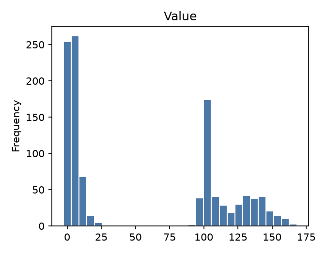
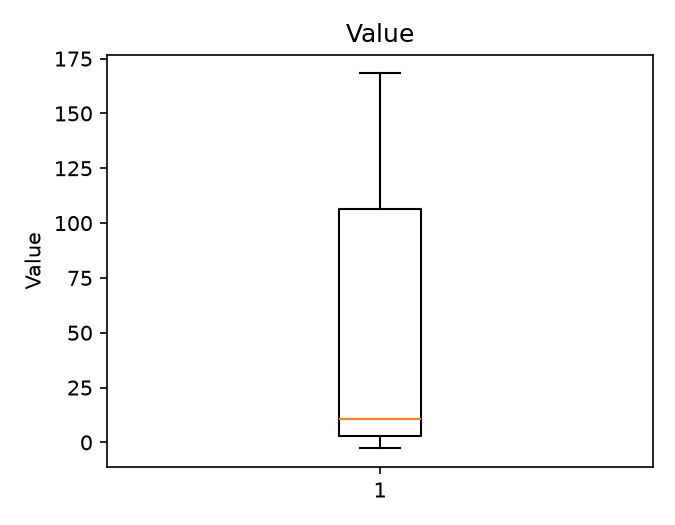
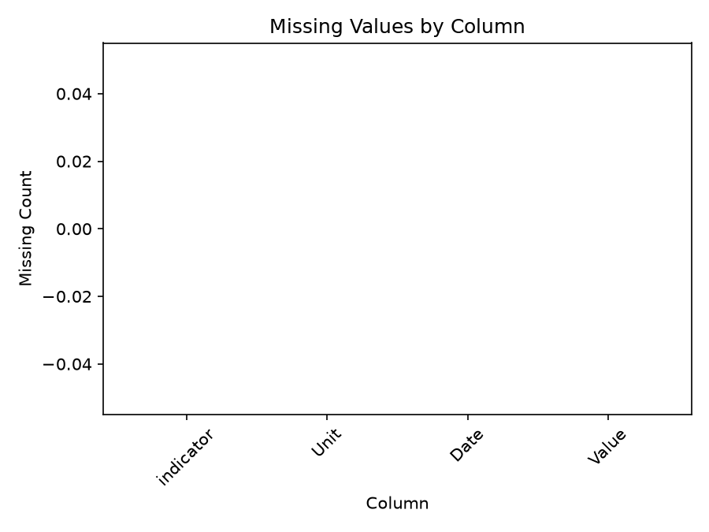

# Executive Summary

| Measure | Value |
| --- | --- |
| Dataset Name | ObservationData_bkgkbwg.csv |
| Rows | 1108 |
| Columns | 4 |
| Date Range | Not detected |
| Detected Frequency | Not detected |
| Missing Values | 0 |
| Duplicate Rows | 0 |
| Duplicate Dates | 0 |
| Outliers Detected | 0 |
| Numeric Columns | 1 |
| Categorical Columns | 3 |
| Memory Usage | 224.82 KB |

## Dataset Overview

| Measure | Value |
| --- | --- |
| Rows | 1108 |
| Columns | 4 |
| Memory Usage | 224.82 KB |
| Shape | 1108 rows x 4 columns |
| Column Count | 4 |
| Numeric Columns | Value |
| Numeric Column Count | 1 |
| Categorical Columns | indicator, Unit, Date |
| Categorical Column Count | 3 |
| Datetime Columns | None |
| Datetime Column Count | 0 |

## Column Profile

| Column | Data Type | Memory Usage | Missing Count | Missing % | Unique Values | Example Value |
| --- | --- | --- | --- | --- | --- | --- |
| indicator | str | 88.14 KB | 0 | 0 | 9 | Annual Inflation, Rural Village |
| Unit | str | 68.13 KB | 0 | 0 | 2 | Index Sep 2016 = 100 |
| Date | str | 59.77 KB | 0 | 0 | 126 | 2016M1 |
| Value | float64 | 8.66 KB | 0 | 0 | 731 | 2.8 |

## Preview

### First 5 Rows

| indicator | Unit | Date | Value |
| --- | --- | --- | --- |
| Annual Inflation, Rural Village | Index Sep 2016 = 100 | 2016M1 | 2.8 |
| Annual Inflation, Rural Village | Index Sep 2016 = 100 | 2016M2 | 3.1 |
| Annual Inflation, Rural Village | Index Sep 2016 = 100 | 2016M3 | 2.7 |
| Annual Inflation, Rural Village | Index Sep 2016 = 100 | 2016M4 | 2.7 |
| Annual Inflation, Rural Village | Index Sep 2016 = 100 | 2016M5 | 2.5 |

### Last 5 Rows

| indicator | Unit | Date | Value |
| --- | --- | --- | --- |
| Core Monthly Inflation Rate (Trimmed Mean) (percentage) | % | 2026M2 | 4.6 |
| Core Monthly Inflation Rate (Trimmed Mean) (percentage) | % | 2026M3 | 4.77348 |
| Core Monthly Inflation Rate (Trimmed Mean) (percentage) | % | 2026M4 | 8.79646 |
| Core Monthly Inflation Rate (Trimmed Mean) (percentage) | % | 2026M5 | 9.10994 |
| Core Monthly Inflation Rate (Trimmed Mean) (percentage) | % | 2026M6 | 9.0095 |

## Data Quality

| Measure | Value |
| --- | --- |
| Missing values | 0 |
| Missing % | 0 |
| Duplicate rows | 0 |
| Duplicate dates | 0 |
| Infinite values | 0 |
| Zero values | 0 |
| Negative values | 14 |
| Constant columns | None |
| Near-constant columns | None |
| Potential identifier columns | None |
| Mixed data type columns | None |
| Object columns containing dates | None |

### Numeric Sign Counts

| Column | Zero Values | Negative Values | Positive Values |
| --- | --- | --- | --- |
| Value | 0 | 14 | 1094 |

## Missing Value Analysis

### Missing Count Per Column

| Column | Missing Count | Missing % |
| --- | --- | --- |
| indicator | 0 | 0 |
| Unit | 0 | 0 |
| Date | 0 | 0 |
| Value | 0 | 0 |

Rows containing missing values: 0 (0.0%)

### Rows Containing Missing Values (First 10)

No records.

Grouped missing-value tables generated: 0

## Duplicate Analysis

Duplicate count: 0

### Preview Duplicate Records

No records.

### Repeated Date Values

No datetime columns detected.

## Numeric Statistics

| Column | Count | Mean | Median | Mode | Minimum | Maximum | Range | Variance | Standard Deviation | Coefficient of Variation | IQR | Skewness | Kurtosis | Zero Count | Negative Count | Positive Count | Outlier Count Using IQR |
| --- | --- | --- | --- | --- | --- | --- | --- | --- | --- | --- | --- | --- | --- | --- | --- | --- | --- |
| Value | 1108 | 56.4545 | 10.65 | 2.9 | -2.70938 | 168.324 | 171.034 | 3391.39 | 58.2356 | 1.03155 | 103.4 | 0.32061 | -1.68837 | 0 | 14 | 1094 | 0 |

## Categorical Statistics

### indicator

Unique values: 9

| Top 10 Values | Frequency | Frequency % |
| --- | --- | --- |
| Annual Inflation, Rural Village | 126 | 11.37 |
| Annual Inflation, Urban Village | 126 | 11.37 |
| Food & Non- | 126 | 11.37 |
| Alcohol | 126 | 11.37 |
| Imported Tradeables Index | 126 | 11.37 |
| Inflation (%) | 126 | 11.37 |
| Consumer Price Index (Trimmed Mean) (September 2016 = 100) | 126 | 11.37 |
| Core Monthly Inflation (Excluding Administered Prices) (percentage) | 113 | 10.2 |
| Core Monthly Inflation Rate (Trimmed Mean) (percentage) | 113 | 10.2 |

### Unit

Unique values: 2

| Top 10 Values | Frequency | Frequency % |
| --- | --- | --- |
| Index Sep 2016 = 100 | 756 | 68.23 |
| % | 352 | 31.77 |

### Date

Unique values: 126

| Top 10 Values | Frequency | Frequency % |
| --- | --- | --- |
| 2016M1 | 9 | 0.81 |
| 2016M2 | 9 | 0.81 |
| 2016M3 | 9 | 0.81 |
| 2016M4 | 9 | 0.81 |
| 2016M5 | 9 | 0.81 |
| 2016M6 | 9 | 0.81 |
| 2016M7 | 9 | 0.81 |
| 2016M8 | 9 | 0.81 |
| 2016M9 | 9 | 0.81 |
| 2016M10 | 9 | 0.81 |

## Datetime Analysis

Datetime columns detected: 0

## Join Key Analysis

No candidate join keys detected.

## Correlation Analysis

Numeric columns available for correlation: fewer than 2

## Distribution Analysis

## Time-Series Diagnostics

Datetime columns detected: 0

- Time Series: Not generated

## Dataset-Specific Checks

Dataset-specific rule: No filename-specific rule matched

| Measure | Value |
| --- | --- |
| Dataset-specific checks generated | 0 |

## Pipeline Impact

| Measured Observation | Measured Value |
| --- | --- |
| Numeric measure-like column names present | Value |
| Dataset-specific rule applied | No filename-specific rule matched |

## Figures

| Figure | Saved File |
| --- | --- |
| Missing-value plot | ObservationData_bkgkbwg_missing.png |
| Correlation heatmap | Not generated |
| Histograms | ObservationData_bkgkbwg_histogram.png |
| Boxplots | ObservationData_bkgkbwg_boxplot.png |
| Time-series plot | Not generated |

- Correlation Heatmap: Not generated
