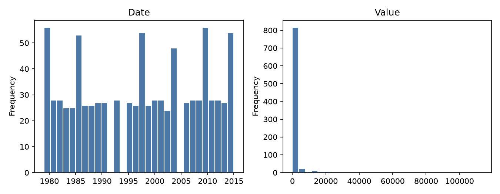
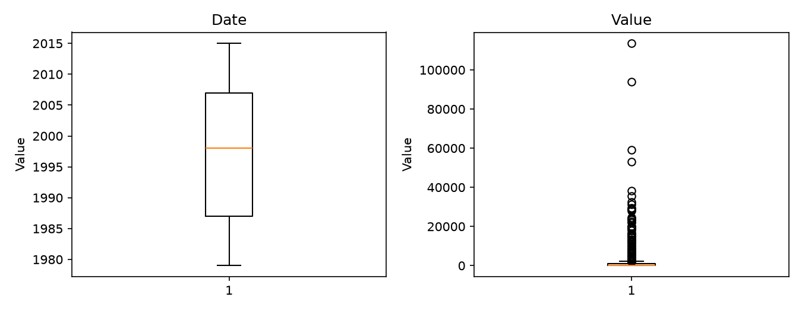
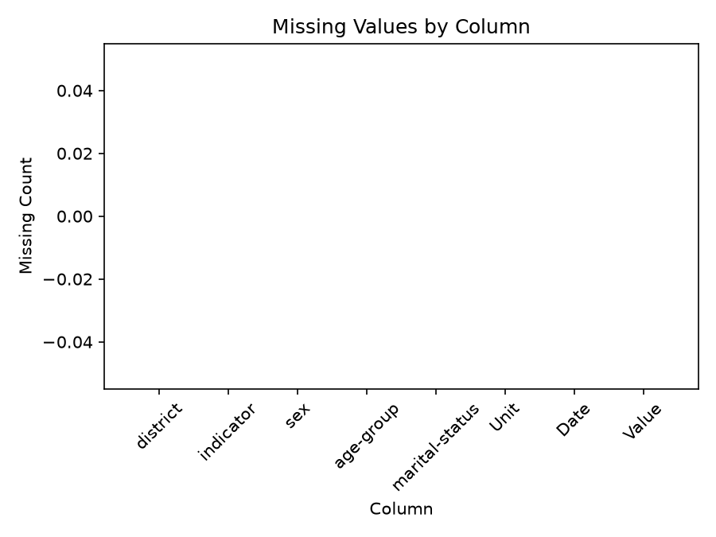

# Executive Summary

| Measure | Value |
| --- | --- |
| Dataset Name | ObservationData_dioidmb.csv |
| Rows | 886 |
| Columns | 8 |
| Date Range | Not detected |
| Detected Frequency | Not detected |
| Missing Values | 0 |
| Duplicate Rows | 9 |
| Duplicate Dates | 0 |
| Outliers Detected | 126 |
| Numeric Columns | 2 |
| Categorical Columns | 6 |
| Memory Usage | 315.55 KB |

## Dataset Overview

| Measure | Value |
| --- | --- |
| Rows | 886 |
| Columns | 8 |
| Memory Usage | 315.55 KB |
| Shape | 886 rows x 8 columns |
| Column Count | 8 |
| Numeric Columns | Date, Value |
| Numeric Column Count | 2 |
| Categorical Columns | district, indicator, sex, age-group, marital-status, Unit |
| Categorical Column Count | 6 |
| Datetime Columns | None |
| Datetime Column Count | 0 |

## Column Profile

| Column | Data Type | Memory Usage | Missing Count | Missing % | Unique Values | Example Value |
| --- | --- | --- | --- | --- | --- | --- |
| district | str | 49.32 KB | 0 | 0 | 1 | Botswana |
| indicator | str | 48.34 KB | 0 | 0 | 10 | Sorghum |
| sex | str | 52.78 KB | 0 | 0 | 1 | Total number |
| age-group | str | 51.91 KB | 0 | 0 | 1 | totalnumber |
| marital-status | str | 46.72 KB | 0 | 0 | 1 | Total |
| Unit | str | 52.50 KB | 0 | 0 | 4 | Thousand Hectares |
| Date | int64 | 6.92 KB | 0 | 0 | 33 | 1979 |
| Value | int64 | 6.92 KB | 0 | 0 | 463 | 67 |

## Preview

### First 5 Rows

| district | indicator | sex | age-group | marital-status | Unit | Date | Value |
| --- | --- | --- | --- | --- | --- | --- | --- |
| Botswana | Sorghum | Total number | totalnumber | Total | Thousand Hectares | 1979 | 67 |
| Botswana | Sorghum | Total number | totalnumber | Total | Thousand Hectares | 1980 | 143 |
| Botswana | Sorghum | Total number | totalnumber | Total | Thousand Hectares | 1981 | 136 |
| Botswana | Sorghum | Total number | totalnumber | Total | Thousand Hectares | 1982 | 91 |
| Botswana | Sorghum | Total number | totalnumber | Total | Thousand Hectares | 1983 | 125 |

### Last 5 Rows

| district | indicator | sex | age-group | marital-status | Unit | Date | Value |
| --- | --- | --- | --- | --- | --- | --- | --- |
| Botswana | Chicken | Total number | totalnumber | Total | Number | 2011 | 1499 |
| Botswana | Chicken | Total number | totalnumber | Total | Number | 2012 | 1130 |
| Botswana | Chicken | Total number | totalnumber | Total | Number | 2013 | 1081 |
| Botswana | Chicken | Total number | totalnumber | Total | Number | 2014 | 1017 |
| Botswana | Chicken | Total number | totalnumber | Total | Number | 2015 | 760 |

## Data Quality

| Measure | Value |
| --- | --- |
| Missing values | 0 |
| Missing % | 0 |
| Duplicate rows | 9 |
| Duplicate dates | 0 |
| Infinite values | 0 |
| Zero values | 6 |
| Negative values | 0 |
| Constant columns | district, sex, age-group, marital-status |
| Near-constant columns | None |
| Potential identifier columns | None |
| Mixed data type columns | None |
| Object columns containing dates | None |

### Numeric Sign Counts

| Column | Zero Values | Negative Values | Positive Values |
| --- | --- | --- | --- |
| Date | 0 | 0 | 886 |
| Value | 6 | 0 | 880 |

## Missing Value Analysis

### Missing Count Per Column

| Column | Missing Count | Missing % |
| --- | --- | --- |
| district | 0 | 0 |
| indicator | 0 | 0 |
| sex | 0 | 0 |
| age-group | 0 | 0 |
| marital-status | 0 | 0 |
| Unit | 0 | 0 |
| Date | 0 | 0 |
| Value | 0 | 0 |

Rows containing missing values: 0 (0.0%)

### Rows Containing Missing Values (First 10)

No records.

Grouped missing-value tables generated: 0

## Duplicate Analysis

Duplicate count: 9

### Preview Duplicate Records

| district | indicator | sex | age-group | marital-status | Unit | Date | Value |
| --- | --- | --- | --- | --- | --- | --- | --- |
| Botswana | Sunflower | Total number | totalnumber | Total | Thousand Hectares | 1980 | 5 |
| Botswana | Sunflower | Total number | totalnumber | Total | Thousand Hectares | 1981 | 1 |
| Botswana | Sunflower | Total number | totalnumber | Total | Thousand Hectares | 1982 | 1 |
| Botswana | Sunflower | Total number | totalnumber | Total | Thousand Hectares | 1997 | 1 |
| Botswana | Sunflower | Total number | totalnumber | Total | Thousand Hectares | 2000 | 1 |
| Botswana | Sunflower | Total number | totalnumber | Total | Thousand Hectares | 2001 | 1 |
| Botswana | Sunflower | Total number | totalnumber | Total | Thousand Hectares | 2009 | 1 |
| Botswana | Sunflower | Total number | totalnumber | Total | Thousand Hectares | 2011 | 14 |
| Botswana | Sunflower | Total number | totalnumber | Total | Thousand Hectares | 2014 | 1 |
| Botswana | Sunflower | Total number | totalnumber | Total | Thousand Hectares | 1980 | 5 |

### Repeated Date Values

No datetime columns detected.

## Numeric Statistics

| Column | Count | Mean | Median | Mode | Minimum | Maximum | Range | Variance | Standard Deviation | Coefficient of Variation | IQR | Skewness | Kurtosis | Zero Count | Negative Count | Positive Count | Outlier Count Using IQR |
| --- | --- | --- | --- | --- | --- | --- | --- | --- | --- | --- | --- | --- | --- | --- | --- | --- | --- |
| Date | 886 | 1997.23 | 1998 | 1979 | 1979 | 2015 | 36 | 125.321 | 11.1947 | 0.00560512 | 20 | -0.0607307 | -1.30908 | 0 | 0 | 886 | 0 |
| Value | 886 | 1835.94 | 116.5 | 1 | 0 | 113547 | 113547 | 5.02419e+07 | 7088.15 | 3.86078 | 839.5 | 9.10114 | 112.004 | 6 | 0 | 880 | 126 |

## Categorical Statistics

### district

Unique values: 1

| Top 10 Values | Frequency | Frequency % |
| --- | --- | --- |
| Botswana | 886 | 100 |

### indicator

Unique values: 10

| Top 10 Values | Frequency | Frequency % |
| --- | --- | --- |
| Sorghum | 132 | 14.9 |
| Maize | 132 | 14.9 |
| Pulses | 132 | 14.9 |
| Millet | 131 | 14.79 |
| Groundnuts | 121 | 13.66 |
| Sunflower | 106 | 11.96 |
| Cattle | 33 | 3.72 |
| Goats | 33 | 3.72 |
| Sheep | 33 | 3.72 |
| Chicken | 33 | 3.72 |

### sex

Unique values: 1

| Top 10 Values | Frequency | Frequency % |
| --- | --- | --- |
| Total number | 886 | 100 |

### age-group

Unique values: 1

| Top 10 Values | Frequency | Frequency % |
| --- | --- | --- |
| totalnumber | 886 | 100 |

### marital-status

Unique values: 1

| Top 10 Values | Frequency | Frequency % |
| --- | --- | --- |
| Total | 886 | 100 |

### Unit

Unique values: 4

| Top 10 Values | Frequency | Frequency % |
| --- | --- | --- |
| Thousand Hectares | 334 | 37.7 |
| metric tonnes | 222 | 25.06 |
| KG/HA | 198 | 22.35 |
| Number | 132 | 14.9 |

## Datetime Analysis

Datetime columns detected: 0

## Join Key Analysis

No candidate join keys detected.

## Correlation Analysis

| Column | Date | Value |
| --- | --- | --- |
| Date | 1 | 0.0131499 |
| Value | 0.0131499 | 1 |

| Measure | Columns | Correlation |
| --- | --- | --- |
| Highest correlation pair | Date \| Value | 0.0131499 |
| Lowest correlation pair | Date \| Value | 0.0131499 |

## Distribution Analysis

## Time-Series Diagnostics

Datetime columns detected: 0

- Time Series: Not generated

## Dataset-Specific Checks

Dataset-specific rule: No filename-specific rule matched

| Measure | Value |
| --- | --- |
| Dataset-specific checks generated | 0 |

## Pipeline Impact

| Measured Observation | Measured Value |
| --- | --- |
| Duplicate rows present | 9 |
| Constant columns present | district, sex, age-group, marital-status |
| Numeric measure-like column names present | Value |
| Dataset-specific rule applied | No filename-specific rule matched |

## Figures

| Figure | Saved File |
| --- | --- |
| Missing-value plot | ObservationData_dioidmb_missing.png |
| Correlation heatmap | ObservationData_dioidmb_correlation.png |
| Histograms | ObservationData_dioidmb_histogram.png |
| Boxplots | ObservationData_dioidmb_boxplot.png |
| Time-series plot | Not generated |

