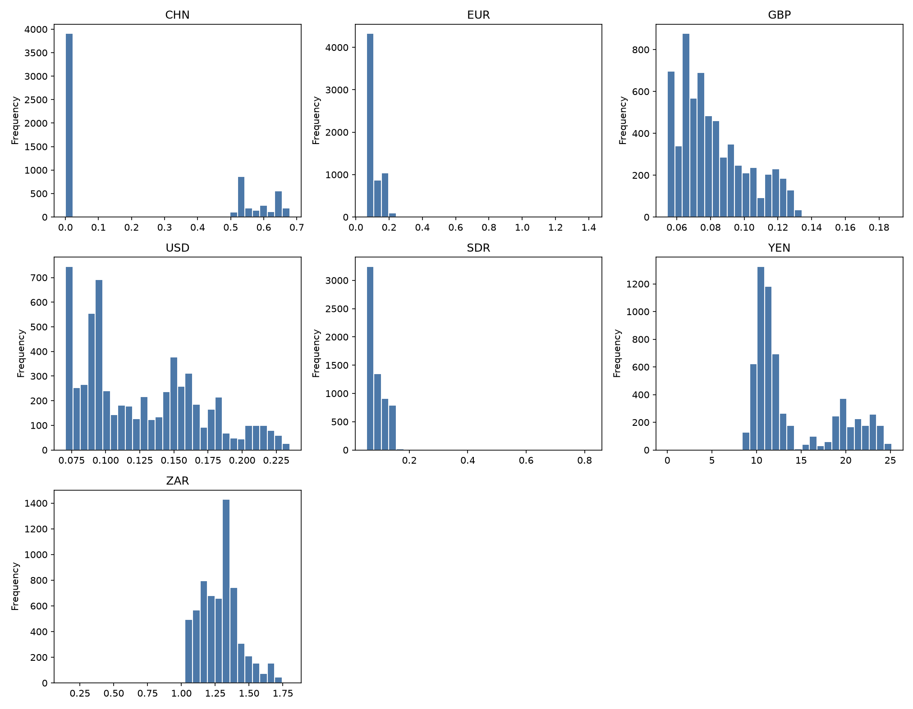
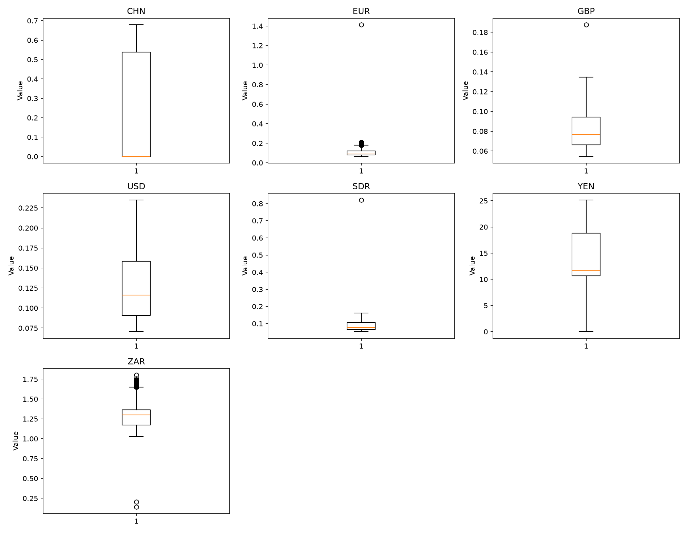
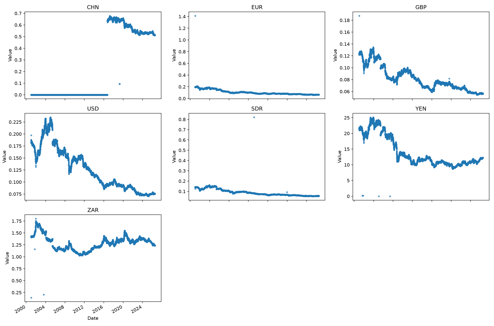
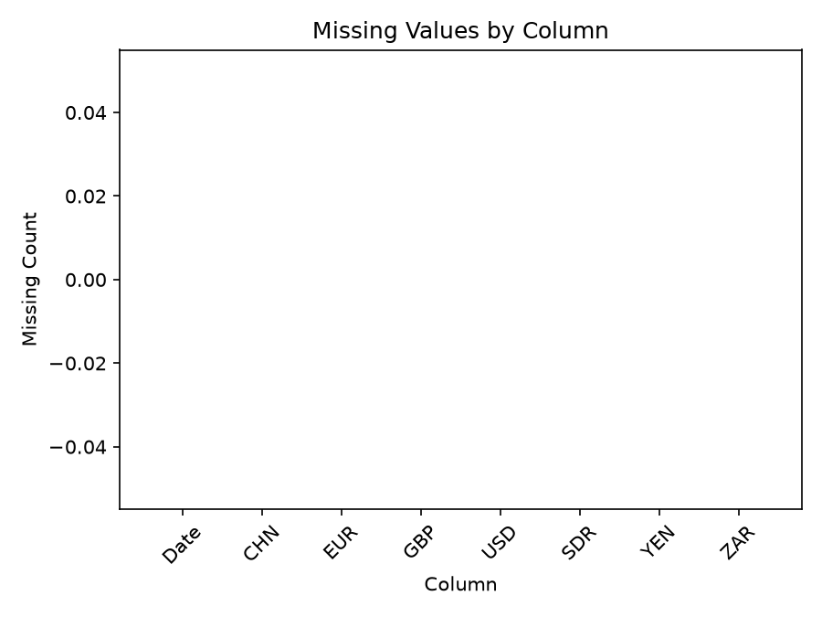
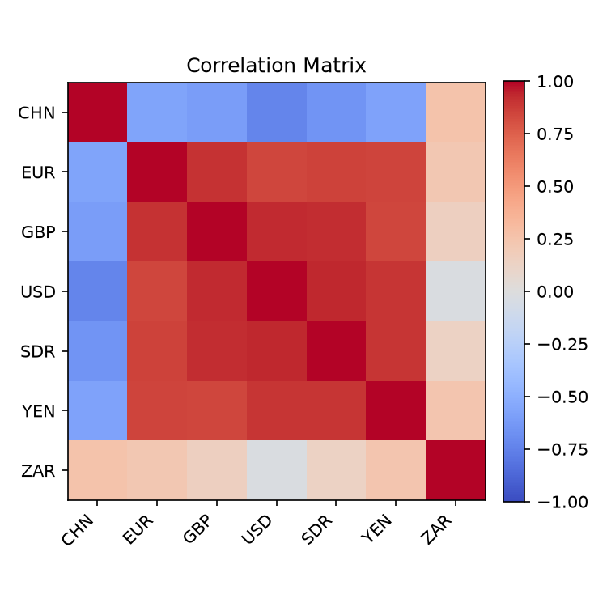

# Executive Summary

| Measure | Value |
| --- | --- |
| Dataset Name | bank-of-botswana-exchange-rates.csv |
| Rows | 6327 |
| Columns | 8 |
| Date Range | 2001-01-03 to 2026-07-17 |
| Detected Frequency | Irregular |
| Missing Values | 0 |
| Duplicate Rows | 0 |
| Duplicate Dates | 3 |
| Outliers Detected | 481 |
| Numeric Columns | 7 |
| Categorical Columns | 0 |
| Memory Usage | 716.86 KB |

## Dataset Overview

| Measure | Value |
| --- | --- |
| Rows | 6327 |
| Columns | 8 |
| Memory Usage | 716.86 KB |
| Shape | 6327 rows x 8 columns |
| Column Count | 8 |
| Numeric Columns | CHN, EUR, GBP, USD, SDR, YEN, ZAR |
| Numeric Column Count | 7 |
| Categorical Columns | None |
| Categorical Column Count | 0 |
| Datetime Columns | Date |
| Datetime Column Count | 1 |

## Column Profile

| Column | Data Type | Memory Usage | Missing Count | Missing % | Unique Values | Example Value |
| --- | --- | --- | --- | --- | --- | --- |
| Date | str | 370.72 KB | 0 | 0 | 6324 | 17 Jul 2026 |
| CHN | float64 | 49.43 KB | 0 | 0 | 1002 | 0.5112 |
| EUR | float64 | 49.43 KB | 0 | 0 | 1151 | 0.0659 |
| GBP | float64 | 49.43 KB | 0 | 0 | 756 | 0.056 |
| USD | float64 | 49.43 KB | 0 | 0 | 1413 | 0.0755 |
| SDR | float64 | 49.43 KB | 0 | 0 | 941 | 0.0555 |
| YEN | float64 | 49.43 KB | 0 | 0 | 1264 | 12.25 |
| ZAR | float64 | 49.43 KB | 0 | 0 | 3509 | 1.241 |

## Preview

### First 5 Rows

| Date | CHN | EUR | GBP | USD | SDR | YEN | ZAR |
| --- | --- | --- | --- | --- | --- | --- | --- |
| 17 Jul 2026 | 0.5112 | 0.0659 | 0.056 | 0.0755 | 0.0555 | 12.25 | 1.241 |
| 16 Jul 2026 | 0.5128 | 0.0661 | 0.056 | 0.0758 | 0.0556 | 12.28 | 1.2377 |
| 15 Jul 2026 | 0.5125 | 0.0662 | 0.0564 | 0.0757 | 0.0557 | 12.28 | 1.2368 |
| 14 Jul 2026 | 0.5108 | 0.0662 | 0.0564 | 0.0753 | 0.0555 | 12.23 | 1.2408 |
| 13 Jul 2026 | 0.5129 | 0.0663 | 0.0564 | 0.0756 | 0.0557 | 12.26 | 1.2379 |

### Last 5 Rows

| Date | CHN | EUR | GBP | USD | SDR | YEN | ZAR |
| --- | --- | --- | --- | --- | --- | --- | --- |
| 23 Apr 2009 | 0 | 0.1027 | 0.0919 | 0.1339 | 0.0901 | 13.13 | 1.1929 |
| 22 Apr 2009 | 0 | 0.1027 | 0.0907 | 0.1329 | 0.0897 | 13.08 | 1.1972 |
| 29 Apr 2009 | 0 | 0.1037 | 0.093 | 0.1368 | 0.0915 | 13.25 | 1.1804 |
| 28 Apr 2009 | 0 | 0.1034 | 0.0924 | 0.1346 | 0.0904 | 12.9 | 1.1902 |
| 27 Apr 2009 | 0 | 0.1023 | 0.0923 | 0.1345 | 0.0901 | 13.01 | 1.1929 |

## Data Quality

| Measure | Value |
| --- | --- |
| Missing values | 0 |
| Missing % | 0 |
| Duplicate rows | 0 |
| Duplicate dates | 3 |
| Infinite values | 0 |
| Zero values | 3911 |
| Negative values | 0 |
| Constant columns | None |
| Near-constant columns | None |
| Potential identifier columns | None |
| Mixed data type columns | None |
| Object columns containing dates | Date |

### Numeric Sign Counts

| Column | Zero Values | Negative Values | Positive Values |
| --- | --- | --- | --- |
| CHN | 3909 | 0 | 2418 |
| EUR | 0 | 0 | 6327 |
| GBP | 0 | 0 | 6327 |
| USD | 0 | 0 | 6327 |
| SDR | 0 | 0 | 6327 |
| YEN | 2 | 0 | 6325 |
| ZAR | 0 | 0 | 6327 |

## Missing Value Analysis

### Missing Count Per Column

| Column | Missing Count | Missing % |
| --- | --- | --- |
| Date | 0 | 0 |
| CHN | 0 | 0 |
| EUR | 0 | 0 |
| GBP | 0 | 0 |
| USD | 0 | 0 |
| SDR | 0 | 0 |
| YEN | 0 | 0 |
| ZAR | 0 | 0 |

Rows containing missing values: 0 (0.0%)

### Rows Containing Missing Values (First 10)

No records.

Grouped missing-value tables generated: 0

## Duplicate Analysis

Duplicate count: 0

### Preview Duplicate Records

No records.

### Repeated Date Values

| Datetime Column | Duplicate Date Rows | Duplicate Date Values | Status | First Duplicated Dates |
| --- | --- | --- | --- | --- |
| Date | 3 | 3 | Detected | 2019-08-13, 2018-10-23, 2018-01-17 |

## Numeric Statistics

| Column | Count | Mean | Median | Mode | Minimum | Maximum | Range | Variance | Standard Deviation | Coefficient of Variation | IQR | Skewness | Kurtosis | Zero Count | Negative Count | Positive Count | Outlier Count Using IQR |
| --- | --- | --- | --- | --- | --- | --- | --- | --- | --- | --- | --- | --- | --- | --- | --- | --- | --- |
| CHN | 6327 | 0.222891 | 0 | 0 | 0 | 0.6787 | 0.6787 | 0.081436 | 0.28537 | 1.28031 | 0.53825 | 0.525819 | -1.66997 | 3909 | 0 | 2418 | 0 |
| EUR | 6327 | 0.106377 | 0.0911 | 0.0831 | 0.0634 | 1.4117 | 1.3483 | 0.00169161 | 0.0411292 | 0.386637 | 0.0407 | 5.8506 | 159.523 | 0 | 0 | 6327 | 297 |
| GBP | 6327 | 0.081887 | 0.0765 | 0.0666 | 0.0544 | 0.1875 | 0.1331 | 0.000399495 | 0.0199874 | 0.244085 | 0.0279 | 0.762862 | -0.344336 | 0 | 0 | 6327 | 1 |
| USD | 6327 | 0.126373 | 0.1161 | 0.0733 | 0.0705 | 0.2349 | 0.1644 | 0.00185541 | 0.0430745 | 0.340852 | 0.0676 | 0.553605 | -0.773352 | 0 | 0 | 6327 | 0 |
| SDR | 6327 | 0.0880831 | 0.0764 | 0.0553 | 0.0528 | 0.821 | 0.7682 | 0.000945983 | 0.0307568 | 0.34918 | 0.0423 | 2.80667 | 49.9799 | 0 | 0 | 6327 | 1 |
| YEN | 6327 | 14.0058 | 11.66 | 10.91 | 0 | 25.15 | 25.15 | 21.8972 | 4.67944 | 0.334108 | 8.17 | 0.925771 | -0.65431 | 2 | 0 | 6325 | 0 |
| ZAR | 6327 | 1.28731 | 1.3002 | 1.323 | 0.1429 | 1.8006 | 1.6577 | 0.0216473 | 0.14713 | 0.114293 | 0.19 | 0.374931 | 1.12173 | 0 | 0 | 6327 | 182 |

## Categorical Statistics

Categorical columns detected: 0

## Datetime Analysis

| Column | Earliest Date | Latest Date | Date Span Days | Unique Dates | Duplicate Dates | Chronological Ordering | Monotonic Increasing | Estimated Frequency | Median Spacing | Most Common Spacing |
| --- | --- | --- | --- | --- | --- | --- | --- | --- | --- | --- |
| Date | 2001-01-03 | 2026-07-17 | 9326 | 6324 | 3 | False | False | Irregular | 1 days 00:00:00 | 1 days 00:00:00 |

## Join Key Analysis

No candidate join keys detected.

## Correlation Analysis

| Column | CHN | EUR | GBP | USD | SDR | YEN | ZAR |
| --- | --- | --- | --- | --- | --- | --- | --- |
| CHN | 1 | -0.569499 | -0.604068 | -0.731791 | -0.64962 | -0.57624 | 0.25148 |
| EUR | -0.569499 | 1 | 0.90296 | 0.841206 | 0.856681 | 0.849069 | 0.224223 |
| GBP | -0.604068 | 0.90296 | 1 | 0.92766 | 0.917672 | 0.843087 | 0.1554 |
| USD | -0.731791 | 0.841206 | 0.92766 | 1 | 0.932951 | 0.897337 | -0.0235082 |
| SDR | -0.64962 | 0.856681 | 0.917672 | 0.932951 | 1 | 0.893331 | 0.132179 |
| YEN | -0.57624 | 0.849069 | 0.843087 | 0.897337 | 0.893331 | 1 | 0.241793 |
| ZAR | 0.25148 | 0.224223 | 0.1554 | -0.0235082 | 0.132179 | 0.241793 | 1 |

| Measure | Columns | Correlation |
| --- | --- | --- |
| Highest correlation pair | USD \| SDR | 0.932951 |
| Lowest correlation pair | CHN \| USD | -0.731791 |

## Distribution Analysis

## Time-Series Diagnostics

| Column | Regular Frequency | Estimated Frequency | Missing Periods | Duplicate Periods | Business-Day Applicable | Business-Day Continuity % | Missing Business Days | Unexpected Weekday Gaps | Monthly Applicable | Monthly Continuity % | Missing Months |
| --- | --- | --- | --- | --- | --- | --- | --- | --- | --- | --- | --- |
| Date | False | Irregular | Not calculated | 3 | False | Not applicable | Not applicable | Not applicable | False | Not applicable | Not applicable |

## Dataset-Specific Checks

Dataset-specific rule: No filename-specific rule matched

| Measure | Value |
| --- | --- |
| Dataset-specific checks generated | 0 |

## Pipeline Impact

| Measured Observation | Measured Value |
| --- | --- |
| Object columns containing date-like values | Date |
| Duplicate datetime values present | 3 |
| Numeric measure-like column names present | USD |
| Dataset-specific rule applied | No filename-specific rule matched |

## Figures

| Figure | Saved File |
| --- | --- |
| Missing-value plot | bank-of-botswana-exchange-rates_missing.png |
| Correlation heatmap | bank-of-botswana-exchange-rates_correlation.png |
| Histograms | bank-of-botswana-exchange-rates_histogram.png |
| Boxplots | bank-of-botswana-exchange-rates_boxplot.png |
| Time-series plot | bank-of-botswana-exchange-rates_timeseries.png |

