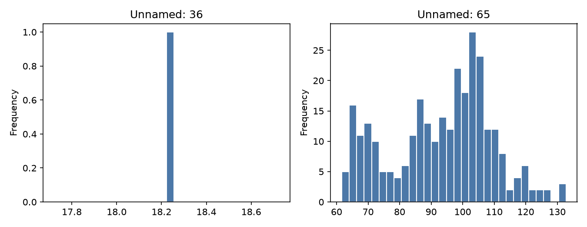
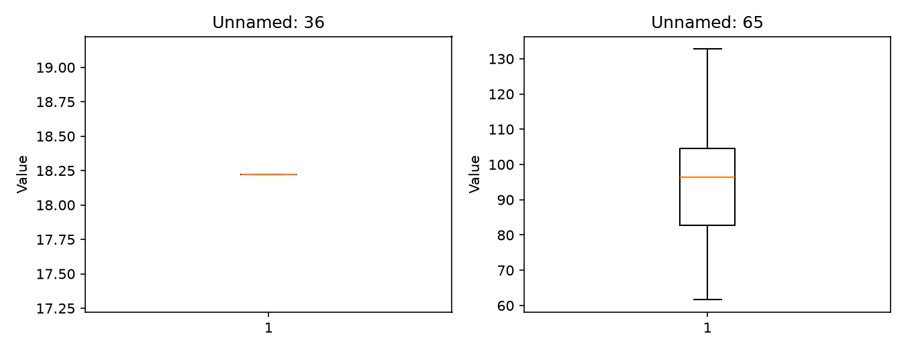
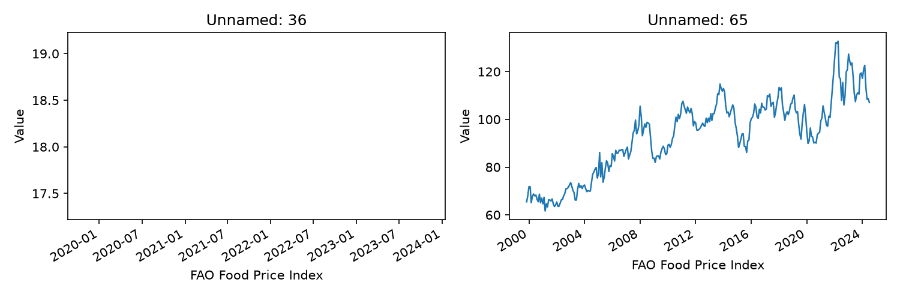
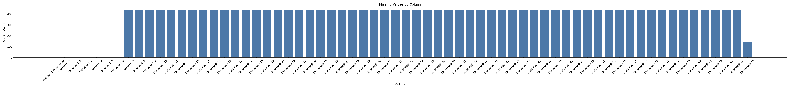
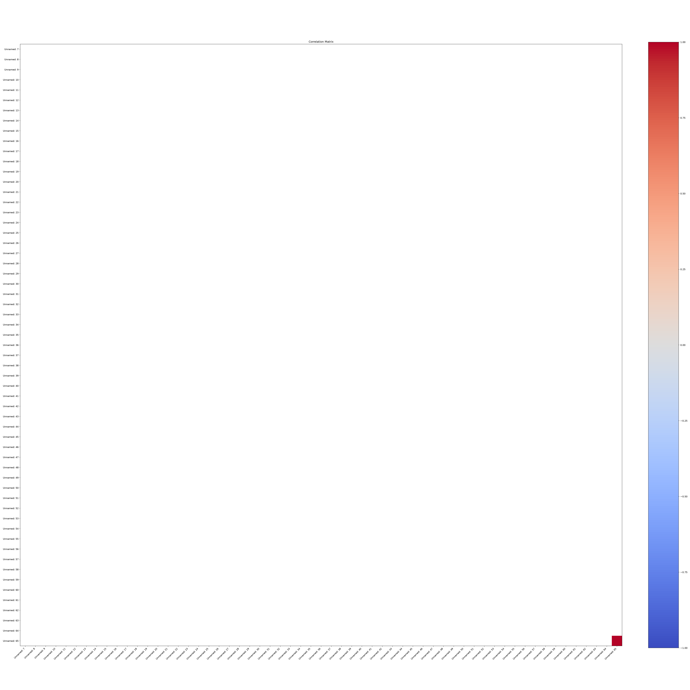

# Executive Summary

| Measure | Value |
| --- | --- |
| Dataset Name | food_price_indices_data.csv |
| Rows | 441 |
| Columns | 66 |
| Date Range | 1990-01-01 to 2026-06-01 |
| Detected Frequency | MS |
| Missing Values | 25734 |
| Duplicate Rows | 0 |
| Duplicate Dates | 0 |
| Outliers Detected | 0 |
| Numeric Columns | 59 |
| Categorical Columns | 6 |
| Memory Usage | 365.47 KB |

## Dataset Overview

| Measure | Value |
| --- | --- |
| Rows | 441 |
| Columns | 66 |
| Memory Usage | 365.47 KB |
| Shape | 441 rows x 66 columns |
| Column Count | 66 |
| Numeric Columns | Unnamed: 7, Unnamed: 8, Unnamed: 9, Unnamed: 10, Unnamed: 11, Unnamed: 12, Unnamed: 13, Unnamed: 14, Unnamed: 15, Unnamed: 16, Unnamed: 17, Unnamed: 18, Unnamed: 19, Unnamed: 20, Unnamed: 21, Unnamed: 22, Unnamed: 23, Unnamed: 24, Unnamed: 25, Unnamed: 26, Unnamed: 27, Unnamed: 28, Unnamed: 29, Unnamed: 30, Unnamed: 31, Unnamed: 32, Unnamed: 33, Unnamed: 34, Unnamed: 35, Unnamed: 36, Unnamed: 37, Unnamed: 38, Unnamed: 39, Unnamed: 40, Unnamed: 41, Unnamed: 42, Unnamed: 43, Unnamed: 44, Unnamed: 45, Unnamed: 46, Unnamed: 47, Unnamed: 48, Unnamed: 49, Unnamed: 50, Unnamed: 51, Unnamed: 52, Unnamed: 53, Unnamed: 54, Unnamed: 55, Unnamed: 56, Unnamed: 57, Unnamed: 58, Unnamed: 59, Unnamed: 60, Unnamed: 61, Unnamed: 62, Unnamed: 63, Unnamed: 64, Unnamed: 65 |
| Numeric Column Count | 59 |
| Categorical Columns | Unnamed: 1, Unnamed: 2, Unnamed: 3, Unnamed: 4, Unnamed: 5, Unnamed: 6 |
| Categorical Column Count | 6 |
| Datetime Columns | FAO Food Price Index |
| Datetime Column Count | 1 |

## Column Profile

| Column | Data Type | Memory Usage | Missing Count | Missing % | Unique Values | Example Value |
| --- | --- | --- | --- | --- | --- | --- |
| FAO Food Price Index | str | 24.10 KB | 1 | 0.23 | 441 | 2014-2016=100 |
| Unnamed: 1 | str | 22.93 KB | 2 | 0.45 | 324 | Food Price Index |
| Unnamed: 2 | str | 22.91 KB | 2 | 0.45 | 330 | Meat |
| Unnamed: 3 | str | 22.97 KB | 2 | 0.45 | 357 | Dairy |
| Unnamed: 4 | str | 22.94 KB | 2 | 0.45 | 336 | Cereals |
| Unnamed: 5 | str | 23.31 KB | 2 | 0.45 | 431 | Oils |
| Unnamed: 6 | str | 22.91 KB | 2 | 0.45 | 368 | Sugar |
| Unnamed: 7 | float64 | 3.45 KB | 441 | 100 | 1 |  |
| Unnamed: 8 | float64 | 3.45 KB | 441 | 100 | 1 |  |
| Unnamed: 9 | float64 | 3.45 KB | 441 | 100 | 1 |  |
| Unnamed: 10 | float64 | 3.45 KB | 441 | 100 | 1 |  |
| Unnamed: 11 | float64 | 3.45 KB | 441 | 100 | 1 |  |
| Unnamed: 12 | float64 | 3.45 KB | 441 | 100 | 1 |  |
| Unnamed: 13 | float64 | 3.45 KB | 441 | 100 | 1 |  |
| Unnamed: 14 | float64 | 3.45 KB | 441 | 100 | 1 |  |
| Unnamed: 15 | float64 | 3.45 KB | 441 | 100 | 1 |  |
| Unnamed: 16 | float64 | 3.45 KB | 441 | 100 | 1 |  |
| Unnamed: 17 | float64 | 3.45 KB | 441 | 100 | 1 |  |
| Unnamed: 18 | float64 | 3.45 KB | 441 | 100 | 1 |  |
| Unnamed: 19 | float64 | 3.45 KB | 441 | 100 | 1 |  |
| Unnamed: 20 | float64 | 3.45 KB | 441 | 100 | 1 |  |
| Unnamed: 21 | float64 | 3.45 KB | 441 | 100 | 1 |  |
| Unnamed: 22 | float64 | 3.45 KB | 441 | 100 | 1 |  |
| Unnamed: 23 | float64 | 3.45 KB | 441 | 100 | 1 |  |
| Unnamed: 24 | float64 | 3.45 KB | 441 | 100 | 1 |  |
| Unnamed: 25 | float64 | 3.45 KB | 441 | 100 | 1 |  |
| Unnamed: 26 | float64 | 3.45 KB | 441 | 100 | 1 |  |
| Unnamed: 27 | float64 | 3.45 KB | 441 | 100 | 1 |  |
| Unnamed: 28 | float64 | 3.45 KB | 441 | 100 | 1 |  |
| Unnamed: 29 | float64 | 3.45 KB | 441 | 100 | 1 |  |
| Unnamed: 30 | float64 | 3.45 KB | 441 | 100 | 1 |  |
| Unnamed: 31 | float64 | 3.45 KB | 441 | 100 | 1 |  |
| Unnamed: 32 | float64 | 3.45 KB | 441 | 100 | 1 |  |
| Unnamed: 33 | float64 | 3.45 KB | 441 | 100 | 1 |  |
| Unnamed: 34 | float64 | 3.45 KB | 441 | 100 | 1 |  |
| Unnamed: 35 | float64 | 3.45 KB | 441 | 100 | 1 |  |
| Unnamed: 36 | float64 | 3.45 KB | 440 | 99.77 | 2 | 18.2225 |
| Unnamed: 37 | float64 | 3.45 KB | 441 | 100 | 1 |  |
| Unnamed: 38 | float64 | 3.45 KB | 441 | 100 | 1 |  |
| Unnamed: 39 | float64 | 3.45 KB | 441 | 100 | 1 |  |
| Unnamed: 40 | float64 | 3.45 KB | 441 | 100 | 1 |  |
| Unnamed: 41 | float64 | 3.45 KB | 441 | 100 | 1 |  |
| Unnamed: 42 | float64 | 3.45 KB | 441 | 100 | 1 |  |
| Unnamed: 43 | float64 | 3.45 KB | 441 | 100 | 1 |  |
| Unnamed: 44 | float64 | 3.45 KB | 441 | 100 | 1 |  |
| Unnamed: 45 | float64 | 3.45 KB | 441 | 100 | 1 |  |
| Unnamed: 46 | float64 | 3.45 KB | 441 | 100 | 1 |  |
| Unnamed: 47 | float64 | 3.45 KB | 441 | 100 | 1 |  |
| Unnamed: 48 | float64 | 3.45 KB | 441 | 100 | 1 |  |
| Unnamed: 49 | float64 | 3.45 KB | 441 | 100 | 1 |  |
| Unnamed: 50 | float64 | 3.45 KB | 441 | 100 | 1 |  |
| Unnamed: 51 | float64 | 3.45 KB | 441 | 100 | 1 |  |
| Unnamed: 52 | float64 | 3.45 KB | 441 | 100 | 1 |  |
| Unnamed: 53 | float64 | 3.45 KB | 441 | 100 | 1 |  |
| Unnamed: 54 | float64 | 3.45 KB | 441 | 100 | 1 |  |
| Unnamed: 55 | float64 | 3.45 KB | 441 | 100 | 1 |  |
| Unnamed: 56 | float64 | 3.45 KB | 441 | 100 | 1 |  |
| Unnamed: 57 | float64 | 3.45 KB | 441 | 100 | 1 |  |
| Unnamed: 58 | float64 | 3.45 KB | 441 | 100 | 1 |  |
| Unnamed: 59 | float64 | 3.45 KB | 441 | 100 | 1 |  |
| Unnamed: 60 | float64 | 3.45 KB | 441 | 100 | 1 |  |
| Unnamed: 61 | float64 | 3.45 KB | 441 | 100 | 1 |  |
| Unnamed: 62 | float64 | 3.45 KB | 441 | 100 | 1 |  |
| Unnamed: 63 | float64 | 3.45 KB | 441 | 100 | 1 |  |
| Unnamed: 64 | float64 | 3.45 KB | 441 | 100 | 1 |  |
| Unnamed: 65 | float64 | 3.45 KB | 144 | 32.65 | 298 | 65.4525 |

## Preview

### First 5 Rows

| FAO Food Price Index | Unnamed: 1 | Unnamed: 2 | Unnamed: 3 | Unnamed: 4 | Unnamed: 5 | Unnamed: 6 | Unnamed: 7 | Unnamed: 8 | Unnamed: 9 | Unnamed: 10 | Unnamed: 11 | Unnamed: 12 | Unnamed: 13 | Unnamed: 14 | Unnamed: 15 | Unnamed: 16 | Unnamed: 17 | Unnamed: 18 | Unnamed: 19 | Unnamed: 20 | Unnamed: 21 | Unnamed: 22 | Unnamed: 23 | Unnamed: 24 | Unnamed: 25 | Unnamed: 26 | Unnamed: 27 | Unnamed: 28 | Unnamed: 29 | Unnamed: 30 | Unnamed: 31 | Unnamed: 32 | Unnamed: 33 | Unnamed: 34 | Unnamed: 35 | Unnamed: 36 | Unnamed: 37 | Unnamed: 38 | Unnamed: 39 | Unnamed: 40 | Unnamed: 41 | Unnamed: 42 | Unnamed: 43 | Unnamed: 44 | Unnamed: 45 | Unnamed: 46 | Unnamed: 47 | Unnamed: 48 | Unnamed: 49 | Unnamed: 50 | Unnamed: 51 | Unnamed: 52 | Unnamed: 53 | Unnamed: 54 | Unnamed: 55 | Unnamed: 56 | Unnamed: 57 | Unnamed: 58 | Unnamed: 59 | Unnamed: 60 | Unnamed: 61 | Unnamed: 62 | Unnamed: 63 | Unnamed: 64 | Unnamed: 65 |
| --- | --- | --- | --- | --- | --- | --- | --- | --- | --- | --- | --- | --- | --- | --- | --- | --- | --- | --- | --- | --- | --- | --- | --- | --- | --- | --- | --- | --- | --- | --- | --- | --- | --- | --- | --- | --- | --- | --- | --- | --- | --- | --- | --- | --- | --- | --- | --- | --- | --- | --- | --- | --- | --- | --- | --- | --- | --- | --- | --- | --- | --- | --- | --- | --- | --- |
| 2014-2016=100 | NaN | NaN | NaN | NaN | NaN | NaN | NaN | NaN | NaN | NaN | NaN | NaN | NaN | NaN | NaN | NaN | NaN | NaN | NaN | NaN | NaN | NaN | NaN | NaN | NaN | NaN | NaN | NaN | NaN | NaN | NaN | NaN | NaN | NaN | NaN | NaN | NaN | NaN | NaN | NaN | NaN | NaN | NaN | NaN | NaN | NaN | NaN | NaN | NaN | NaN | NaN | NaN | NaN | NaN | NaN | NaN | NaN | NaN | NaN | NaN | NaN | NaN | NaN | NaN | NaN |
| Date | Food Price Index | Meat | Dairy | Cereals | Oils | Sugar | NaN | NaN | NaN | NaN | NaN | NaN | NaN | NaN | NaN | NaN | NaN | NaN | NaN | NaN | NaN | NaN | NaN | NaN | NaN | NaN | NaN | NaN | NaN | NaN | NaN | NaN | NaN | NaN | NaN | NaN | NaN | NaN | NaN | NaN | NaN | NaN | NaN | NaN | NaN | NaN | NaN | NaN | NaN | NaN | NaN | NaN | NaN | NaN | NaN | NaN | NaN | NaN | NaN | NaN | NaN | NaN | NaN | NaN | NaN |
| NaN | NaN | NaN | NaN | NaN | NaN | NaN | NaN | NaN | NaN | NaN | NaN | NaN | NaN | NaN | NaN | NaN | NaN | NaN | NaN | NaN | NaN | NaN | NaN | NaN | NaN | NaN | NaN | NaN | NaN | NaN | NaN | NaN | NaN | NaN | NaN | NaN | NaN | NaN | NaN | NaN | NaN | NaN | NaN | NaN | NaN | NaN | NaN | NaN | NaN | NaN | NaN | NaN | NaN | NaN | NaN | NaN | NaN | NaN | NaN | NaN | NaN | NaN | NaN | NaN | NaN |
| 1990-01 | 64.4 | 74.3 | 53.5 | 64.1 | 44.59 | 87.9 | NaN | NaN | NaN | NaN | NaN | NaN | NaN | NaN | NaN | NaN | NaN | NaN | NaN | NaN | NaN | NaN | NaN | NaN | NaN | NaN | NaN | NaN | NaN | NaN | NaN | NaN | NaN | NaN | NaN | NaN | NaN | NaN | NaN | NaN | NaN | NaN | NaN | NaN | NaN | NaN | NaN | NaN | NaN | NaN | NaN | NaN | NaN | NaN | NaN | NaN | NaN | NaN | NaN | NaN | NaN | NaN | NaN | NaN | NaN |
| 1990-02 | 64.7 | 76.8 | 52.2 | 62.2 | 44.50 | 90.7 | NaN | NaN | NaN | NaN | NaN | NaN | NaN | NaN | NaN | NaN | NaN | NaN | NaN | NaN | NaN | NaN | NaN | NaN | NaN | NaN | NaN | NaN | NaN | NaN | NaN | NaN | NaN | NaN | NaN | NaN | NaN | NaN | NaN | NaN | NaN | NaN | NaN | NaN | NaN | NaN | NaN | NaN | NaN | NaN | NaN | NaN | NaN | NaN | NaN | NaN | NaN | NaN | NaN | NaN | NaN | NaN | NaN | NaN | NaN |

### Last 5 Rows

| FAO Food Price Index | Unnamed: 1 | Unnamed: 2 | Unnamed: 3 | Unnamed: 4 | Unnamed: 5 | Unnamed: 6 | Unnamed: 7 | Unnamed: 8 | Unnamed: 9 | Unnamed: 10 | Unnamed: 11 | Unnamed: 12 | Unnamed: 13 | Unnamed: 14 | Unnamed: 15 | Unnamed: 16 | Unnamed: 17 | Unnamed: 18 | Unnamed: 19 | Unnamed: 20 | Unnamed: 21 | Unnamed: 22 | Unnamed: 23 | Unnamed: 24 | Unnamed: 25 | Unnamed: 26 | Unnamed: 27 | Unnamed: 28 | Unnamed: 29 | Unnamed: 30 | Unnamed: 31 | Unnamed: 32 | Unnamed: 33 | Unnamed: 34 | Unnamed: 35 | Unnamed: 36 | Unnamed: 37 | Unnamed: 38 | Unnamed: 39 | Unnamed: 40 | Unnamed: 41 | Unnamed: 42 | Unnamed: 43 | Unnamed: 44 | Unnamed: 45 | Unnamed: 46 | Unnamed: 47 | Unnamed: 48 | Unnamed: 49 | Unnamed: 50 | Unnamed: 51 | Unnamed: 52 | Unnamed: 53 | Unnamed: 54 | Unnamed: 55 | Unnamed: 56 | Unnamed: 57 | Unnamed: 58 | Unnamed: 59 | Unnamed: 60 | Unnamed: 61 | Unnamed: 62 | Unnamed: 63 | Unnamed: 64 | Unnamed: 65 |
| --- | --- | --- | --- | --- | --- | --- | --- | --- | --- | --- | --- | --- | --- | --- | --- | --- | --- | --- | --- | --- | --- | --- | --- | --- | --- | --- | --- | --- | --- | --- | --- | --- | --- | --- | --- | --- | --- | --- | --- | --- | --- | --- | --- | --- | --- | --- | --- | --- | --- | --- | --- | --- | --- | --- | --- | --- | --- | --- | --- | --- | --- | --- | --- | --- | --- |
| 2026-02 | 125.5 | 126.5 | 119.4 | 108.7 | 174.2 | 86.2 | NaN | NaN | NaN | NaN | NaN | NaN | NaN | NaN | NaN | NaN | NaN | NaN | NaN | NaN | NaN | NaN | NaN | NaN | NaN | NaN | NaN | NaN | NaN | NaN | NaN | NaN | NaN | NaN | NaN | NaN | NaN | NaN | NaN | NaN | NaN | NaN | NaN | NaN | NaN | NaN | NaN | NaN | NaN | NaN | NaN | NaN | NaN | NaN | NaN | NaN | NaN | NaN | NaN | NaN | NaN | NaN | NaN | NaN | NaN |
| 2026-03 | 128.7 | 128.0 | 121.2 | 110.4 | 183.1 | 92.8 | NaN | NaN | NaN | NaN | NaN | NaN | NaN | NaN | NaN | NaN | NaN | NaN | NaN | NaN | NaN | NaN | NaN | NaN | NaN | NaN | NaN | NaN | NaN | NaN | NaN | NaN | NaN | NaN | NaN | NaN | NaN | NaN | NaN | NaN | NaN | NaN | NaN | NaN | NaN | NaN | NaN | NaN | NaN | NaN | NaN | NaN | NaN | NaN | NaN | NaN | NaN | NaN | NaN | NaN | NaN | NaN | NaN | NaN | NaN |
| 2026-04 | 131.0 | 130.4 | 119.7 | 111.3 | 193.9 | 88.5 | NaN | NaN | NaN | NaN | NaN | NaN | NaN | NaN | NaN | NaN | NaN | NaN | NaN | NaN | NaN | NaN | NaN | NaN | NaN | NaN | NaN | NaN | NaN | NaN | NaN | NaN | NaN | NaN | NaN | NaN | NaN | NaN | NaN | NaN | NaN | NaN | NaN | NaN | NaN | NaN | NaN | NaN | NaN | NaN | NaN | NaN | NaN | NaN | NaN | NaN | NaN | NaN | NaN | NaN | NaN | NaN | NaN | NaN | NaN |
| 2026-05 | 130.8 | 130.5 | 119.2 | 114.2 | 185.0 | 95.1 | NaN | NaN | NaN | NaN | NaN | NaN | NaN | NaN | NaN | NaN | NaN | NaN | NaN | NaN | NaN | NaN | NaN | NaN | NaN | NaN | NaN | NaN | NaN | NaN | NaN | NaN | NaN | NaN | NaN | NaN | NaN | NaN | NaN | NaN | NaN | NaN | NaN | NaN | NaN | NaN | NaN | NaN | NaN | NaN | NaN | NaN | NaN | NaN | NaN | NaN | NaN | NaN | NaN | NaN | NaN | NaN | NaN | NaN | NaN |
| 2026-06 | 130.3 | 131.0 | 117.4 | 110.2 | 192.0 | 89.7 | NaN | NaN | NaN | NaN | NaN | NaN | NaN | NaN | NaN | NaN | NaN | NaN | NaN | NaN | NaN | NaN | NaN | NaN | NaN | NaN | NaN | NaN | NaN | NaN | NaN | NaN | NaN | NaN | NaN | NaN | NaN | NaN | NaN | NaN | NaN | NaN | NaN | NaN | NaN | NaN | NaN | NaN | NaN | NaN | NaN | NaN | NaN | NaN | NaN | NaN | NaN | NaN | NaN | NaN | NaN | NaN | NaN | NaN | NaN |

## Data Quality

| Measure | Value |
| --- | --- |
| Missing values | 25734 |
| Missing % | 88.41 |
| Duplicate rows | 0 |
| Duplicate dates | 0 |
| Infinite values | 0 |
| Zero values | 0 |
| Negative values | 0 |
| Constant columns | Unnamed: 7, Unnamed: 8, Unnamed: 9, Unnamed: 10, Unnamed: 11, Unnamed: 12, Unnamed: 13, Unnamed: 14, Unnamed: 15, Unnamed: 16, Unnamed: 17, Unnamed: 18, Unnamed: 19, Unnamed: 20, Unnamed: 21, Unnamed: 22, Unnamed: 23, Unnamed: 24, Unnamed: 25, Unnamed: 26, Unnamed: 27, Unnamed: 28, Unnamed: 29, Unnamed: 30, Unnamed: 31, Unnamed: 32, Unnamed: 33, Unnamed: 34, Unnamed: 35, Unnamed: 37, Unnamed: 38, Unnamed: 39, Unnamed: 40, Unnamed: 41, Unnamed: 42, Unnamed: 43, Unnamed: 44, Unnamed: 45, Unnamed: 46, Unnamed: 47, Unnamed: 48, Unnamed: 49, Unnamed: 50, Unnamed: 51, Unnamed: 52, Unnamed: 53, Unnamed: 54, Unnamed: 55, Unnamed: 56, Unnamed: 57, Unnamed: 58, Unnamed: 59, Unnamed: 60, Unnamed: 61, Unnamed: 62, Unnamed: 63, Unnamed: 64 |
| Near-constant columns | Unnamed: 36 |
| Potential identifier columns | Unnamed: 5 |
| Mixed data type columns | None |
| Object columns containing dates | FAO Food Price Index |

### Numeric Sign Counts

| Column | Zero Values | Negative Values | Positive Values |
| --- | --- | --- | --- |
| Unnamed: 7 | 0 | 0 | 0 |
| Unnamed: 8 | 0 | 0 | 0 |
| Unnamed: 9 | 0 | 0 | 0 |
| Unnamed: 10 | 0 | 0 | 0 |
| Unnamed: 11 | 0 | 0 | 0 |
| Unnamed: 12 | 0 | 0 | 0 |
| Unnamed: 13 | 0 | 0 | 0 |
| Unnamed: 14 | 0 | 0 | 0 |
| Unnamed: 15 | 0 | 0 | 0 |
| Unnamed: 16 | 0 | 0 | 0 |
| Unnamed: 17 | 0 | 0 | 0 |
| Unnamed: 18 | 0 | 0 | 0 |
| Unnamed: 19 | 0 | 0 | 0 |
| Unnamed: 20 | 0 | 0 | 0 |
| Unnamed: 21 | 0 | 0 | 0 |
| Unnamed: 22 | 0 | 0 | 0 |
| Unnamed: 23 | 0 | 0 | 0 |
| Unnamed: 24 | 0 | 0 | 0 |
| Unnamed: 25 | 0 | 0 | 0 |
| Unnamed: 26 | 0 | 0 | 0 |
| Unnamed: 27 | 0 | 0 | 0 |
| Unnamed: 28 | 0 | 0 | 0 |
| Unnamed: 29 | 0 | 0 | 0 |
| Unnamed: 30 | 0 | 0 | 0 |
| Unnamed: 31 | 0 | 0 | 0 |
| Unnamed: 32 | 0 | 0 | 0 |
| Unnamed: 33 | 0 | 0 | 0 |
| Unnamed: 34 | 0 | 0 | 0 |
| Unnamed: 35 | 0 | 0 | 0 |
| Unnamed: 36 | 0 | 0 | 1 |
| Unnamed: 37 | 0 | 0 | 0 |
| Unnamed: 38 | 0 | 0 | 0 |
| Unnamed: 39 | 0 | 0 | 0 |
| Unnamed: 40 | 0 | 0 | 0 |
| Unnamed: 41 | 0 | 0 | 0 |
| Unnamed: 42 | 0 | 0 | 0 |
| Unnamed: 43 | 0 | 0 | 0 |
| Unnamed: 44 | 0 | 0 | 0 |
| Unnamed: 45 | 0 | 0 | 0 |
| Unnamed: 46 | 0 | 0 | 0 |
| Unnamed: 47 | 0 | 0 | 0 |
| Unnamed: 48 | 0 | 0 | 0 |
| Unnamed: 49 | 0 | 0 | 0 |
| Unnamed: 50 | 0 | 0 | 0 |
| Unnamed: 51 | 0 | 0 | 0 |
| Unnamed: 52 | 0 | 0 | 0 |
| Unnamed: 53 | 0 | 0 | 0 |
| Unnamed: 54 | 0 | 0 | 0 |
| Unnamed: 55 | 0 | 0 | 0 |
| Unnamed: 56 | 0 | 0 | 0 |
| Unnamed: 57 | 0 | 0 | 0 |
| Unnamed: 58 | 0 | 0 | 0 |
| Unnamed: 59 | 0 | 0 | 0 |
| Unnamed: 60 | 0 | 0 | 0 |
| Unnamed: 61 | 0 | 0 | 0 |
| Unnamed: 62 | 0 | 0 | 0 |
| Unnamed: 63 | 0 | 0 | 0 |
| Unnamed: 64 | 0 | 0 | 0 |
| Unnamed: 65 | 0 | 0 | 297 |

### Near-Constant Columns (Dominant Value >= 95%)

| Column | Dominant Value | Dominant Count | Dominant % | Unique Values |
| --- | --- | --- | --- | --- |
| Unnamed: 36 | NaN | 440 | 99.77 | 2 |

### Potential Identifier Columns (Unique Ratio >= 95%)

| Column | Unique Values | Unique % |
| --- | --- | --- |
| Unnamed: 5 | 431 | 97.73 |

## Missing Value Analysis

### Missing Count Per Column

| Column | Missing Count | Missing % |
| --- | --- | --- |
| FAO Food Price Index | 1 | 0.23 |
| Unnamed: 1 | 2 | 0.45 |
| Unnamed: 2 | 2 | 0.45 |
| Unnamed: 3 | 2 | 0.45 |
| Unnamed: 4 | 2 | 0.45 |
| Unnamed: 5 | 2 | 0.45 |
| Unnamed: 6 | 2 | 0.45 |
| Unnamed: 7 | 441 | 100 |
| Unnamed: 8 | 441 | 100 |
| Unnamed: 9 | 441 | 100 |
| Unnamed: 10 | 441 | 100 |
| Unnamed: 11 | 441 | 100 |
| Unnamed: 12 | 441 | 100 |
| Unnamed: 13 | 441 | 100 |
| Unnamed: 14 | 441 | 100 |
| Unnamed: 15 | 441 | 100 |
| Unnamed: 16 | 441 | 100 |
| Unnamed: 17 | 441 | 100 |
| Unnamed: 18 | 441 | 100 |
| Unnamed: 19 | 441 | 100 |
| Unnamed: 20 | 441 | 100 |
| Unnamed: 21 | 441 | 100 |
| Unnamed: 22 | 441 | 100 |
| Unnamed: 23 | 441 | 100 |
| Unnamed: 24 | 441 | 100 |
| Unnamed: 25 | 441 | 100 |
| Unnamed: 26 | 441 | 100 |
| Unnamed: 27 | 441 | 100 |
| Unnamed: 28 | 441 | 100 |
| Unnamed: 29 | 441 | 100 |
| Unnamed: 30 | 441 | 100 |
| Unnamed: 31 | 441 | 100 |
| Unnamed: 32 | 441 | 100 |
| Unnamed: 33 | 441 | 100 |
| Unnamed: 34 | 441 | 100 |
| Unnamed: 35 | 441 | 100 |
| Unnamed: 36 | 440 | 99.77 |
| Unnamed: 37 | 441 | 100 |
| Unnamed: 38 | 441 | 100 |
| Unnamed: 39 | 441 | 100 |
| Unnamed: 40 | 441 | 100 |
| Unnamed: 41 | 441 | 100 |
| Unnamed: 42 | 441 | 100 |
| Unnamed: 43 | 441 | 100 |
| Unnamed: 44 | 441 | 100 |
| Unnamed: 45 | 441 | 100 |
| Unnamed: 46 | 441 | 100 |
| Unnamed: 47 | 441 | 100 |
| Unnamed: 48 | 441 | 100 |
| Unnamed: 49 | 441 | 100 |
| Unnamed: 50 | 441 | 100 |
| Unnamed: 51 | 441 | 100 |
| Unnamed: 52 | 441 | 100 |
| Unnamed: 53 | 441 | 100 |
| Unnamed: 54 | 441 | 100 |
| Unnamed: 55 | 441 | 100 |
| Unnamed: 56 | 441 | 100 |
| Unnamed: 57 | 441 | 100 |
| Unnamed: 58 | 441 | 100 |
| Unnamed: 59 | 441 | 100 |
| Unnamed: 60 | 441 | 100 |
| Unnamed: 61 | 441 | 100 |
| Unnamed: 62 | 441 | 100 |
| Unnamed: 63 | 441 | 100 |
| Unnamed: 64 | 441 | 100 |
| Unnamed: 65 | 144 | 32.65 |

Rows containing missing values: 441 (100.0%)

### Rows Containing Missing Values (First 10)

| FAO Food Price Index | Unnamed: 1 | Unnamed: 2 | Unnamed: 3 | Unnamed: 4 | Unnamed: 5 | Unnamed: 6 | Unnamed: 7 | Unnamed: 8 | Unnamed: 9 | Unnamed: 10 | Unnamed: 11 | Unnamed: 12 | Unnamed: 13 | Unnamed: 14 | Unnamed: 15 | Unnamed: 16 | Unnamed: 17 | Unnamed: 18 | Unnamed: 19 | Unnamed: 20 | Unnamed: 21 | Unnamed: 22 | Unnamed: 23 | Unnamed: 24 | Unnamed: 25 | Unnamed: 26 | Unnamed: 27 | Unnamed: 28 | Unnamed: 29 | Unnamed: 30 | Unnamed: 31 | Unnamed: 32 | Unnamed: 33 | Unnamed: 34 | Unnamed: 35 | Unnamed: 36 | Unnamed: 37 | Unnamed: 38 | Unnamed: 39 | Unnamed: 40 | Unnamed: 41 | Unnamed: 42 | Unnamed: 43 | Unnamed: 44 | Unnamed: 45 | Unnamed: 46 | Unnamed: 47 | Unnamed: 48 | Unnamed: 49 | Unnamed: 50 | Unnamed: 51 | Unnamed: 52 | Unnamed: 53 | Unnamed: 54 | Unnamed: 55 | Unnamed: 56 | Unnamed: 57 | Unnamed: 58 | Unnamed: 59 | Unnamed: 60 | Unnamed: 61 | Unnamed: 62 | Unnamed: 63 | Unnamed: 64 | Unnamed: 65 |
| --- | --- | --- | --- | --- | --- | --- | --- | --- | --- | --- | --- | --- | --- | --- | --- | --- | --- | --- | --- | --- | --- | --- | --- | --- | --- | --- | --- | --- | --- | --- | --- | --- | --- | --- | --- | --- | --- | --- | --- | --- | --- | --- | --- | --- | --- | --- | --- | --- | --- | --- | --- | --- | --- | --- | --- | --- | --- | --- | --- | --- | --- | --- | --- | --- | --- |
| 2014-2016=100 | NaN | NaN | NaN | NaN | NaN | NaN | NaN | NaN | NaN | NaN | NaN | NaN | NaN | NaN | NaN | NaN | NaN | NaN | NaN | NaN | NaN | NaN | NaN | NaN | NaN | NaN | NaN | NaN | NaN | NaN | NaN | NaN | NaN | NaN | NaN | NaN | NaN | NaN | NaN | NaN | NaN | NaN | NaN | NaN | NaN | NaN | NaN | NaN | NaN | NaN | NaN | NaN | NaN | NaN | NaN | NaN | NaN | NaN | NaN | NaN | NaN | NaN | NaN | NaN | NaN |
| Date | Food Price Index | Meat | Dairy | Cereals | Oils | Sugar | NaN | NaN | NaN | NaN | NaN | NaN | NaN | NaN | NaN | NaN | NaN | NaN | NaN | NaN | NaN | NaN | NaN | NaN | NaN | NaN | NaN | NaN | NaN | NaN | NaN | NaN | NaN | NaN | NaN | NaN | NaN | NaN | NaN | NaN | NaN | NaN | NaN | NaN | NaN | NaN | NaN | NaN | NaN | NaN | NaN | NaN | NaN | NaN | NaN | NaN | NaN | NaN | NaN | NaN | NaN | NaN | NaN | NaN | NaN |
| NaN | NaN | NaN | NaN | NaN | NaN | NaN | NaN | NaN | NaN | NaN | NaN | NaN | NaN | NaN | NaN | NaN | NaN | NaN | NaN | NaN | NaN | NaN | NaN | NaN | NaN | NaN | NaN | NaN | NaN | NaN | NaN | NaN | NaN | NaN | NaN | NaN | NaN | NaN | NaN | NaN | NaN | NaN | NaN | NaN | NaN | NaN | NaN | NaN | NaN | NaN | NaN | NaN | NaN | NaN | NaN | NaN | NaN | NaN | NaN | NaN | NaN | NaN | NaN | NaN | NaN |
| 1990-01 | 64.4 | 74.3 | 53.5 | 64.1 | 44.59 | 87.9 | NaN | NaN | NaN | NaN | NaN | NaN | NaN | NaN | NaN | NaN | NaN | NaN | NaN | NaN | NaN | NaN | NaN | NaN | NaN | NaN | NaN | NaN | NaN | NaN | NaN | NaN | NaN | NaN | NaN | NaN | NaN | NaN | NaN | NaN | NaN | NaN | NaN | NaN | NaN | NaN | NaN | NaN | NaN | NaN | NaN | NaN | NaN | NaN | NaN | NaN | NaN | NaN | NaN | NaN | NaN | NaN | NaN | NaN | NaN |
| 1990-02 | 64.7 | 76.8 | 52.2 | 62.2 | 44.50 | 90.7 | NaN | NaN | NaN | NaN | NaN | NaN | NaN | NaN | NaN | NaN | NaN | NaN | NaN | NaN | NaN | NaN | NaN | NaN | NaN | NaN | NaN | NaN | NaN | NaN | NaN | NaN | NaN | NaN | NaN | NaN | NaN | NaN | NaN | NaN | NaN | NaN | NaN | NaN | NaN | NaN | NaN | NaN | NaN | NaN | NaN | NaN | NaN | NaN | NaN | NaN | NaN | NaN | NaN | NaN | NaN | NaN | NaN | NaN | NaN |
| 1990-03 | 64.0 | 78.5 | 41.4 | 61.3 | 45.75 | 95.1 | NaN | NaN | NaN | NaN | NaN | NaN | NaN | NaN | NaN | NaN | NaN | NaN | NaN | NaN | NaN | NaN | NaN | NaN | NaN | NaN | NaN | NaN | NaN | NaN | NaN | NaN | NaN | NaN | NaN | NaN | NaN | NaN | NaN | NaN | NaN | NaN | NaN | NaN | NaN | NaN | NaN | NaN | NaN | NaN | NaN | NaN | NaN | NaN | NaN | NaN | NaN | NaN | NaN | NaN | NaN | NaN | NaN | NaN | NaN |
| 1990-04 | 66.0 | 81.2 | 48.4 | 62.8 | 44.02 | 94.3 | NaN | NaN | NaN | NaN | NaN | NaN | NaN | NaN | NaN | NaN | NaN | NaN | NaN | NaN | NaN | NaN | NaN | NaN | NaN | NaN | NaN | NaN | NaN | NaN | NaN | NaN | NaN | NaN | NaN | NaN | NaN | NaN | NaN | NaN | NaN | NaN | NaN | NaN | NaN | NaN | NaN | NaN | NaN | NaN | NaN | NaN | NaN | NaN | NaN | NaN | NaN | NaN | NaN | NaN | NaN | NaN | NaN | NaN | NaN |
| 1990-05 | 64.6 | 81.8 | 39.2 | 62.0 | 45.50 | 90.4 | NaN | NaN | NaN | NaN | NaN | NaN | NaN | NaN | NaN | NaN | NaN | NaN | NaN | NaN | NaN | NaN | NaN | NaN | NaN | NaN | NaN | NaN | NaN | NaN | NaN | NaN | NaN | NaN | NaN | NaN | NaN | NaN | NaN | NaN | NaN | NaN | NaN | NaN | NaN | NaN | NaN | NaN | NaN | NaN | NaN | NaN | NaN | NaN | NaN | NaN | NaN | NaN | NaN | NaN | NaN | NaN | NaN | NaN | NaN |
| 1990-06 | 64.1 | 84.2 | 39.2 | 60.7 | 43.80 | 80.3 | NaN | NaN | NaN | NaN | NaN | NaN | NaN | NaN | NaN | NaN | NaN | NaN | NaN | NaN | NaN | NaN | NaN | NaN | NaN | NaN | NaN | NaN | NaN | NaN | NaN | NaN | NaN | NaN | NaN | NaN | NaN | NaN | NaN | NaN | NaN | NaN | NaN | NaN | NaN | NaN | NaN | NaN | NaN | NaN | NaN | NaN | NaN | NaN | NaN | NaN | NaN | NaN | NaN | NaN | NaN | NaN | NaN | NaN | NaN |
| 1990-07 | 62.9 | 84.5 | 39.2 | 57.9 | 43.72 | 74.2 | NaN | NaN | NaN | NaN | NaN | NaN | NaN | NaN | NaN | NaN | NaN | NaN | NaN | NaN | NaN | NaN | NaN | NaN | NaN | NaN | NaN | NaN | NaN | NaN | NaN | NaN | NaN | NaN | NaN | NaN | NaN | NaN | NaN | NaN | NaN | NaN | NaN | NaN | NaN | NaN | NaN | NaN | NaN | NaN | NaN | NaN | NaN | NaN | NaN | NaN | NaN | NaN | NaN | NaN | NaN | NaN | NaN | NaN | NaN |

### Missing Values Grouped by Year

| Year | Rows With Missing Values | Missing Cells |
| --- | --- | --- |
| 1990 | 12 | 708 |
| 1991 | 12 | 708 |
| 1992 | 12 | 708 |
| 1993 | 12 | 708 |
| 1994 | 12 | 708 |
| 1995 | 12 | 708 |
| 1996 | 12 | 708 |
| 1997 | 12 | 708 |
| 1998 | 12 | 708 |
| 2025 | 12 | 708 |

## Duplicate Analysis

Duplicate count: 0

### Preview Duplicate Records

No records.

### Repeated Date Values

| Datetime Column | Duplicate Date Rows | Duplicate Date Values | Status | First Duplicated Dates |
| --- | --- | --- | --- | --- |
| FAO Food Price Index | 0 | 0 | No duplicates | None |

## Numeric Statistics

| Column | Count | Mean | Median | Mode | Minimum | Maximum | Range | Variance | Standard Deviation | Coefficient of Variation | IQR | Skewness | Kurtosis | Zero Count | Negative Count | Positive Count | Outlier Count Using IQR |
| --- | --- | --- | --- | --- | --- | --- | --- | --- | --- | --- | --- | --- | --- | --- | --- | --- | --- |
| Unnamed: 7 | 0 | NaN | NaN | NaN | NaN | NaN | NaN | NaN | NaN | NaN | NaN | NaN | NaN | 0 | 0 | 0 | 0 |
| Unnamed: 8 | 0 | NaN | NaN | NaN | NaN | NaN | NaN | NaN | NaN | NaN | NaN | NaN | NaN | 0 | 0 | 0 | 0 |
| Unnamed: 9 | 0 | NaN | NaN | NaN | NaN | NaN | NaN | NaN | NaN | NaN | NaN | NaN | NaN | 0 | 0 | 0 | 0 |
| Unnamed: 10 | 0 | NaN | NaN | NaN | NaN | NaN | NaN | NaN | NaN | NaN | NaN | NaN | NaN | 0 | 0 | 0 | 0 |
| Unnamed: 11 | 0 | NaN | NaN | NaN | NaN | NaN | NaN | NaN | NaN | NaN | NaN | NaN | NaN | 0 | 0 | 0 | 0 |
| Unnamed: 12 | 0 | NaN | NaN | NaN | NaN | NaN | NaN | NaN | NaN | NaN | NaN | NaN | NaN | 0 | 0 | 0 | 0 |
| Unnamed: 13 | 0 | NaN | NaN | NaN | NaN | NaN | NaN | NaN | NaN | NaN | NaN | NaN | NaN | 0 | 0 | 0 | 0 |
| Unnamed: 14 | 0 | NaN | NaN | NaN | NaN | NaN | NaN | NaN | NaN | NaN | NaN | NaN | NaN | 0 | 0 | 0 | 0 |
| Unnamed: 15 | 0 | NaN | NaN | NaN | NaN | NaN | NaN | NaN | NaN | NaN | NaN | NaN | NaN | 0 | 0 | 0 | 0 |
| Unnamed: 16 | 0 | NaN | NaN | NaN | NaN | NaN | NaN | NaN | NaN | NaN | NaN | NaN | NaN | 0 | 0 | 0 | 0 |
| Unnamed: 17 | 0 | NaN | NaN | NaN | NaN | NaN | NaN | NaN | NaN | NaN | NaN | NaN | NaN | 0 | 0 | 0 | 0 |
| Unnamed: 18 | 0 | NaN | NaN | NaN | NaN | NaN | NaN | NaN | NaN | NaN | NaN | NaN | NaN | 0 | 0 | 0 | 0 |
| Unnamed: 19 | 0 | NaN | NaN | NaN | NaN | NaN | NaN | NaN | NaN | NaN | NaN | NaN | NaN | 0 | 0 | 0 | 0 |
| Unnamed: 20 | 0 | NaN | NaN | NaN | NaN | NaN | NaN | NaN | NaN | NaN | NaN | NaN | NaN | 0 | 0 | 0 | 0 |
| Unnamed: 21 | 0 | NaN | NaN | NaN | NaN | NaN | NaN | NaN | NaN | NaN | NaN | NaN | NaN | 0 | 0 | 0 | 0 |
| Unnamed: 22 | 0 | NaN | NaN | NaN | NaN | NaN | NaN | NaN | NaN | NaN | NaN | NaN | NaN | 0 | 0 | 0 | 0 |
| Unnamed: 23 | 0 | NaN | NaN | NaN | NaN | NaN | NaN | NaN | NaN | NaN | NaN | NaN | NaN | 0 | 0 | 0 | 0 |
| Unnamed: 24 | 0 | NaN | NaN | NaN | NaN | NaN | NaN | NaN | NaN | NaN | NaN | NaN | NaN | 0 | 0 | 0 | 0 |
| Unnamed: 25 | 0 | NaN | NaN | NaN | NaN | NaN | NaN | NaN | NaN | NaN | NaN | NaN | NaN | 0 | 0 | 0 | 0 |
| Unnamed: 26 | 0 | NaN | NaN | NaN | NaN | NaN | NaN | NaN | NaN | NaN | NaN | NaN | NaN | 0 | 0 | 0 | 0 |
| Unnamed: 27 | 0 | NaN | NaN | NaN | NaN | NaN | NaN | NaN | NaN | NaN | NaN | NaN | NaN | 0 | 0 | 0 | 0 |
| Unnamed: 28 | 0 | NaN | NaN | NaN | NaN | NaN | NaN | NaN | NaN | NaN | NaN | NaN | NaN | 0 | 0 | 0 | 0 |
| Unnamed: 29 | 0 | NaN | NaN | NaN | NaN | NaN | NaN | NaN | NaN | NaN | NaN | NaN | NaN | 0 | 0 | 0 | 0 |
| Unnamed: 30 | 0 | NaN | NaN | NaN | NaN | NaN | NaN | NaN | NaN | NaN | NaN | NaN | NaN | 0 | 0 | 0 | 0 |
| Unnamed: 31 | 0 | NaN | NaN | NaN | NaN | NaN | NaN | NaN | NaN | NaN | NaN | NaN | NaN | 0 | 0 | 0 | 0 |
| Unnamed: 32 | 0 | NaN | NaN | NaN | NaN | NaN | NaN | NaN | NaN | NaN | NaN | NaN | NaN | 0 | 0 | 0 | 0 |
| Unnamed: 33 | 0 | NaN | NaN | NaN | NaN | NaN | NaN | NaN | NaN | NaN | NaN | NaN | NaN | 0 | 0 | 0 | 0 |
| Unnamed: 34 | 0 | NaN | NaN | NaN | NaN | NaN | NaN | NaN | NaN | NaN | NaN | NaN | NaN | 0 | 0 | 0 | 0 |
| Unnamed: 35 | 0 | NaN | NaN | NaN | NaN | NaN | NaN | NaN | NaN | NaN | NaN | NaN | NaN | 0 | 0 | 0 | 0 |
| Unnamed: 36 | 1 | 18.2225 | 18.2225 | 18.2225 | 18.2225 | 18.2225 | 0 | NaN | NaN | NaN | 0 | NaN | NaN | 0 | 0 | 1 | 0 |
| Unnamed: 37 | 0 | NaN | NaN | NaN | NaN | NaN | NaN | NaN | NaN | NaN | NaN | NaN | NaN | 0 | 0 | 0 | 0 |
| Unnamed: 38 | 0 | NaN | NaN | NaN | NaN | NaN | NaN | NaN | NaN | NaN | NaN | NaN | NaN | 0 | 0 | 0 | 0 |
| Unnamed: 39 | 0 | NaN | NaN | NaN | NaN | NaN | NaN | NaN | NaN | NaN | NaN | NaN | NaN | 0 | 0 | 0 | 0 |
| Unnamed: 40 | 0 | NaN | NaN | NaN | NaN | NaN | NaN | NaN | NaN | NaN | NaN | NaN | NaN | 0 | 0 | 0 | 0 |
| Unnamed: 41 | 0 | NaN | NaN | NaN | NaN | NaN | NaN | NaN | NaN | NaN | NaN | NaN | NaN | 0 | 0 | 0 | 0 |
| Unnamed: 42 | 0 | NaN | NaN | NaN | NaN | NaN | NaN | NaN | NaN | NaN | NaN | NaN | NaN | 0 | 0 | 0 | 0 |
| Unnamed: 43 | 0 | NaN | NaN | NaN | NaN | NaN | NaN | NaN | NaN | NaN | NaN | NaN | NaN | 0 | 0 | 0 | 0 |
| Unnamed: 44 | 0 | NaN | NaN | NaN | NaN | NaN | NaN | NaN | NaN | NaN | NaN | NaN | NaN | 0 | 0 | 0 | 0 |
| Unnamed: 45 | 0 | NaN | NaN | NaN | NaN | NaN | NaN | NaN | NaN | NaN | NaN | NaN | NaN | 0 | 0 | 0 | 0 |
| Unnamed: 46 | 0 | NaN | NaN | NaN | NaN | NaN | NaN | NaN | NaN | NaN | NaN | NaN | NaN | 0 | 0 | 0 | 0 |
| Unnamed: 47 | 0 | NaN | NaN | NaN | NaN | NaN | NaN | NaN | NaN | NaN | NaN | NaN | NaN | 0 | 0 | 0 | 0 |
| Unnamed: 48 | 0 | NaN | NaN | NaN | NaN | NaN | NaN | NaN | NaN | NaN | NaN | NaN | NaN | 0 | 0 | 0 | 0 |
| Unnamed: 49 | 0 | NaN | NaN | NaN | NaN | NaN | NaN | NaN | NaN | NaN | NaN | NaN | NaN | 0 | 0 | 0 | 0 |
| Unnamed: 50 | 0 | NaN | NaN | NaN | NaN | NaN | NaN | NaN | NaN | NaN | NaN | NaN | NaN | 0 | 0 | 0 | 0 |
| Unnamed: 51 | 0 | NaN | NaN | NaN | NaN | NaN | NaN | NaN | NaN | NaN | NaN | NaN | NaN | 0 | 0 | 0 | 0 |
| Unnamed: 52 | 0 | NaN | NaN | NaN | NaN | NaN | NaN | NaN | NaN | NaN | NaN | NaN | NaN | 0 | 0 | 0 | 0 |
| Unnamed: 53 | 0 | NaN | NaN | NaN | NaN | NaN | NaN | NaN | NaN | NaN | NaN | NaN | NaN | 0 | 0 | 0 | 0 |
| Unnamed: 54 | 0 | NaN | NaN | NaN | NaN | NaN | NaN | NaN | NaN | NaN | NaN | NaN | NaN | 0 | 0 | 0 | 0 |
| Unnamed: 55 | 0 | NaN | NaN | NaN | NaN | NaN | NaN | NaN | NaN | NaN | NaN | NaN | NaN | 0 | 0 | 0 | 0 |
| Unnamed: 56 | 0 | NaN | NaN | NaN | NaN | NaN | NaN | NaN | NaN | NaN | NaN | NaN | NaN | 0 | 0 | 0 | 0 |
| Unnamed: 57 | 0 | NaN | NaN | NaN | NaN | NaN | NaN | NaN | NaN | NaN | NaN | NaN | NaN | 0 | 0 | 0 | 0 |
| Unnamed: 58 | 0 | NaN | NaN | NaN | NaN | NaN | NaN | NaN | NaN | NaN | NaN | NaN | NaN | 0 | 0 | 0 | 0 |
| Unnamed: 59 | 0 | NaN | NaN | NaN | NaN | NaN | NaN | NaN | NaN | NaN | NaN | NaN | NaN | 0 | 0 | 0 | 0 |
| Unnamed: 60 | 0 | NaN | NaN | NaN | NaN | NaN | NaN | NaN | NaN | NaN | NaN | NaN | NaN | 0 | 0 | 0 | 0 |
| Unnamed: 61 | 0 | NaN | NaN | NaN | NaN | NaN | NaN | NaN | NaN | NaN | NaN | NaN | NaN | 0 | 0 | 0 | 0 |
| Unnamed: 62 | 0 | NaN | NaN | NaN | NaN | NaN | NaN | NaN | NaN | NaN | NaN | NaN | NaN | 0 | 0 | 0 | 0 |
| Unnamed: 63 | 0 | NaN | NaN | NaN | NaN | NaN | NaN | NaN | NaN | NaN | NaN | NaN | NaN | 0 | 0 | 0 | 0 |
| Unnamed: 64 | 0 | NaN | NaN | NaN | NaN | NaN | NaN | NaN | NaN | NaN | NaN | NaN | NaN | 0 | 0 | 0 | 0 |
| Unnamed: 65 | 297 | 93.3121 | 96.4926 | 61.6272 | 61.6272 | 132.766 | 71.1387 | 261.197 | 16.1616 | 0.173199 | 21.8744 | -0.189731 | -0.654811 | 0 | 0 | 297 | 0 |

## Categorical Statistics

### Unnamed: 1

Unique values: 324

| Top 10 Values | Frequency | Frequency % |
| --- | --- | --- |
| 61.8 | 5 | 1.13 |
| 93.8 | 5 | 1.13 |
| 64.7 | 4 | 0.91 |
| 62.2 | 4 | 0.91 |
| 64.8 | 4 | 0.91 |
| 97.8 | 4 | 0.91 |
| 95.0 | 4 | 0.91 |
| 64.4 | 3 | 0.68 |
| 66.0 | 3 | 0.68 |
| 62.9 | 3 | 0.68 |

### Unnamed: 2

Unique values: 330

| Top 10 Values | Frequency | Frequency % |
| --- | --- | --- |
| 81.8 | 4 | 0.91 |
| 84.5 | 4 | 0.91 |
| 95.4 | 4 | 0.91 |
| 80.6 | 3 | 0.68 |
| 78.9 | 3 | 0.68 |
| 78.1 | 3 | 0.68 |
| 76.0 | 3 | 0.68 |
| 62.7 | 3 | 0.68 |
| 69.9 | 3 | 0.68 |
| 72.6 | 3 | 0.68 |

### Unnamed: 3

Unique values: 357

| Top 10 Values | Frequency | Frequency % |
| --- | --- | --- |
| 52.4 | 4 | 0.91 |
| 64.3 | 4 | 0.91 |
| 61.0 | 4 | 0.91 |
| 59.7 | 4 | 0.91 |
| 39.2 | 3 | 0.68 |
| 45.1 | 3 | 0.68 |
| 58.1 | 3 | 0.68 |
| 53.2 | 3 | 0.68 |
| 61.1 | 3 | 0.68 |
| 59.5 | 3 | 0.68 |

### Unnamed: 4

Unique values: 336

| Top 10 Values | Frequency | Frequency % |
| --- | --- | --- |
| 62.7 | 6 | 1.36 |
| 52.8 | 4 | 0.91 |
| 51.7 | 4 | 0.91 |
| 62.0 | 3 | 0.68 |
| 53.7 | 3 | 0.68 |
| 56.5 | 3 | 0.68 |
| 60.6 | 3 | 0.68 |
| 58.2 | 3 | 0.68 |
| 60.2 | 3 | 0.68 |
| 51.0 | 3 | 0.68 |

### Unnamed: 5

Unique values: 431

| Top 10 Values | Frequency | Frequency % |
| --- | --- | --- |
| NaN | 2 | 0.45 |
| 48.58 | 2 | 0.45 |
| 84.42 | 2 | 0.45 |
| 79.95 | 2 | 0.45 |
| 65.44 | 2 | 0.45 |
| 138.56 | 2 | 0.45 |
| 92.15 | 2 | 0.45 |
| 168.6 | 2 | 0.45 |
| 131.8 | 2 | 0.45 |
| 120.9 | 2 | 0.45 |

### Unnamed: 6

Unique values: 368

| Top 10 Values | Frequency | Frequency % |
| --- | --- | --- |
| 79.3 | 4 | 0.91 |
| 80.3 | 3 | 0.68 |
| 63.8 | 3 | 0.68 |
| 48.5 | 3 | 0.68 |
| 74.9 | 3 | 0.68 |
| 74.1 | 3 | 0.68 |
| 79.9 | 3 | 0.68 |
| 68.8 | 3 | 0.68 |
| 66.3 | 3 | 0.68 |
| 37.3 | 3 | 0.68 |

## Datetime Analysis

| Column | Earliest Date | Latest Date | Date Span Days | Unique Dates | Duplicate Dates | Chronological Ordering | Monotonic Increasing | Estimated Frequency | Median Spacing | Most Common Spacing |
| --- | --- | --- | --- | --- | --- | --- | --- | --- | --- | --- |
| FAO Food Price Index | 1990-01-01 | 2026-06-01 | 13300 | 438 | 0 | True | True | MS | 31 days 00:00:00 | 31 days 00:00:00 |

## Join Key Analysis

| Candidate Key | Classification |
| --- | --- |
| FAO Food Price Index | Candidate Key |

## Correlation Analysis

| Column | Unnamed: 7 | Unnamed: 8 | Unnamed: 9 | Unnamed: 10 | Unnamed: 11 | Unnamed: 12 | Unnamed: 13 | Unnamed: 14 | Unnamed: 15 | Unnamed: 16 | Unnamed: 17 | Unnamed: 18 | Unnamed: 19 | Unnamed: 20 | Unnamed: 21 | Unnamed: 22 | Unnamed: 23 | Unnamed: 24 | Unnamed: 25 | Unnamed: 26 | Unnamed: 27 | Unnamed: 28 | Unnamed: 29 | Unnamed: 30 | Unnamed: 31 | Unnamed: 32 | Unnamed: 33 | Unnamed: 34 | Unnamed: 35 | Unnamed: 36 | Unnamed: 37 | Unnamed: 38 | Unnamed: 39 | Unnamed: 40 | Unnamed: 41 | Unnamed: 42 | Unnamed: 43 | Unnamed: 44 | Unnamed: 45 | Unnamed: 46 | Unnamed: 47 | Unnamed: 48 | Unnamed: 49 | Unnamed: 50 | Unnamed: 51 | Unnamed: 52 | Unnamed: 53 | Unnamed: 54 | Unnamed: 55 | Unnamed: 56 | Unnamed: 57 | Unnamed: 58 | Unnamed: 59 | Unnamed: 60 | Unnamed: 61 | Unnamed: 62 | Unnamed: 63 | Unnamed: 64 | Unnamed: 65 |
| --- | --- | --- | --- | --- | --- | --- | --- | --- | --- | --- | --- | --- | --- | --- | --- | --- | --- | --- | --- | --- | --- | --- | --- | --- | --- | --- | --- | --- | --- | --- | --- | --- | --- | --- | --- | --- | --- | --- | --- | --- | --- | --- | --- | --- | --- | --- | --- | --- | --- | --- | --- | --- | --- | --- | --- | --- | --- | --- | --- |
| Unnamed: 7 | NaN | NaN | NaN | NaN | NaN | NaN | NaN | NaN | NaN | NaN | NaN | NaN | NaN | NaN | NaN | NaN | NaN | NaN | NaN | NaN | NaN | NaN | NaN | NaN | NaN | NaN | NaN | NaN | NaN | NaN | NaN | NaN | NaN | NaN | NaN | NaN | NaN | NaN | NaN | NaN | NaN | NaN | NaN | NaN | NaN | NaN | NaN | NaN | NaN | NaN | NaN | NaN | NaN | NaN | NaN | NaN | NaN | NaN | NaN |
| Unnamed: 8 | NaN | NaN | NaN | NaN | NaN | NaN | NaN | NaN | NaN | NaN | NaN | NaN | NaN | NaN | NaN | NaN | NaN | NaN | NaN | NaN | NaN | NaN | NaN | NaN | NaN | NaN | NaN | NaN | NaN | NaN | NaN | NaN | NaN | NaN | NaN | NaN | NaN | NaN | NaN | NaN | NaN | NaN | NaN | NaN | NaN | NaN | NaN | NaN | NaN | NaN | NaN | NaN | NaN | NaN | NaN | NaN | NaN | NaN | NaN |
| Unnamed: 9 | NaN | NaN | NaN | NaN | NaN | NaN | NaN | NaN | NaN | NaN | NaN | NaN | NaN | NaN | NaN | NaN | NaN | NaN | NaN | NaN | NaN | NaN | NaN | NaN | NaN | NaN | NaN | NaN | NaN | NaN | NaN | NaN | NaN | NaN | NaN | NaN | NaN | NaN | NaN | NaN | NaN | NaN | NaN | NaN | NaN | NaN | NaN | NaN | NaN | NaN | NaN | NaN | NaN | NaN | NaN | NaN | NaN | NaN | NaN |
| Unnamed: 10 | NaN | NaN | NaN | NaN | NaN | NaN | NaN | NaN | NaN | NaN | NaN | NaN | NaN | NaN | NaN | NaN | NaN | NaN | NaN | NaN | NaN | NaN | NaN | NaN | NaN | NaN | NaN | NaN | NaN | NaN | NaN | NaN | NaN | NaN | NaN | NaN | NaN | NaN | NaN | NaN | NaN | NaN | NaN | NaN | NaN | NaN | NaN | NaN | NaN | NaN | NaN | NaN | NaN | NaN | NaN | NaN | NaN | NaN | NaN |
| Unnamed: 11 | NaN | NaN | NaN | NaN | NaN | NaN | NaN | NaN | NaN | NaN | NaN | NaN | NaN | NaN | NaN | NaN | NaN | NaN | NaN | NaN | NaN | NaN | NaN | NaN | NaN | NaN | NaN | NaN | NaN | NaN | NaN | NaN | NaN | NaN | NaN | NaN | NaN | NaN | NaN | NaN | NaN | NaN | NaN | NaN | NaN | NaN | NaN | NaN | NaN | NaN | NaN | NaN | NaN | NaN | NaN | NaN | NaN | NaN | NaN |
| Unnamed: 12 | NaN | NaN | NaN | NaN | NaN | NaN | NaN | NaN | NaN | NaN | NaN | NaN | NaN | NaN | NaN | NaN | NaN | NaN | NaN | NaN | NaN | NaN | NaN | NaN | NaN | NaN | NaN | NaN | NaN | NaN | NaN | NaN | NaN | NaN | NaN | NaN | NaN | NaN | NaN | NaN | NaN | NaN | NaN | NaN | NaN | NaN | NaN | NaN | NaN | NaN | NaN | NaN | NaN | NaN | NaN | NaN | NaN | NaN | NaN |
| Unnamed: 13 | NaN | NaN | NaN | NaN | NaN | NaN | NaN | NaN | NaN | NaN | NaN | NaN | NaN | NaN | NaN | NaN | NaN | NaN | NaN | NaN | NaN | NaN | NaN | NaN | NaN | NaN | NaN | NaN | NaN | NaN | NaN | NaN | NaN | NaN | NaN | NaN | NaN | NaN | NaN | NaN | NaN | NaN | NaN | NaN | NaN | NaN | NaN | NaN | NaN | NaN | NaN | NaN | NaN | NaN | NaN | NaN | NaN | NaN | NaN |
| Unnamed: 14 | NaN | NaN | NaN | NaN | NaN | NaN | NaN | NaN | NaN | NaN | NaN | NaN | NaN | NaN | NaN | NaN | NaN | NaN | NaN | NaN | NaN | NaN | NaN | NaN | NaN | NaN | NaN | NaN | NaN | NaN | NaN | NaN | NaN | NaN | NaN | NaN | NaN | NaN | NaN | NaN | NaN | NaN | NaN | NaN | NaN | NaN | NaN | NaN | NaN | NaN | NaN | NaN | NaN | NaN | NaN | NaN | NaN | NaN | NaN |
| Unnamed: 15 | NaN | NaN | NaN | NaN | NaN | NaN | NaN | NaN | NaN | NaN | NaN | NaN | NaN | NaN | NaN | NaN | NaN | NaN | NaN | NaN | NaN | NaN | NaN | NaN | NaN | NaN | NaN | NaN | NaN | NaN | NaN | NaN | NaN | NaN | NaN | NaN | NaN | NaN | NaN | NaN | NaN | NaN | NaN | NaN | NaN | NaN | NaN | NaN | NaN | NaN | NaN | NaN | NaN | NaN | NaN | NaN | NaN | NaN | NaN |
| Unnamed: 16 | NaN | NaN | NaN | NaN | NaN | NaN | NaN | NaN | NaN | NaN | NaN | NaN | NaN | NaN | NaN | NaN | NaN | NaN | NaN | NaN | NaN | NaN | NaN | NaN | NaN | NaN | NaN | NaN | NaN | NaN | NaN | NaN | NaN | NaN | NaN | NaN | NaN | NaN | NaN | NaN | NaN | NaN | NaN | NaN | NaN | NaN | NaN | NaN | NaN | NaN | NaN | NaN | NaN | NaN | NaN | NaN | NaN | NaN | NaN |
| Unnamed: 17 | NaN | NaN | NaN | NaN | NaN | NaN | NaN | NaN | NaN | NaN | NaN | NaN | NaN | NaN | NaN | NaN | NaN | NaN | NaN | NaN | NaN | NaN | NaN | NaN | NaN | NaN | NaN | NaN | NaN | NaN | NaN | NaN | NaN | NaN | NaN | NaN | NaN | NaN | NaN | NaN | NaN | NaN | NaN | NaN | NaN | NaN | NaN | NaN | NaN | NaN | NaN | NaN | NaN | NaN | NaN | NaN | NaN | NaN | NaN |
| Unnamed: 18 | NaN | NaN | NaN | NaN | NaN | NaN | NaN | NaN | NaN | NaN | NaN | NaN | NaN | NaN | NaN | NaN | NaN | NaN | NaN | NaN | NaN | NaN | NaN | NaN | NaN | NaN | NaN | NaN | NaN | NaN | NaN | NaN | NaN | NaN | NaN | NaN | NaN | NaN | NaN | NaN | NaN | NaN | NaN | NaN | NaN | NaN | NaN | NaN | NaN | NaN | NaN | NaN | NaN | NaN | NaN | NaN | NaN | NaN | NaN |
| Unnamed: 19 | NaN | NaN | NaN | NaN | NaN | NaN | NaN | NaN | NaN | NaN | NaN | NaN | NaN | NaN | NaN | NaN | NaN | NaN | NaN | NaN | NaN | NaN | NaN | NaN | NaN | NaN | NaN | NaN | NaN | NaN | NaN | NaN | NaN | NaN | NaN | NaN | NaN | NaN | NaN | NaN | NaN | NaN | NaN | NaN | NaN | NaN | NaN | NaN | NaN | NaN | NaN | NaN | NaN | NaN | NaN | NaN | NaN | NaN | NaN |
| Unnamed: 20 | NaN | NaN | NaN | NaN | NaN | NaN | NaN | NaN | NaN | NaN | NaN | NaN | NaN | NaN | NaN | NaN | NaN | NaN | NaN | NaN | NaN | NaN | NaN | NaN | NaN | NaN | NaN | NaN | NaN | NaN | NaN | NaN | NaN | NaN | NaN | NaN | NaN | NaN | NaN | NaN | NaN | NaN | NaN | NaN | NaN | NaN | NaN | NaN | NaN | NaN | NaN | NaN | NaN | NaN | NaN | NaN | NaN | NaN | NaN |
| Unnamed: 21 | NaN | NaN | NaN | NaN | NaN | NaN | NaN | NaN | NaN | NaN | NaN | NaN | NaN | NaN | NaN | NaN | NaN | NaN | NaN | NaN | NaN | NaN | NaN | NaN | NaN | NaN | NaN | NaN | NaN | NaN | NaN | NaN | NaN | NaN | NaN | NaN | NaN | NaN | NaN | NaN | NaN | NaN | NaN | NaN | NaN | NaN | NaN | NaN | NaN | NaN | NaN | NaN | NaN | NaN | NaN | NaN | NaN | NaN | NaN |
| Unnamed: 22 | NaN | NaN | NaN | NaN | NaN | NaN | NaN | NaN | NaN | NaN | NaN | NaN | NaN | NaN | NaN | NaN | NaN | NaN | NaN | NaN | NaN | NaN | NaN | NaN | NaN | NaN | NaN | NaN | NaN | NaN | NaN | NaN | NaN | NaN | NaN | NaN | NaN | NaN | NaN | NaN | NaN | NaN | NaN | NaN | NaN | NaN | NaN | NaN | NaN | NaN | NaN | NaN | NaN | NaN | NaN | NaN | NaN | NaN | NaN |
| Unnamed: 23 | NaN | NaN | NaN | NaN | NaN | NaN | NaN | NaN | NaN | NaN | NaN | NaN | NaN | NaN | NaN | NaN | NaN | NaN | NaN | NaN | NaN | NaN | NaN | NaN | NaN | NaN | NaN | NaN | NaN | NaN | NaN | NaN | NaN | NaN | NaN | NaN | NaN | NaN | NaN | NaN | NaN | NaN | NaN | NaN | NaN | NaN | NaN | NaN | NaN | NaN | NaN | NaN | NaN | NaN | NaN | NaN | NaN | NaN | NaN |
| Unnamed: 24 | NaN | NaN | NaN | NaN | NaN | NaN | NaN | NaN | NaN | NaN | NaN | NaN | NaN | NaN | NaN | NaN | NaN | NaN | NaN | NaN | NaN | NaN | NaN | NaN | NaN | NaN | NaN | NaN | NaN | NaN | NaN | NaN | NaN | NaN | NaN | NaN | NaN | NaN | NaN | NaN | NaN | NaN | NaN | NaN | NaN | NaN | NaN | NaN | NaN | NaN | NaN | NaN | NaN | NaN | NaN | NaN | NaN | NaN | NaN |
| Unnamed: 25 | NaN | NaN | NaN | NaN | NaN | NaN | NaN | NaN | NaN | NaN | NaN | NaN | NaN | NaN | NaN | NaN | NaN | NaN | NaN | NaN | NaN | NaN | NaN | NaN | NaN | NaN | NaN | NaN | NaN | NaN | NaN | NaN | NaN | NaN | NaN | NaN | NaN | NaN | NaN | NaN | NaN | NaN | NaN | NaN | NaN | NaN | NaN | NaN | NaN | NaN | NaN | NaN | NaN | NaN | NaN | NaN | NaN | NaN | NaN |
| Unnamed: 26 | NaN | NaN | NaN | NaN | NaN | NaN | NaN | NaN | NaN | NaN | NaN | NaN | NaN | NaN | NaN | NaN | NaN | NaN | NaN | NaN | NaN | NaN | NaN | NaN | NaN | NaN | NaN | NaN | NaN | NaN | NaN | NaN | NaN | NaN | NaN | NaN | NaN | NaN | NaN | NaN | NaN | NaN | NaN | NaN | NaN | NaN | NaN | NaN | NaN | NaN | NaN | NaN | NaN | NaN | NaN | NaN | NaN | NaN | NaN |
| Unnamed: 27 | NaN | NaN | NaN | NaN | NaN | NaN | NaN | NaN | NaN | NaN | NaN | NaN | NaN | NaN | NaN | NaN | NaN | NaN | NaN | NaN | NaN | NaN | NaN | NaN | NaN | NaN | NaN | NaN | NaN | NaN | NaN | NaN | NaN | NaN | NaN | NaN | NaN | NaN | NaN | NaN | NaN | NaN | NaN | NaN | NaN | NaN | NaN | NaN | NaN | NaN | NaN | NaN | NaN | NaN | NaN | NaN | NaN | NaN | NaN |
| Unnamed: 28 | NaN | NaN | NaN | NaN | NaN | NaN | NaN | NaN | NaN | NaN | NaN | NaN | NaN | NaN | NaN | NaN | NaN | NaN | NaN | NaN | NaN | NaN | NaN | NaN | NaN | NaN | NaN | NaN | NaN | NaN | NaN | NaN | NaN | NaN | NaN | NaN | NaN | NaN | NaN | NaN | NaN | NaN | NaN | NaN | NaN | NaN | NaN | NaN | NaN | NaN | NaN | NaN | NaN | NaN | NaN | NaN | NaN | NaN | NaN |
| Unnamed: 29 | NaN | NaN | NaN | NaN | NaN | NaN | NaN | NaN | NaN | NaN | NaN | NaN | NaN | NaN | NaN | NaN | NaN | NaN | NaN | NaN | NaN | NaN | NaN | NaN | NaN | NaN | NaN | NaN | NaN | NaN | NaN | NaN | NaN | NaN | NaN | NaN | NaN | NaN | NaN | NaN | NaN | NaN | NaN | NaN | NaN | NaN | NaN | NaN | NaN | NaN | NaN | NaN | NaN | NaN | NaN | NaN | NaN | NaN | NaN |
| Unnamed: 30 | NaN | NaN | NaN | NaN | NaN | NaN | NaN | NaN | NaN | NaN | NaN | NaN | NaN | NaN | NaN | NaN | NaN | NaN | NaN | NaN | NaN | NaN | NaN | NaN | NaN | NaN | NaN | NaN | NaN | NaN | NaN | NaN | NaN | NaN | NaN | NaN | NaN | NaN | NaN | NaN | NaN | NaN | NaN | NaN | NaN | NaN | NaN | NaN | NaN | NaN | NaN | NaN | NaN | NaN | NaN | NaN | NaN | NaN | NaN |
| Unnamed: 31 | NaN | NaN | NaN | NaN | NaN | NaN | NaN | NaN | NaN | NaN | NaN | NaN | NaN | NaN | NaN | NaN | NaN | NaN | NaN | NaN | NaN | NaN | NaN | NaN | NaN | NaN | NaN | NaN | NaN | NaN | NaN | NaN | NaN | NaN | NaN | NaN | NaN | NaN | NaN | NaN | NaN | NaN | NaN | NaN | NaN | NaN | NaN | NaN | NaN | NaN | NaN | NaN | NaN | NaN | NaN | NaN | NaN | NaN | NaN |
| Unnamed: 32 | NaN | NaN | NaN | NaN | NaN | NaN | NaN | NaN | NaN | NaN | NaN | NaN | NaN | NaN | NaN | NaN | NaN | NaN | NaN | NaN | NaN | NaN | NaN | NaN | NaN | NaN | NaN | NaN | NaN | NaN | NaN | NaN | NaN | NaN | NaN | NaN | NaN | NaN | NaN | NaN | NaN | NaN | NaN | NaN | NaN | NaN | NaN | NaN | NaN | NaN | NaN | NaN | NaN | NaN | NaN | NaN | NaN | NaN | NaN |
| Unnamed: 33 | NaN | NaN | NaN | NaN | NaN | NaN | NaN | NaN | NaN | NaN | NaN | NaN | NaN | NaN | NaN | NaN | NaN | NaN | NaN | NaN | NaN | NaN | NaN | NaN | NaN | NaN | NaN | NaN | NaN | NaN | NaN | NaN | NaN | NaN | NaN | NaN | NaN | NaN | NaN | NaN | NaN | NaN | NaN | NaN | NaN | NaN | NaN | NaN | NaN | NaN | NaN | NaN | NaN | NaN | NaN | NaN | NaN | NaN | NaN |
| Unnamed: 34 | NaN | NaN | NaN | NaN | NaN | NaN | NaN | NaN | NaN | NaN | NaN | NaN | NaN | NaN | NaN | NaN | NaN | NaN | NaN | NaN | NaN | NaN | NaN | NaN | NaN | NaN | NaN | NaN | NaN | NaN | NaN | NaN | NaN | NaN | NaN | NaN | NaN | NaN | NaN | NaN | NaN | NaN | NaN | NaN | NaN | NaN | NaN | NaN | NaN | NaN | NaN | NaN | NaN | NaN | NaN | NaN | NaN | NaN | NaN |
| Unnamed: 35 | NaN | NaN | NaN | NaN | NaN | NaN | NaN | NaN | NaN | NaN | NaN | NaN | NaN | NaN | NaN | NaN | NaN | NaN | NaN | NaN | NaN | NaN | NaN | NaN | NaN | NaN | NaN | NaN | NaN | NaN | NaN | NaN | NaN | NaN | NaN | NaN | NaN | NaN | NaN | NaN | NaN | NaN | NaN | NaN | NaN | NaN | NaN | NaN | NaN | NaN | NaN | NaN | NaN | NaN | NaN | NaN | NaN | NaN | NaN |
| Unnamed: 36 | NaN | NaN | NaN | NaN | NaN | NaN | NaN | NaN | NaN | NaN | NaN | NaN | NaN | NaN | NaN | NaN | NaN | NaN | NaN | NaN | NaN | NaN | NaN | NaN | NaN | NaN | NaN | NaN | NaN | NaN | NaN | NaN | NaN | NaN | NaN | NaN | NaN | NaN | NaN | NaN | NaN | NaN | NaN | NaN | NaN | NaN | NaN | NaN | NaN | NaN | NaN | NaN | NaN | NaN | NaN | NaN | NaN | NaN | NaN |
| Unnamed: 37 | NaN | NaN | NaN | NaN | NaN | NaN | NaN | NaN | NaN | NaN | NaN | NaN | NaN | NaN | NaN | NaN | NaN | NaN | NaN | NaN | NaN | NaN | NaN | NaN | NaN | NaN | NaN | NaN | NaN | NaN | NaN | NaN | NaN | NaN | NaN | NaN | NaN | NaN | NaN | NaN | NaN | NaN | NaN | NaN | NaN | NaN | NaN | NaN | NaN | NaN | NaN | NaN | NaN | NaN | NaN | NaN | NaN | NaN | NaN |
| Unnamed: 38 | NaN | NaN | NaN | NaN | NaN | NaN | NaN | NaN | NaN | NaN | NaN | NaN | NaN | NaN | NaN | NaN | NaN | NaN | NaN | NaN | NaN | NaN | NaN | NaN | NaN | NaN | NaN | NaN | NaN | NaN | NaN | NaN | NaN | NaN | NaN | NaN | NaN | NaN | NaN | NaN | NaN | NaN | NaN | NaN | NaN | NaN | NaN | NaN | NaN | NaN | NaN | NaN | NaN | NaN | NaN | NaN | NaN | NaN | NaN |
| Unnamed: 39 | NaN | NaN | NaN | NaN | NaN | NaN | NaN | NaN | NaN | NaN | NaN | NaN | NaN | NaN | NaN | NaN | NaN | NaN | NaN | NaN | NaN | NaN | NaN | NaN | NaN | NaN | NaN | NaN | NaN | NaN | NaN | NaN | NaN | NaN | NaN | NaN | NaN | NaN | NaN | NaN | NaN | NaN | NaN | NaN | NaN | NaN | NaN | NaN | NaN | NaN | NaN | NaN | NaN | NaN | NaN | NaN | NaN | NaN | NaN |
| Unnamed: 40 | NaN | NaN | NaN | NaN | NaN | NaN | NaN | NaN | NaN | NaN | NaN | NaN | NaN | NaN | NaN | NaN | NaN | NaN | NaN | NaN | NaN | NaN | NaN | NaN | NaN | NaN | NaN | NaN | NaN | NaN | NaN | NaN | NaN | NaN | NaN | NaN | NaN | NaN | NaN | NaN | NaN | NaN | NaN | NaN | NaN | NaN | NaN | NaN | NaN | NaN | NaN | NaN | NaN | NaN | NaN | NaN | NaN | NaN | NaN |
| Unnamed: 41 | NaN | NaN | NaN | NaN | NaN | NaN | NaN | NaN | NaN | NaN | NaN | NaN | NaN | NaN | NaN | NaN | NaN | NaN | NaN | NaN | NaN | NaN | NaN | NaN | NaN | NaN | NaN | NaN | NaN | NaN | NaN | NaN | NaN | NaN | NaN | NaN | NaN | NaN | NaN | NaN | NaN | NaN | NaN | NaN | NaN | NaN | NaN | NaN | NaN | NaN | NaN | NaN | NaN | NaN | NaN | NaN | NaN | NaN | NaN |
| Unnamed: 42 | NaN | NaN | NaN | NaN | NaN | NaN | NaN | NaN | NaN | NaN | NaN | NaN | NaN | NaN | NaN | NaN | NaN | NaN | NaN | NaN | NaN | NaN | NaN | NaN | NaN | NaN | NaN | NaN | NaN | NaN | NaN | NaN | NaN | NaN | NaN | NaN | NaN | NaN | NaN | NaN | NaN | NaN | NaN | NaN | NaN | NaN | NaN | NaN | NaN | NaN | NaN | NaN | NaN | NaN | NaN | NaN | NaN | NaN | NaN |
| Unnamed: 43 | NaN | NaN | NaN | NaN | NaN | NaN | NaN | NaN | NaN | NaN | NaN | NaN | NaN | NaN | NaN | NaN | NaN | NaN | NaN | NaN | NaN | NaN | NaN | NaN | NaN | NaN | NaN | NaN | NaN | NaN | NaN | NaN | NaN | NaN | NaN | NaN | NaN | NaN | NaN | NaN | NaN | NaN | NaN | NaN | NaN | NaN | NaN | NaN | NaN | NaN | NaN | NaN | NaN | NaN | NaN | NaN | NaN | NaN | NaN |
| Unnamed: 44 | NaN | NaN | NaN | NaN | NaN | NaN | NaN | NaN | NaN | NaN | NaN | NaN | NaN | NaN | NaN | NaN | NaN | NaN | NaN | NaN | NaN | NaN | NaN | NaN | NaN | NaN | NaN | NaN | NaN | NaN | NaN | NaN | NaN | NaN | NaN | NaN | NaN | NaN | NaN | NaN | NaN | NaN | NaN | NaN | NaN | NaN | NaN | NaN | NaN | NaN | NaN | NaN | NaN | NaN | NaN | NaN | NaN | NaN | NaN |
| Unnamed: 45 | NaN | NaN | NaN | NaN | NaN | NaN | NaN | NaN | NaN | NaN | NaN | NaN | NaN | NaN | NaN | NaN | NaN | NaN | NaN | NaN | NaN | NaN | NaN | NaN | NaN | NaN | NaN | NaN | NaN | NaN | NaN | NaN | NaN | NaN | NaN | NaN | NaN | NaN | NaN | NaN | NaN | NaN | NaN | NaN | NaN | NaN | NaN | NaN | NaN | NaN | NaN | NaN | NaN | NaN | NaN | NaN | NaN | NaN | NaN |
| Unnamed: 46 | NaN | NaN | NaN | NaN | NaN | NaN | NaN | NaN | NaN | NaN | NaN | NaN | NaN | NaN | NaN | NaN | NaN | NaN | NaN | NaN | NaN | NaN | NaN | NaN | NaN | NaN | NaN | NaN | NaN | NaN | NaN | NaN | NaN | NaN | NaN | NaN | NaN | NaN | NaN | NaN | NaN | NaN | NaN | NaN | NaN | NaN | NaN | NaN | NaN | NaN | NaN | NaN | NaN | NaN | NaN | NaN | NaN | NaN | NaN |
| Unnamed: 47 | NaN | NaN | NaN | NaN | NaN | NaN | NaN | NaN | NaN | NaN | NaN | NaN | NaN | NaN | NaN | NaN | NaN | NaN | NaN | NaN | NaN | NaN | NaN | NaN | NaN | NaN | NaN | NaN | NaN | NaN | NaN | NaN | NaN | NaN | NaN | NaN | NaN | NaN | NaN | NaN | NaN | NaN | NaN | NaN | NaN | NaN | NaN | NaN | NaN | NaN | NaN | NaN | NaN | NaN | NaN | NaN | NaN | NaN | NaN |
| Unnamed: 48 | NaN | NaN | NaN | NaN | NaN | NaN | NaN | NaN | NaN | NaN | NaN | NaN | NaN | NaN | NaN | NaN | NaN | NaN | NaN | NaN | NaN | NaN | NaN | NaN | NaN | NaN | NaN | NaN | NaN | NaN | NaN | NaN | NaN | NaN | NaN | NaN | NaN | NaN | NaN | NaN | NaN | NaN | NaN | NaN | NaN | NaN | NaN | NaN | NaN | NaN | NaN | NaN | NaN | NaN | NaN | NaN | NaN | NaN | NaN |
| Unnamed: 49 | NaN | NaN | NaN | NaN | NaN | NaN | NaN | NaN | NaN | NaN | NaN | NaN | NaN | NaN | NaN | NaN | NaN | NaN | NaN | NaN | NaN | NaN | NaN | NaN | NaN | NaN | NaN | NaN | NaN | NaN | NaN | NaN | NaN | NaN | NaN | NaN | NaN | NaN | NaN | NaN | NaN | NaN | NaN | NaN | NaN | NaN | NaN | NaN | NaN | NaN | NaN | NaN | NaN | NaN | NaN | NaN | NaN | NaN | NaN |
| Unnamed: 50 | NaN | NaN | NaN | NaN | NaN | NaN | NaN | NaN | NaN | NaN | NaN | NaN | NaN | NaN | NaN | NaN | NaN | NaN | NaN | NaN | NaN | NaN | NaN | NaN | NaN | NaN | NaN | NaN | NaN | NaN | NaN | NaN | NaN | NaN | NaN | NaN | NaN | NaN | NaN | NaN | NaN | NaN | NaN | NaN | NaN | NaN | NaN | NaN | NaN | NaN | NaN | NaN | NaN | NaN | NaN | NaN | NaN | NaN | NaN |
| Unnamed: 51 | NaN | NaN | NaN | NaN | NaN | NaN | NaN | NaN | NaN | NaN | NaN | NaN | NaN | NaN | NaN | NaN | NaN | NaN | NaN | NaN | NaN | NaN | NaN | NaN | NaN | NaN | NaN | NaN | NaN | NaN | NaN | NaN | NaN | NaN | NaN | NaN | NaN | NaN | NaN | NaN | NaN | NaN | NaN | NaN | NaN | NaN | NaN | NaN | NaN | NaN | NaN | NaN | NaN | NaN | NaN | NaN | NaN | NaN | NaN |
| Unnamed: 52 | NaN | NaN | NaN | NaN | NaN | NaN | NaN | NaN | NaN | NaN | NaN | NaN | NaN | NaN | NaN | NaN | NaN | NaN | NaN | NaN | NaN | NaN | NaN | NaN | NaN | NaN | NaN | NaN | NaN | NaN | NaN | NaN | NaN | NaN | NaN | NaN | NaN | NaN | NaN | NaN | NaN | NaN | NaN | NaN | NaN | NaN | NaN | NaN | NaN | NaN | NaN | NaN | NaN | NaN | NaN | NaN | NaN | NaN | NaN |
| Unnamed: 53 | NaN | NaN | NaN | NaN | NaN | NaN | NaN | NaN | NaN | NaN | NaN | NaN | NaN | NaN | NaN | NaN | NaN | NaN | NaN | NaN | NaN | NaN | NaN | NaN | NaN | NaN | NaN | NaN | NaN | NaN | NaN | NaN | NaN | NaN | NaN | NaN | NaN | NaN | NaN | NaN | NaN | NaN | NaN | NaN | NaN | NaN | NaN | NaN | NaN | NaN | NaN | NaN | NaN | NaN | NaN | NaN | NaN | NaN | NaN |
| Unnamed: 54 | NaN | NaN | NaN | NaN | NaN | NaN | NaN | NaN | NaN | NaN | NaN | NaN | NaN | NaN | NaN | NaN | NaN | NaN | NaN | NaN | NaN | NaN | NaN | NaN | NaN | NaN | NaN | NaN | NaN | NaN | NaN | NaN | NaN | NaN | NaN | NaN | NaN | NaN | NaN | NaN | NaN | NaN | NaN | NaN | NaN | NaN | NaN | NaN | NaN | NaN | NaN | NaN | NaN | NaN | NaN | NaN | NaN | NaN | NaN |
| Unnamed: 55 | NaN | NaN | NaN | NaN | NaN | NaN | NaN | NaN | NaN | NaN | NaN | NaN | NaN | NaN | NaN | NaN | NaN | NaN | NaN | NaN | NaN | NaN | NaN | NaN | NaN | NaN | NaN | NaN | NaN | NaN | NaN | NaN | NaN | NaN | NaN | NaN | NaN | NaN | NaN | NaN | NaN | NaN | NaN | NaN | NaN | NaN | NaN | NaN | NaN | NaN | NaN | NaN | NaN | NaN | NaN | NaN | NaN | NaN | NaN |
| Unnamed: 56 | NaN | NaN | NaN | NaN | NaN | NaN | NaN | NaN | NaN | NaN | NaN | NaN | NaN | NaN | NaN | NaN | NaN | NaN | NaN | NaN | NaN | NaN | NaN | NaN | NaN | NaN | NaN | NaN | NaN | NaN | NaN | NaN | NaN | NaN | NaN | NaN | NaN | NaN | NaN | NaN | NaN | NaN | NaN | NaN | NaN | NaN | NaN | NaN | NaN | NaN | NaN | NaN | NaN | NaN | NaN | NaN | NaN | NaN | NaN |
| Unnamed: 57 | NaN | NaN | NaN | NaN | NaN | NaN | NaN | NaN | NaN | NaN | NaN | NaN | NaN | NaN | NaN | NaN | NaN | NaN | NaN | NaN | NaN | NaN | NaN | NaN | NaN | NaN | NaN | NaN | NaN | NaN | NaN | NaN | NaN | NaN | NaN | NaN | NaN | NaN | NaN | NaN | NaN | NaN | NaN | NaN | NaN | NaN | NaN | NaN | NaN | NaN | NaN | NaN | NaN | NaN | NaN | NaN | NaN | NaN | NaN |
| Unnamed: 58 | NaN | NaN | NaN | NaN | NaN | NaN | NaN | NaN | NaN | NaN | NaN | NaN | NaN | NaN | NaN | NaN | NaN | NaN | NaN | NaN | NaN | NaN | NaN | NaN | NaN | NaN | NaN | NaN | NaN | NaN | NaN | NaN | NaN | NaN | NaN | NaN | NaN | NaN | NaN | NaN | NaN | NaN | NaN | NaN | NaN | NaN | NaN | NaN | NaN | NaN | NaN | NaN | NaN | NaN | NaN | NaN | NaN | NaN | NaN |
| Unnamed: 59 | NaN | NaN | NaN | NaN | NaN | NaN | NaN | NaN | NaN | NaN | NaN | NaN | NaN | NaN | NaN | NaN | NaN | NaN | NaN | NaN | NaN | NaN | NaN | NaN | NaN | NaN | NaN | NaN | NaN | NaN | NaN | NaN | NaN | NaN | NaN | NaN | NaN | NaN | NaN | NaN | NaN | NaN | NaN | NaN | NaN | NaN | NaN | NaN | NaN | NaN | NaN | NaN | NaN | NaN | NaN | NaN | NaN | NaN | NaN |
| Unnamed: 60 | NaN | NaN | NaN | NaN | NaN | NaN | NaN | NaN | NaN | NaN | NaN | NaN | NaN | NaN | NaN | NaN | NaN | NaN | NaN | NaN | NaN | NaN | NaN | NaN | NaN | NaN | NaN | NaN | NaN | NaN | NaN | NaN | NaN | NaN | NaN | NaN | NaN | NaN | NaN | NaN | NaN | NaN | NaN | NaN | NaN | NaN | NaN | NaN | NaN | NaN | NaN | NaN | NaN | NaN | NaN | NaN | NaN | NaN | NaN |
| Unnamed: 61 | NaN | NaN | NaN | NaN | NaN | NaN | NaN | NaN | NaN | NaN | NaN | NaN | NaN | NaN | NaN | NaN | NaN | NaN | NaN | NaN | NaN | NaN | NaN | NaN | NaN | NaN | NaN | NaN | NaN | NaN | NaN | NaN | NaN | NaN | NaN | NaN | NaN | NaN | NaN | NaN | NaN | NaN | NaN | NaN | NaN | NaN | NaN | NaN | NaN | NaN | NaN | NaN | NaN | NaN | NaN | NaN | NaN | NaN | NaN |
| Unnamed: 62 | NaN | NaN | NaN | NaN | NaN | NaN | NaN | NaN | NaN | NaN | NaN | NaN | NaN | NaN | NaN | NaN | NaN | NaN | NaN | NaN | NaN | NaN | NaN | NaN | NaN | NaN | NaN | NaN | NaN | NaN | NaN | NaN | NaN | NaN | NaN | NaN | NaN | NaN | NaN | NaN | NaN | NaN | NaN | NaN | NaN | NaN | NaN | NaN | NaN | NaN | NaN | NaN | NaN | NaN | NaN | NaN | NaN | NaN | NaN |
| Unnamed: 63 | NaN | NaN | NaN | NaN | NaN | NaN | NaN | NaN | NaN | NaN | NaN | NaN | NaN | NaN | NaN | NaN | NaN | NaN | NaN | NaN | NaN | NaN | NaN | NaN | NaN | NaN | NaN | NaN | NaN | NaN | NaN | NaN | NaN | NaN | NaN | NaN | NaN | NaN | NaN | NaN | NaN | NaN | NaN | NaN | NaN | NaN | NaN | NaN | NaN | NaN | NaN | NaN | NaN | NaN | NaN | NaN | NaN | NaN | NaN |
| Unnamed: 64 | NaN | NaN | NaN | NaN | NaN | NaN | NaN | NaN | NaN | NaN | NaN | NaN | NaN | NaN | NaN | NaN | NaN | NaN | NaN | NaN | NaN | NaN | NaN | NaN | NaN | NaN | NaN | NaN | NaN | NaN | NaN | NaN | NaN | NaN | NaN | NaN | NaN | NaN | NaN | NaN | NaN | NaN | NaN | NaN | NaN | NaN | NaN | NaN | NaN | NaN | NaN | NaN | NaN | NaN | NaN | NaN | NaN | NaN | NaN |
| Unnamed: 65 | NaN | NaN | NaN | NaN | NaN | NaN | NaN | NaN | NaN | NaN | NaN | NaN | NaN | NaN | NaN | NaN | NaN | NaN | NaN | NaN | NaN | NaN | NaN | NaN | NaN | NaN | NaN | NaN | NaN | NaN | NaN | NaN | NaN | NaN | NaN | NaN | NaN | NaN | NaN | NaN | NaN | NaN | NaN | NaN | NaN | NaN | NaN | NaN | NaN | NaN | NaN | NaN | NaN | NaN | NaN | NaN | NaN | NaN | 1 |

## Distribution Analysis

## Time-Series Diagnostics

| Column | Regular Frequency | Estimated Frequency | Missing Periods | Duplicate Periods | Business-Day Applicable | Business-Day Continuity % | Missing Business Days | Unexpected Weekday Gaps | Monthly Applicable | Monthly Continuity % | Missing Months |
| --- | --- | --- | --- | --- | --- | --- | --- | --- | --- | --- | --- |
| FAO Food Price Index | True | MS | 0 | 0 | False | Not applicable | Not applicable | Not applicable | True | 100 | 0 |

## Dataset-Specific Checks

Dataset-specific rule: No filename-specific rule matched

| Measure | Value |
| --- | --- |
| Dataset-specific checks generated | 0 |

## Pipeline Impact

| Measured Observation | Measured Value |
| --- | --- |
| Object columns containing date-like values | FAO Food Price Index |
| Missing values present | 25734 |
| Constant columns present | Unnamed: 7, Unnamed: 8, Unnamed: 9, Unnamed: 10, Unnamed: 11, Unnamed: 12, Unnamed: 13, Unnamed: 14, Unnamed: 15, Unnamed: 16, Unnamed: 17, Unnamed: 18, Unnamed: 19, Unnamed: 20, Unnamed: 21, Unnamed: 22, Unnamed: 23, Unnamed: 24, Unnamed: 25, Unnamed: 26, Unnamed: 27, Unnamed: 28, Unnamed: 29, Unnamed: 30, Unnamed: 31, Unnamed: 32, Unnamed: 33, Unnamed: 34, Unnamed: 35, Unnamed: 37, Unnamed: 38, Unnamed: 39, Unnamed: 40, Unnamed: 41, Unnamed: 42, Unnamed: 43, Unnamed: 44, Unnamed: 45, Unnamed: 46, Unnamed: 47, Unnamed: 48, Unnamed: 49, Unnamed: 50, Unnamed: 51, Unnamed: 52, Unnamed: 53, Unnamed: 54, Unnamed: 55, Unnamed: 56, Unnamed: 57, Unnamed: 58, Unnamed: 59, Unnamed: 60, Unnamed: 61, Unnamed: 62, Unnamed: 63, Unnamed: 64 |
| Near-constant columns at configured threshold | Unnamed: 36 |
| High-cardinality non-float columns at configured threshold | Unnamed: 5 |
| Datetime frequency detected for FAO Food Price Index | MS |
| Dataset-specific rule applied | No filename-specific rule matched |

## Figures

| Figure | Saved File |
| --- | --- |
| Missing-value plot | food_price_indices_data_missing.png |
| Correlation heatmap | food_price_indices_data_correlation.png |
| Histograms | food_price_indices_data_histogram.png |
| Boxplots | food_price_indices_data_boxplot.png |
| Time-series plot | food_price_indices_data_timeseries.png |

